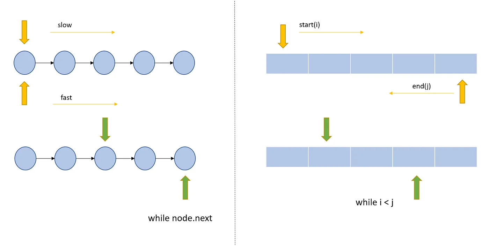

When to use which Data Structure?
Choosing the right data structure is an important part of solving coding problems efficiently. Here are my notes on some commonly used data structures and when to use them:

Array:

When you need constant time access to elements
When the size of the data set is fixed
Linked lists:

When you need to insert or delete elements frequently
When the size of the data set is not fixed
When you need to dynamically allocate memory
Hash Table:

When you need to quickly access or look up elements by a key
When you have a large data set
Tree:

When you need to store hierarchical data
When you need to efficiently search or sort elements
When you need to ensure fast performance
Graph:

When you need to represent complex relationships between data points
When you need to perform tasks like pathfinding, clustering, or recommendation systems
Stack:

When you need to implement a LIFO data structure
When you need to track the most recent elements
Queue:

- When you need to implement a FIFO data structure
- When you need to maintain the order of elements

### [Two Pointers Approach](https://towardsdatascience.com/two-pointer-approach-python-code-f3986b602640)

- Two pointer algorithm is one of the most commonly asked questions in any programming interview.
- Optimizes the runtime by utilizing some order (not necessarily sorting) of the data.
- Generally used to search pairs in a sorted array.
- Works in constant space.

The two-pointer approach has three main steps:

#### Pointer Initialization

Starting points. Pointers can be at any place depending upon what we are trying to achieve. In the left part of the pic, we have both pointers starting at the same position i.e. start of the linked list. In the right part of the pic, we have pointers at extreme ends one at starting index and another one at the last index.

#### Pointer movement

This will decide how we converge toward the solution. Pointers can move in the same direction (left in the above pic) or they can move in the opposite direction (right in the above pic). Also in the left part of the pic, we have different increments for the pointers(top (slow) with 1 unit and bottom (fast) with 2 units).

#### Stop condition

This decides when do we stop. In the left part, we continue till we reach a node whose next element is None. In the right one, we continue till our start is less than the end (i <j).
