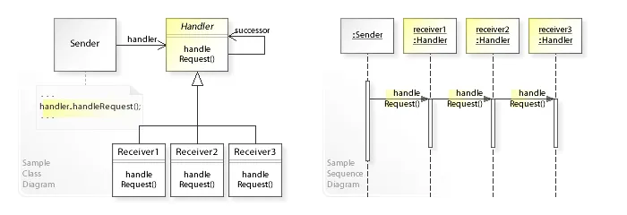

### Chain of responsibility
>
> **TL;DR**
> Allow a request to pass down a chain of receivers until it is handled.

- The Chain of responsibility is an object oriented version of the `if ... elif ... elif ... else ...` idiom, with the benefit that the condition–action blocks can be **dynamically rearranged and reconfigured at runtime.**
- Allows an object to pass a request to move through a chain of handlers.
- Upon receiving a request, each handler decides either to process the request or to pass it to the next handler in the chain.
    
  - In this pattern, there are three main components
    - Sender: The object that sends the request
    - Handler: The interface that defines the request handling method
    - Receiver or ConcreteHandler : The concrete handler that processes the request

- Request receiver in simple form keeps a reference to a single successor.
- As a variation some receivers may be capable of sending requests out in several directions, forming a `tree of responsibility`.

#### An example

- A plugin style password validator which will validate
  - Min 8 Characters
  - Uppercase Letters
  - Contains Number
- if one validation fails, the Chain of Responsibility pattern ensures that the validation process stops, and other scenarios are not validated.
- One of the best aspects of this pattern is its flexibility. We can easily disable existing handlers and add new validators in the future without modifying the existing code extensively.

``` py
from abc import ABC, abstractmethod


class Handler(ABC):
    def __init__(self, successor=None):
        self.successor = successor
        self.success = False

    def set_successor(self, successor):
        self.successor = successor

    def handle_request(self, request):
        if not self.success and self.successor:
            self.successor.handle_request(request)

    @abstractmethod
    def process_request(self, request):
        pass


class Min8CharsHandler(Handler):
    def process_request(self, request):
        if len(request) >= 8:
            self.success = True
        else:
            raise ValueError("Password must be at least 8 characters long")


class UppercaseHandler(Handler):
    def process_request(self, request):
        if any(char.isupper() for char in request):
            self.success = True
        else:
            raise ValueError("Password must contain at least one uppercase letter")


class DigitHandler(Handler):
    def process_request(self, request):
        if any(char.isdigit() for char in request):
            self.success = True
        else:
            raise ValueError("Password must contain at least one digit")


class PasswordValidator:
    def __init__(self, handlers):
        self.first_handler = handlers[0]
        for i in range(len(handlers) - 1):
            handlers[i].set_successor(handlers[i + 1])

    def validate(self, password):
        current_handler = self.first_handler
        try:
            current_handler.process_request(password)
        except ValueError as e:
            return str(e)

        current_handler = current_handler.successor

        while current_handler:
            try:
                current_handler.process_request(password)
            except ValueError as e:
                return str(e)
            current_handler = current_handler.successor

if __name__ == '__main__':
    # Create the list of handlers
    handlers = [DigitHandler(), Min8CharsHandler(), UppercaseHandler()]

    # Create the password validator with the list of handlers
    password_validator = PasswordValidator(handlers)

    print(password_validator.validate("passwo"))  # Password validation failed
    print(password_validator.validate("password1"))  # Password validation failed
    print(password_validator.validate("password1"))  # Password validation failed
    print(password_validator.validate("Password1"))  # None

```

- An alternate implementation

``` py
class PasswordValidator:
    def __init__(self, applied_handlers):
        self.applied_handlers = applied_handlers

    def validate(self, password):
        for handler in self.applied_handlers:
            try:
                handler().process_request(password)
            except ValueError as e:
                break
```

---

``` python
from abc import ABC, abstractmethod
from typing import Optional, Tuple


class Handler(ABC):
    def __init__(self, successor: Optional["Handler"] = None):
        self.successor = successor

    def handle(self, request: int) -> None:
        """
        Handle request and stop.
        If can't - call next handler in chain.
        As an alternative you might even in case of success
        call the next handler.
        """
        res = self.check_range(request)
        if not res and self.successor:
            self.successor.handle(request)

    @abstractmethod
    def check_range(self, request: int) -> Optional[bool]:
        """Compare passed value to predefined interval"""


class ConcreteHandler0(Handler):
    """Each handler can be different.
    Be simple and static...
    """

    @staticmethod
    def check_range(request: int) -> Optional[bool]:
        if 0 <= request < 10:
            print(f"request {request} handled in handler 0")
            return True
        return None


class ConcreteHandler1(Handler):
    """... With it's own internal state"""

    start, end = 10, 20

    def check_range(self, request: int) -> Optional[bool]:
        if self.start <= request < self.end:
            print(f"request {request} handled in handler 1")
            return True
        return None


class ConcreteHandler2(Handler):
    """... With helper methods."""

    def check_range(self, request: int) -> Optional[bool]:
        start, end = self.get_interval_from_db()
        if start <= request < end:
            print(f"request {request} handled in handler 2")
            return True
        return None

    @staticmethod
    def get_interval_from_db() -> Tuple[int, int]:
        return (20, 30)


class FallbackHandler(Handler):
    @staticmethod
    def check_range(request: int) -> Optional[bool]:
        print(f"end of chain, no handler for {request}")
        return False

if __name__ == "__main__":

    def main():
        h0 = ConcreteHandler0()
        h1 = ConcreteHandler1()
        h2 = ConcreteHandler2(FallbackHandler())
        h0.successor = h1
        h1.successor = h2
        requests = [2, 5, 14, 22, 18, 3, 35, 27, 20]
        for request in requests:
            h0.handle(request)
    
    main()

 Output:   
    request 2 handled in handler 0
    request 5 handled in handler 0
    request 14 handled in handler 1
    request 22 handled in handler 2
    request 18 handled in handler 1
    request 3 handled in handler 0
    end of chain, no handler for 35
    request 27 handled in handler 2
    request 20 handled in handler 2
