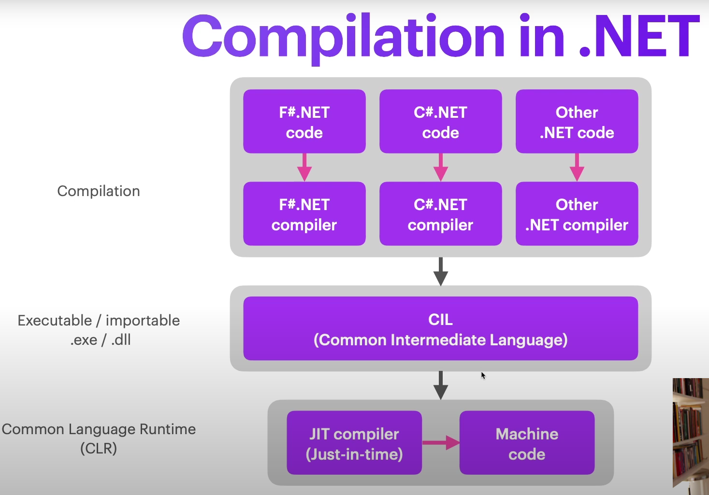

## What is a program

- A program / software / algorithm runs on a computing devices / hardware / machine
- It takes in some inputs and generates outputs
- Programs are written in different languages which consists of syntax (which defines what is valid or not) and semantics (the meaning behind what is written)
- How programs are written can be affected by the paradigm chosen
  - Paradigms can be grouped as
    - `imperative`: you define how and what to do
      - e.g. procedural, object-oriented
    - `declarative`: you define how the output should be
      - e.g. functional, logic
  - Many languages mix paradigms

### Compilation vs Interpretation
- Machine only understand low-level binary code (1s and 0s) but not people
- In order to write programs, we built layers of abstraction over binary code
- A compiler takes in the high level language (e.g. python, c#, java) and converts it into low level binary code that the machine can understand. 
  - Usually we compile the program and generate a file written in machine code
- A interpreter does the same conversion, but on the fly. As it consumes source code, it convert and outputs machine code and execute it
 

### Data Types as Sets
- Set refers a bunch of things
- Hence the data type `Integer` refers to the set containing every possible integer
- Something variables can have data types that are a union of sets i.e. `variable: Union(str, None)`
- When programming, recommended to leverage on set theory (unions, intersections, subsets) to create data type containing only the valid values
  - For e.g. if program only works with integer that are not zero, create the data type `Non-Zero Integer` that contains all integer except zero 

### Data Types: Value types vs Reference types
``` sh
# Value Types

x = 5
y = 5
x == y? # Yes

# Reference Types

x = new Cat
y = new Cat
z = x
x == y? # No since x and y are two different cats
x == z? # Yes 
```
- 
