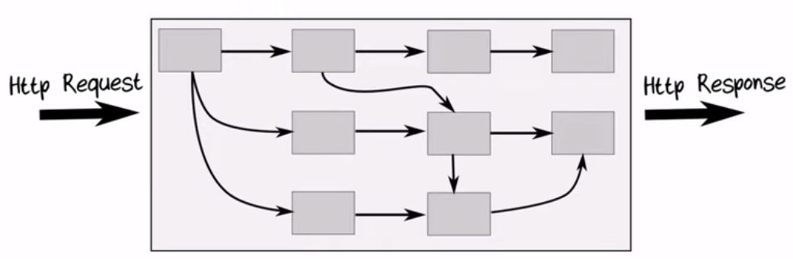

## Pipeline-Oriented Programming



- One directional flow, even with branching

## Why Pipeline-Oriented Programming?

- Pipelines encourage composability
- Pipelines follow good design principles
- easier to maintain
- Easier to test
- Fit well with modern architectures e.g. Onion/Clean/Hexagonal

### Pipelines encourage composability (like Lego..)

- Pipelines encourage you to design so that:
  - Any piece can be connected
  - No need for special adapters
- In the end, You get nice composable components
- Sub-components composed into a new bigger unit

### Pipelines follow good design principles

- Many design patterns work naturally with a pipeline-oriented approach
- Single Responsibility principle: Each component only does one thing, with one input and one output
- Open/Closed principle: It allows for adding new functionality without exchanging existing code
- Strategy pattern, Decorator Pattern

### Pipelines are easier to maintain

- Avoid circular dependencies which is hard to refactor
- Components only depends on other conponents that are before them

## Pipeline Oriented Programming in Practice

### Immutability

If you have immutable data, you will probably need a pipeline

``` py
# Suppose Person is immutable
# We end up with four instances of Person, which can be confusing and ugly
p = Person("Scott", "s@example.com", 21)
p2 = p.with_name("Tom")
p3 = p2.with_email("tom@example.com")
p4 = p3.with_age(42)

# Alternatively, using pipeline
# Looks nicer
p = Person("Scott", "s@example.com", 21)
p
.with_name("Tom")
.with_email("tom@example.com")
.with_age(42)
```

### Pipes

```
# ------------------ PSEUDO CODE -------------
def Add1(input:int) -> int:
    return input + 1

def Square(input:int) -> int:
    return input * input

def Double(input:int) -> int:
    return input * 2    

# deeply nested calls can be hard to understand    
def NestedCalls():
    return Double(Square(Add1(5)))
```
#### Refactoring into pipelines with pipes
Allows us to create a pipeline out of any existing functions

``` 
# ------------------ PSEUDO CODE -------------

# works only for functions with one input
def Pipe(input:int, func:Callable):
    return func(input)

def Pipeline():
    return 5
            .Pipe(Add1)
            .Pipe(Square)
            .Pipe(Double)     
```

#### What if we have functions with two parameters?
```
# ------------------ PSEUDO CODE -------------

def Add(i: int, j:int) -> int:
    return i + j

def Times(i: int, j:int) -> int:
    return i * j

def Pipe_2(input, func, param_2)    
    return func(input, param_2)

def Pipeline_with_params():
    return 5
            .Pipe_2(Add, 1)
            .Pipe_2(Times, 2)    
```

## Example

### FizzBuzz

``` py
for i in range(30):
    if i % 15 == 0:
        print("FizzBuzz")
    elif i % 3 == 0:
        print("Fizz")
    elif i % 5 == 0:   
        print("Buzz")
    else:
        print(i)
```

Issues:
- Not composable
- Hard to test

``` py
# Pipeline Version

class FizzBuzzData:
    def __init__(self, number:int, output:str):
        self.number = number
        self.output = output
    
    def handle(self, divisor: int, output:str):
        if self.output != "":
            return self # already processed
        if self.number % divisor != 0:
            return self # not applicable
        return FizzBuzzData(self.number, output)
    
    def extract(self):
        if self.output == "":
            return str(self.number)
        else:
            return self.output

# we can easily extend the pipeline            
def FizzBuzzPipeline(number:int):
    return FizzBuzzData(i, "") \
                .handle(15, "FizzBuzz") \
                .handle(3, "Fizz") \
                .handle(5, "Buzz") \
                .extract() 
        
def FizzBuzz():
    lst = []
    for i in range(1, 30):
        word = FizzBuzzPipeline(i)  
        lst.append(word)
    print(",".join(lst))         
        
FizzBuzz()

# Alternatively, we can also process the handle functions at the same time
        
```