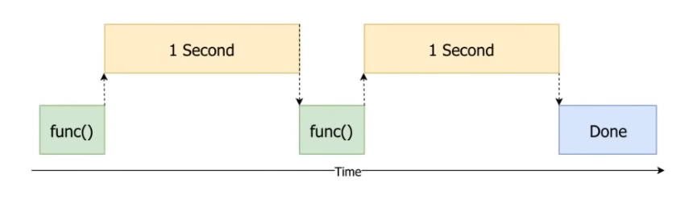
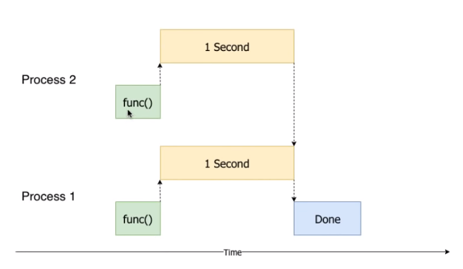

## A Synchronous Example

``` py
import time

start = time.perf_counter()

def do_something():
    print('Sleeping 1 second...')
    time.sleep(1)
    print('Done Sleeping')

do_something()
do_something()

finish = time.perf_counter()
print(f'Finished in {round(finish- start, 2)} second(s)')

```

Here's a visual representation of what is happening under the hood.

- Notice how the functions ran in one after another, only starting after the previous one is done
- Here, The program is said to be running **synchronously**



##  CPU bound vs IO Bound Tasks

- CPU bound tasks are tasks that do a lot of processing and capacity to do more is limited by the amount of CPU available
  - Better to use multi-processing to run processes in parallel instead
  
- IO bound tasks are tasks that limited due to data not being available, hence are left waiting for data
  - e.g. reading/writing files, network operations, downloading files

## What is Multiprocessing?

- The processor on our computer has multiple cores
- With multi-processing, the tasks are split among several cores and executed at the same time



### Using Multiprocessing

- Consider the cost for creating and managing processes as it might result in a net negative impact on processing time
- Unlike threads, processes do not share virtual memory. A process cannot access variables from another process
- Communication between processes is done via pickle. Hence, objects need to be pickle-able
- When possible, pass messages to instruct process on how to create the data, instead of sending the data. Transferring too much data might slow down processes
- instead of reading and sending the data, pass the file_name and have the process load the file
- Avoid multiprocessing when there's a lot of shared computation between tasks
- Optimize chunksize. Bigger chunksize: less trips to Pool for work, more data to copy across process boundaries
- Favour using `imap` and `imap_unordered` for less memory usage

##### Legacy method

```py
import multiprocessing

def do_something(seconds):
    print(f'Sleeping {seconds} second(s)...')
    time.sleep(seconds)
    print('Done Sleeping')

processes = []

# initialize threads in a loop
for _ in range(10):
    p = multiprocessing.Process(target=do_something, args=[1.5])
    p.start()    # start running processes
    process.append(p)

for process in processes:
    process.join()
```

##### New Method

```py
import concurrent.futures

def do_something(seconds):
    print(f'Sleeping {seconds} second(s)...')
    time.sleep(seconds)
    return 'Done Sleeping'

with concurrent.futures.ProcessPoolExecutor() as executor:
    secs - [5, 4, 3, 2, 1]
    results = [executor.submit(do_something, sec) for sec in secs]

    # will print in LIFO
    for f in concurrent.futures.as_completed(results):
        print(f.result())

# =====================================

# if you want to print in FIFO
with concurrent.futures.ProcessPoolExecutor() as executor:
    secs - [5, 4, 3, 2, 1]
    results = executor.map(do_something, secs)

    for result in results:
        print result


# map: will wait until all is done before returning all at once in order      
# imap: return results based on starting order
# imap_unordered: returns results in unspecified order
```

