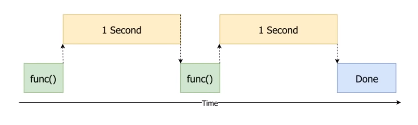

https://www.youtube.com/watch?v=IEEhzQoKtQU&ab_channel=CoreySchafer

## A Synchronous Example

``` py
import time

start = time.perf_counter()

def do_something():
    print('Sleeping 1 second...')
    time.sleep(1)
    print('Done Sleeping')

do_something()
do_something()

finish = time.perf_counter()
print(f'Finished in {round(finish- start, 2)} second(s)')

```

Here's a visual representation of what is happening under the hood.

- Here, The program is said to be running **synchronously**
- Notice how the program is just waiting and not doing much after running each function. 
- This presents opportunity for threading



##  CPU bound vs IO Bound Tasks

- CPU bound tasks are tasks that do a lot of processing and capacity to do more is limited by the amount of CPU available
  - Better to use multi-processing to run processes in parallel instead
  - Note that there is a cost for managing threads that might result in a net negative impact on processing time
- IO bound tasks are tasks that limited due to data not being available, hence are left waiting for data
  - e.g. reading/writing files, network operations, downloading files

## What is Threading?

- Gives the illusion of concurrency
- Instead of idling, the program runs other pieces, while the IO operation finish


### Using Threading

##### Legacy method

```py
import threading

def do_something(seconds):
    print(f'Sleeping {seconds} second(s)...')
    time.sleep(seconds)
    print('Done Sleeping')

threads = []

# initialize threads in a loop
for _ in range(10):
    t = threading.Thread(target=do_something, args=[1.5])
    t.start()    # start running thread
    threads.append(t)

for thread in threads:
    thread.join()
```

##### New Method

```py
import concurrent.futures

def do_something(seconds):
    print(f'Sleeping {seconds} second(s)...')
    time.sleep(seconds)
    reutrn 'Done Sleeping'

with concurrent.futures.ThreadPoolExecutor() as executor:
    secs - [5, 4, 3, 2, 1]
    results = [executor.submit(do_something, sec) for sec in secs]

    # will print in LIFO
    for f in concurrent.futures.as_completed(results):
        print(f.result())

# =====================================

# if you want to print in FIFO
with concurrent.futures.ThreadPoolExecutor() as executor:
    secs - [5, 4, 3, 2, 1]
    results = executor.map(do_something, secs)

    for result in results:
        print result
```

## The Global Interpreter Lock(GIL)

- Helps threads prevent themselves from accessing the same data at the same time
- In other words, if two threads wants to access same data, one thread is locked out and has to wait until the other thread is done with its thing and releases the lock on the data.