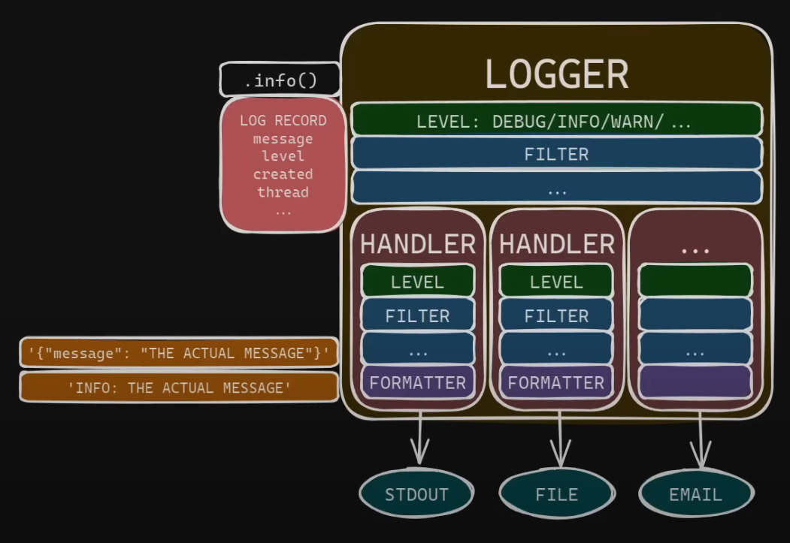
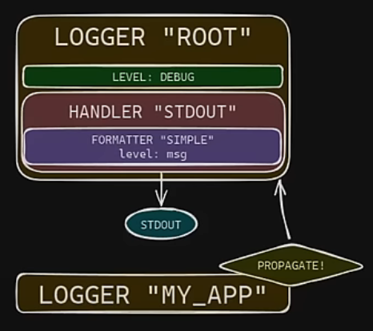
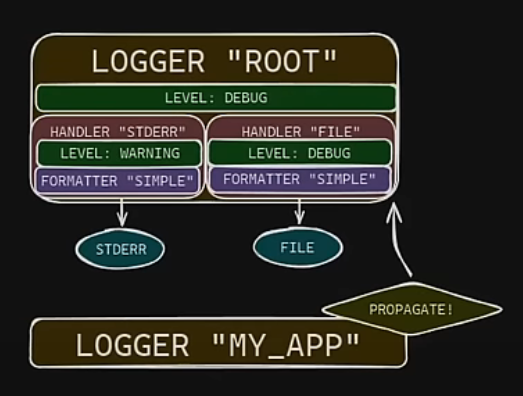

https://betterstack.com/community/guides/logging/how-to-start-logging-with-python/#the-python-logging-hierarchy
https://www.youtube.com/watch?v=9L77QExPmI0

### The Components



#### Loggers

-   The actual thing used in code to log messages
-   Each message is a LogRecord object that contains contextual info i.e. message, level, created, thread
-   Loggers also can be configured
    -   `level`: to drop message below a certain severity
    -   filters: to drop that meet certain conditions or alter messages (for e.g. sensitive data)
-   Changes to the messages will persist throughout.
-   The LogRecord is then passed to the handlers

#### Filters

#### Handlers

-   Handlers define how and where to log records i.e. stdout, file, email, log service
-   Each handler also has level and filters to customize the output
-   However, unlike the logger, these changes revert once it is passed to the next handler.

#### Formatters

-   log messages are generated in the form of text but LogRecords are python objects
-   Formatters is used to convert the LogRecord into text so that it can be sent out
-   Formatters allows you to customize how the log message look like and choose which data in included in the log message

### The Logging Tree

-   Loggers are accessed and created by name
-   Log messages will propagate from child loggers to its parent all the way to the root logger

### Best Practices

1. Use `dictConfig`

    - Useful logging is multi-destination
    - Usually want logging to multiple places
        - for e.g.
            - capture all logs in a file on top of having errors go to `stderr`
            - have logs go to stdout and send emails for errors

    ```py
    import logging.config

    logger = logging.getLogger("my_app")

    logging_config = {
        'version': 1,
        'filters': {...},
        'formatters': {...},
        'handlers': {...},
        'loggers': {...},
    }
    ```

**An example: Logging to stdout**


``` py
import logging

logging.info("some_message")   # BAD: This uses the root logger
logger = logging.getlogger("my_app") # GOOD: Use your own logger


# Note: You can store the logging_config separately in a json/yaml file
logging_config = {
    "version": 1,
    "disable_existing_loggers": False,
    "formatters": {
        "simple": {
            "format": "%(levelname)s: %(message)s",  # didnt specify class so uses logging.formatter by default
        }
    },
    "handlers": {
        "stdout": {
            "class": "logging.StreamHandler",
            "formatter": "simple",
            "stream": "ext://sys.stdout",
        }
    },
    "loggers": {
        "root": {"level": "DEBUG", "handlers": ["stdout"]}
    },
}
def setup_logging()
    logging.config.dictConfig(logging_config)
    queue_handler = logging.getHandlerByName("queue_handler")
    if queue_handler is not None:
        queue_handler.listener.start()
        atexit.register(queue_handler.listener.stop())


def main():
    setup_logging()
    logger.debug("debug message", extra={"x": "hello"})
    logger.info("info message")
    logger.warning("warning message")
    logger.error("error message")
    logger.critical("critical message")
    
...

def main():
    logging.config.dictConfig(config=logging_config)
    ...
```


2. Put all handlers/filters on the root logger

   -   An benefit of this is that any messages generated by third party libraries get formatted the same way as messages generated by your own app.

3. Dont use the root logger in your code.

``` py
import logging

logging.info("some_message")   # BAD: This uses the root logger
logger = logging.getlogger("my_app")
logger.info("some_message") # GOOD: Use your own logger

```

4. One logger per major subcomponent.

   -   Do not use `getLogger(__name__)` in every file

5. Store config in `json` or `yaml` file

6. Use ISO-8601 Timestamps (with timezone)


7. Store persistent logs in JSON for easy search
8. Add Context with `logging.info(..., extra={...})`
9. Log off the main thread
10. For libraries, don't configure logging
