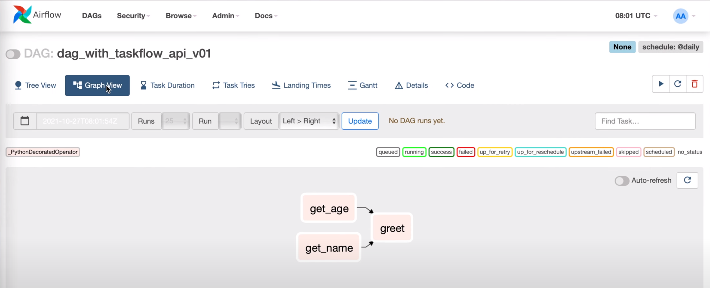

## DAG Essential Configs

``` py
from airflow import DAG
from datatime import datetime

with DAG(
    dag_id=<UNIQUE_DAG_NAME>,
    start_date=datetime(YYYY,MM,DD),
    schedule_interval=<CRON_EXPRESSION>,
    catchup=False
)
```

- **start_date**: The timestamp from which the scheduler will attempt to backfill
- **schedule_interval**: How often a DAG run
- **end_date**: The timestamp from which a DAG ends

## Creating DAGs

```py
from datetime import datetime, timedelta

from airflow import DAG
from airflow.operators.bash import BashOperator


default_args = {
    'owner': 'coder2j',
    'retries': 5,
    'retry_delay': timedelta(minutes=2)
}


with DAG(
    dag_id='our_first_dag_v5',
    default_args=default_args,
    description='This is our first dag that we write',
    start_date=datetime(2021, 7, 29, 2),
    schedule_interval='@daily'
) as dag:
    task1 = BashOperator(
        task_id='first_task',
        bash_command="echo hello world, this is the first task!"
    )

    task2 = BashOperator(
        task_id='second_task',
        bash_command="echo hey, I am task2 and will be running after task1!"
    )

    task3 = BashOperator(
        task_id='thrid_task',
        bash_command="echo hey, I am task3 and will be running after task1 at the same time as task2!"
    )

    # Task dependency method 1
    # task1.set_downstream(task2)
    # task1.set_downstream(task3)

    # Task dependency method 2
    # task1 >> task2
    # task1 >> task3

    # Task dependency method 3
    task1 >> [task2, task3]
```

<br>

## Testing DAG Tasks

``` bash
# get airflow container details
docker-compose ps

# start bash terminal for airflow scheduler
docker exec -it <AIRFLOW_SCHEDULER_NAME> /bin/bash

# --------- In airflow scheduler terminal --------------------
# see all commands
airflow -h

# testing task
# Best Practice: Test task every time a new task is added
airflow tasks test <DAG_ID> <TASK_ID> <DATETIME_IN_THE_PAST>


 
```

## Airflow Task Flow API
- cleaner implementation of DAGs
- helps with managing inputs and outputs between tasks

```py

from datetime import datetime, timedelta
from airflow.decorators import dag, task


default_args = {
    'owner': 'coder2j',
    'retries': 5,
    'retry_delay': timedelta(minutes=5)
}

@dag(dag_id='dag_with_taskflow_api_v02', 
     default_args=default_args, 
     start_date=datetime(2021, 10, 26), 
     schedule_interval='@daily')
def hello_world_etl():

    @task(multiple_outputs=True)
    def get_name():
        return {
            'first_name': 'Jerry',
            'last_name': 'Fridman'
        }

    @task()
    def get_age():
        return 19

    @task()
    def greet(first_name, last_name, age):
        print(f"Hello World! My name is {first_name} {last_name} "
              f"and I am {age} years old!")
    
    name_dict = get_name()
    age = get_age()
    greet(first_name=name_dict['first_name'], 
          last_name=name_dict['last_name'],
          age=age)

greet_dag = hello_world_etl()

```

**Looking at the Airflow UI**




