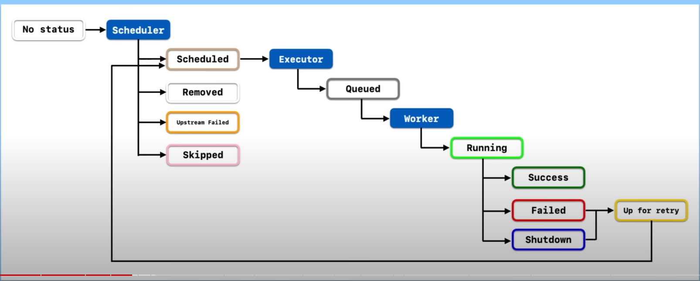

## Links
- Tutorial: https://www.youtube.com/watch?v=K9AnJ9_ZAXE&ab_channel=coder2j
- Debug Tips: https://www.youtube.com/watch?v=5QxqqeOxJhI&list=PLwFJcsJ61oujAqYpMp1kdUBcPG0sE0QMT&index=15&ab_channel=coder2j
- Email Alerts: https://www.youtube.com/watch?v=D18G7hW8418&list=PLwFJcsJ61oujAqYpMp1kdUBcPG0sE0QMT&index=18&ab_channel=coder2j
- Bad & Best Practices:  https://www.youtube.com/watch?v=LBoT1DzGFS4&ab_channel=PlainSchwarz
- Trigger DAGs via REST API: https://brocktibert.com/post/trigger-airflow-dags-via-the-rest-api/


## What is Airflow?
- A platforn on which to create, schedule and monitor workflows

## Installation

```sh
# code taken from official Airflow GitHub repo
# change python version accordingly
pip install 'apache-airflow==2.6.3' \
 --constraint "https://raw.githubusercontent.com/apache/airflow/constraints-2.6.3/constraints-3.8.txt"

# initialize database for Airflow
# to have everything install within the current directory
export AIRFLOW_HOME=.

# this create a sqlite db, log folder and some config files
airflow db init

#---------------------------------------------------------------

# to see the fields required
airflow users create --help
# create user
airflow users create 
    --username admin
    --firstname <FIRST_NAME>
    --lastname <LAST_NAME>
    --role Admin
    --email <EMAIL>
    
# start airflow webserver
airflow webserver -p 8080

#------------------------------------------------------------

# if scheduler is not running error
export AIRFLOW_HOME=.
airflow scheduler

```

### Running Airflow in Docker 


## Core Concepts
- `DAGs`
  - Directed Acyclic Graphs
  - A collections of `tasks` to be exected
  - `Tasks` are executed by `Operators`
- Execution Date: logical datetime in which the DAG is executed
- Task Instance: A execution of a task at a specfic point in time
- Dag Run: instantiation of a DAG which contain task instances

## Task Lifecycle

- Available statuses
  - `no_status`: scheduler created empty task instance
    - `schedule`: scheduler determined task instance needs to run
      - `queued`: schedule sent task to executor to run on the queue
        - `running`: worker picked up task and is now running it
          - `success`: task completed without error
          - `failed`: task failed
          - `shutdown`: task aborted
            - `up_for_retry`: rerun task
            - `up_for_reschedule`: reschedule task every certain time interval
    - `upstream_failed`: task's upstream task failed
    - `skipped`: task is skipped
    - `removed`: task is removed


## Architecture


## Creating DAGs

```py
from datetime import datetime, timedelta

from airflow import DAG
from airflow.operators.bash import BashOperator


default_args = {
    'owner': 'coder2j',
    'retries': 5,
    'retry_delay': timedelta(minutes=2)
}


with DAG(
    dag_id='our_first_dag_v5',
    default_args=default_args,
    description='This is our first dag that we write',
    start_date=datetime(2021, 7, 29, 2),
    schedule_interval='@daily'
) as dag:
    task1 = BashOperator(
        task_id='first_task',
        bash_command="echo hello world, this is the first task!"
    )

    task2 = BashOperator(
        task_id='second_task',
        bash_command="echo hey, I am task2 and will be running after task1!"
    )

    task3 = BashOperator(
        task_id='thrid_task',
        bash_command="echo hey, I am task3 and will be running after task1 at the same time as task2!"
    )

    # Task dependency method 1
    # task1.set_downstream(task2)
    # task1.set_downstream(task3)

    # Task dependency method 2
    # task1 >> task2
    # task1 >> task3

    # Task dependency method 3
    task1 >> [task2, task3]
```
<br>

### Using `PythonOperator`
#### Passing Parameters
- use `op_kwargs` to load params:
  - e.g. `op_kwargs = {'name': 'Tom' , 'age': 20}` to pass params for `greet(name, age)`

#### Data Sharing 
- NOTE: max size is 48KB
- use **Xcoms** to pass values across tasks
  - `return` publishes values to the 'general space' where other functions have access to and use
  - to publish value: use `ti.xcom_push(<KEY>, <VALUE>)`
  - to get values: 
    - from 'general space':use `ti.xcom_pull(<task_id_of_task_to_provide_value>)`
    - from specific task:use `ti.xcom_pull(<task_id_of_task_providing_value>, <key>)`

#### Code Example
```py

from datetime import datetime, timedelta

from airflow import DAG
from airflow.operators.python import PythonOperator


default_args = {
    'owner': 'coder2j',
    'retries': 5,
    'retry_delay': timedelta(minutes=5)
}


def greet(some_dict, ti):
    print("some dict: ", some_dict)
    first_name = ti.xcom_pull(task_ids='get_name', key='first_name')
    last_name = ti.xcom_pull(task_ids='get_name', key='last_name')
    age = ti.xcom_pull(task_ids='get_age', key='age')
    print(f"Hello World! My name is {first_name} {last_name}, "
          f"and I am {age} years old!")


def get_name(ti):
    ti.xcom_push(key='first_name', value='Jerry')
    ti.xcom_push(key='last_name', value='Fridman')


def get_age(ti):
    ti.xcom_push(key='age', value=19)


with DAG(
    default_args=default_args,
    dag_id='our_dag_with_python_operator_v07',
    description='Our first dag using python operator',
    start_date=datetime(2021, 10, 6),
    schedule_interval='@daily'
) as dag:
    task1 = PythonOperator(
        task_id='greet',
        python_callable=greet,
        op_kwargs={'some_dict': {'a': 1, 'b': 2}}
    )

    task2 = PythonOperator(
        task_id='get_name',
        python_callable=get_name
    )

    task3 = PythonOperator(
        task_id='get_age',
        python_callable=get_age
    )

    [task2, task3] >> task1
```

## Airflow Task Flow API
- cleaner implementation of DAGs

```py
from datetime import datetime, timedelta

from airflow.decorators import dag, task


default_args = {
    'owner': 'coder2j',
    'retries': 5,
    'retry_delay': timedelta(minutes=5)
}

@dag(dag_id='dag_with_taskflow_api_v02', 
     default_args=default_args, 
     start_date=datetime(2021, 10, 26), 
     schedule_interval='@daily')
def hello_world_etl():

    @task(multiple_outputs=True)
    def get_name():
        return {
            'first_name': 'Jerry',
            'last_name': 'Fridman'
        }

    @task()
    def get_age():
        return 19

    @task()
    def greet(first_name, last_name, age):
        print(f"Hello World! My name is {first_name} {last_name} "
              f"and I am {age} years old!")
    
    name_dict = get_name()
    age = get_age()
    greet(first_name=name_dict['first_name'], 
          last_name=name_dict['last_name'],
          age=age)

greet_dag = hello_world_etl()

```

## Airflow: Catch-Up vs BackFill
#### Catchup
- Catchup is a parameter that controls the scheduling behavior of a workflow in Airflow. 
- When the `catchup=True` (which is the default behavior), Airflow will automatically backfill any missed executions of the workflow for all the intervals between the workflow's start date and the current date.

#### Backfill: 
  - Backfill refers to the process of running a workflow for a specific range of historical dates, filling in any gaps in the data processing for those dates. 
  - This can be useful when you have added a new task to an existing workflow, or when you need to reprocess data due to changes in the logic or data quality issues.

#### How to execute **BACKFILL**
##### Step 1: Set `catchup=False`

```py
from datetime import datetime, timedelta

from airflow import DAG
from airflow.operators.bash import BashOperator


default_args = {
    'owner': 'coder2j',
    'retries': 5,
    'retry_delay': timedelta(minutes=5)
}

with DAG(
    dag_id='dag_with_catchup_backfill_v02',
    default_args=default_args,
    start_date=datetime(2021, 11, 1),
    schedule_interval='@daily',
    catchup=False   # default to True
) as dag:
    task1 = BashOperator(
        task_id='task1',
        bash_command='echo This is a simple bash command!'
    )
```
##### Step 2: Run these commands in CLI

``` sh
# to get airflow docker container ID
docker ps

# start bash terminal 
docker exec -it <AIRFLOW_CONTAINER_ID> bash  

# execute backfill. date_format: YYYY_MM_DD
airflow dags backfill -s <START_DATE> -e <END_DATE> <DAG_ID> 

# exit bash terminal
exit
```

## Scheduling using CRON
- CRON Presets: https://airflow.apache.org/docs/apache-airflow/stable/core-concepts/dag-run.html
- CRON Editor: https://crontab.guru/

```py
from datetime import datetime, timedelta

from airflow import DAG
from airflow.operators.bash import BashOperator


default_args = {
    'owner': 'coder2j',
    'retries': 5,
    'retry_delay': timedelta(minutes=5)
}

with DAG(
    default_args=default_args,
    dag_id="dag_with_cron_expression_v04",
    start_date=datetime(2021, 11, 1),
    schedule_interval='0 3 * * Tue-Fri'     # <<< CRON expression here
) as dag:
    task1 = BashOperator(
        task_id='task1',
        bash_command="echo dag with cron expression!"
    )
    task1
```

## Airflow Connections


### Postgres Operator
- NOTE: for host field, if using docker application, `localhost` doesn't work, try `host.docker.internal` instead
- TIP: Recommended to delete data before inserting data to prevent duplication of primary keys


```py
from datetime import datetime, timedelta

from airflow import DAG
from airflow.providers.postgres.operators.postgres import PostgresOperator


default_args = {
    'owner': 'coder2j',
    'retries': 5,
    'retry_delay': timedelta(minutes=5)
}


with DAG(
    dag_id='dag_with_postgres_operator_v03',
    default_args=default_args,
    start_date=datetime(2021, 12, 19),
    schedule_interval='0 0 * * *'
) as dag:
    task1 = PostgresOperator(
        task_id='create_postgres_table',
        postgres_conn_id='postgres_localhost',
        sql="""
            create table if not exists dag_runs (
                dt date,
                dag_id character varying,
                primary key (dt, dag_id)
            )
        """
    )

    # the curly bracket notation is for airflow macros
    task2 = PostgresOperator(
        task_id='insert_into_table',
        postgres_conn_id='postgres_localhost',
        sql="""
            insert into dag_runs (dt, dag_id) values ('{{ ds }}', '{{ dag.dag_id }}')
        """
    )

    task3 = PostgresOperator(
        task_id='delete_data_from_table',
        postgres_conn_id='postgres_localhost',
        sql="""
            delete from dag_runs where dt = '{{ ds }}' and dag_id = '{{ dag.dag_id }}';
        """
    )
    task1 >> task3 >> task2
```

## Install Python dependencies in Airflow Docker Container
- Two ways: Image Extending, Image Customising


### Image Extending
Step 1. Create `requirements.txt` file
```raw
scikit-learn==0.24.2
matplotlib==3.3.3
```
Step 2. Create `dockerfile`
```sh
FROM apache/airflow:2.0.1
COPY requirements.txt /requirements.txt
RUN pip install --user --upgrade pip
RUN pip install --no-cache-dir --user -r /requirement.txt
```
Step 3. Build extended image
```sh
docker build 
    .  # dockerfile loation -> current dorectory 
    --tag extending_airflow:latest # set image_name to extending_airflow
```
Step 4. Ensure image_name in `docker-compose.yaml` matches
Step 5: Build and run docker container
```
docker-compose up 
    -d 
    --no-deps 
    --build airflow-webserver 
    airflow-scheduler
```

### Example using python dependencies

```py
from datetime import datetime, timedelta

from airflow import DAG
from airflow.operators.python import PythonOperator


default_args = {
    'owner': 'coder2j',
    'retry': 5,
    'retry_delay': timedelta(minutes=5)
}


def get_sklearn():
    import sklearn
    print(f"sklearn with version: {sklearn.__version__} ")


def get_matplotlib():
    import matplotlib
    print(f"matplotlib with version: {matplotlib.__version__}")


with DAG(
    default_args=default_args,
    dag_id="dag_with_python_dependencies_v03",
    start_date=datetime(2021, 10, 12),
    schedule_interval='@daily'
) as dag:
    task1 = PythonOperator(
        task_id='get_sklearn',
        python_callable=get_sklearn
    )
    
    task2 = PythonOperator(
        task_id='get_matplotlib',
        python_callable=get_matplotlib
    )

    task1 >> task2
```

## Airflow Hooks
- A hook is an abstraction of a specific API that allows Airflow to interact with an external system. Hooks are built into many operators, but they can also be used directly in DAG code.

#### Example
``` py
import csv
import logging
from datetime import datetime, timedelta
from tempfile import NamedTemporaryFile

from airflow import DAG
from airflow.operators.python import PythonOperator
from airflow.providers.postgres.hooks.postgres import PostgresHook
from airflow.providers.amazon.aws.hooks.s3 import S3Hook


default_args = {
    'owner': 'coder2j',
    'retries': 5,
    'retry_delay': timedelta(minutes=10)
}


def postgres_to_s3(ds_nodash, next_ds_nodash):
    # step 1: query data from postgresql db and save into text file
    hook = PostgresHook(postgres_conn_id="postgres_localhost")
    conn = hook.get_conn()
    cursor = conn.cursor()
    cursor.execute("select * from orders where date >= %s and date < %s",
                   (ds_nodash, next_ds_nodash))
    with NamedTemporaryFile(mode='w', suffix=f"{ds_nodash}") as f:
    # with open(f"dags/get_orders_{ds_nodash}.txt", "w") as f:
        csv_writer = csv.writer(f)
        csv_writer.writerow([i[0] for i in cursor.description])
        csv_writer.writerows(cursor)
        f.flush()
        cursor.close()
        conn.close()
        logging.info("Saved orders data in text file: %s", f"dags/get_orders_{ds_nodash}.txt")
    # step 2: upload text file into S3
        s3_hook = S3Hook(aws_conn_id="minio_conn")
        s3_hook.load_file(
            filename=f.name,
            key=f"orders/{ds_nodash}.txt",
            bucket_name="airflow",
            replace=True
        )
        logging.info("Orders file %s has been pushed to S3!", f.name)


with DAG(
    dag_id="dag_with_postgres_hooks_v04",
    default_args=default_args,
    start_date=datetime(2022, 4, 30),
    schedule_interval='@daily'
) as dag:
    task1 = PythonOperator(
        task_id="postgres_to_s3",
        python_callable=postgres_to_s3
    )
    task1
```