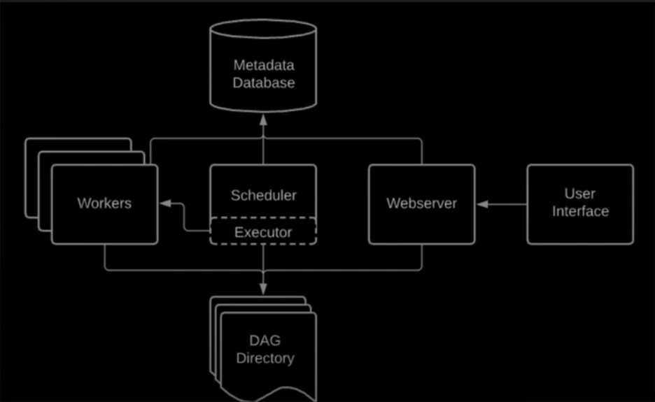

## What is Airflow?

- A open source platforn on which to create, schedule and monitor workflows
- NOT a data streaming solution. Triggering pipelines every second does not work!!
- NOT data processing framework. You end up with memory errors

## Installation

- Airflow is built in a modular way
- Airflow Core: `pip install apache-airflow`
- Installing additional providers adds new functionalites e.g. `pip install apache-airflow-providers-amazon`

```sh
# code taken from official Airflow GitHub repo
# change python version accordingly
pip install 'apache-airflow==2.6.3' \
 --constraint "https://raw.githubusercontent.com/apache/airflow/constraints-2.6.3/constraints-3.8.txt"

# initialize database for Airflow
# to have everything install within the current directory
export AIRFLOW_HOME=.

# this create a sqlite db, log folder and some config files
airflow db init

#---------------------------------------------------------------

# to see the fields required
airflow users create --help
# create user
airflow users create 
    --username admin
    --firstname <FIRST_NAME>
    --lastname <LAST_NAME>
    --role Admin
    --email <EMAIL>
    
# start airflow webserver
airflow webserver -p 8080

#------------------------------------------------------------

# if scheduler is not running error
export AIRFLOW_HOME=.
airflow scheduler

```

## Core Concepts

- `DAGs`
  - Directed Acyclic Graphs
  - A collections of `tasks` to be exected
  - `Tasks` are executed by `Operators`
- Operator
  - template for a predefined task
  - 3 types:
    - Action Operators: Executes an action
    - Transfer Operators: Transfers data from point to point
    - Sensor Operators: Wait for a condition to be met
- Execution Date: logical datetime in which the DAG is executed
- Task Instance: A execution of a task at a specfic point in time
- Dag Run: instantiation of a DAG which contain task instances

## Core Compoments



- **Web Server**: A flask python web server that allows you to access the interface
- **Scheduler**: Critical component. Does the scheduling of tasks, pipelines
- **Metadata Database**: Database that stored metadata regarding pipelines, tasks, users
- Triggerer
- **Executor**: Defines how tasks are executed. Note that it does not do the execution of task
- Other Componenets:
  - **Queue**: Your tasks will be pushed into it in order to execute them in the right order
  - **Worker**: Does the execution of tasks

## Architecture

- Single Node Architecture:
  - Everything in one node, on one machine
  - Queue is part of the Executor, which in turn is part of the Scheduler
- Multi Node Architecture:
  - Usually for production
  - Node 1: Web Server, Scheduler, Executor(Part of scheduler)
  - Node 2: Metastore, Queue (External to executor, usually RabbitMQ, Redis)
  - Additional Worker Nodes
  - Can scale up processing power by increasing number of worker nodes

## Execution Flow

- Add `dag.py` in DAG Directory
- Scheduler scans DAG Directory
  - New dags might take up to 5 mins to detect
  - Changes to existing dags might take up to 30 secs
- Scheduler runs dag. Creates the dagrun object, with state 'Running'
- First task to execute becomes a task instance object.Status from 'None' to 'Scheduled'
- The task instance object is sent into the Queue of the executor. State changes to 'Queued'
- Executor creates a subprocess to run task. State='Running'
- Once task is done, state changes to 'Success'/'Failed' based on outcome
- Scheduler checks
  - if there is no tasks to execute: DAG is done. DagRun status='Success'

## Task Lifecycle


- Available statuses
  - `no_status`: scheduler created empty task instance
    - `schedule`: scheduler determined task instance needs to run
      - `queued`: schedule sent task to executor to run on the queue
        - `running`: worker picked up task and is now running it
          - `success`: task completed without error
          - `failed`: task failed
          - `shutdown`: task aborted
            - `up_for_retry`: rerun task
            - `up_for_reschedule`: reschedule task every certain time interval
    - `upstream_failed`: task's upstream task failed
    - `skipped`: task is skipped
    - `removed`: task is removed
