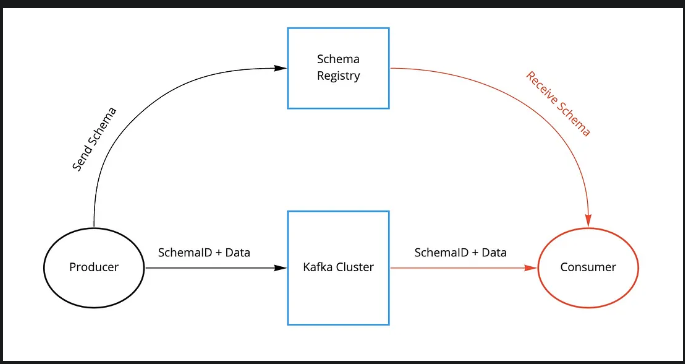

- Link: https://docs.confluent.io/platform/current/schema-registry/index.html
- Medium Article: https://medium.com/slalom-technology/introduction-to-schema-registry-in-kafka-915ccf06b902

## What is Schema Registry?

- Schema Registry provides a centralized repository for managing and validating schemas for topic message data, and for serialization and deserialization of the data over the network.
- It is an application that resides outside of your Kafka cluster and handles the distribution of schemas to the producer and consumer by storing a copy of schema in its local cache.

## Why Schema Registry
- Kafka, at its core, only transfers data in byte format. 
- Kafka has no knowledge of the data it's transferring
- There is also no data verification that’s being done at the Kafka cluster level.
- Due to the decoupled nature of Kafka, producers and consumers do not communicate with each other directly.
- However, the consumer still needs to know the type of data the producer is sending in order to deserialize it. 
- Schema Register provide an alternative channel for producers to share info about the schema with consumer who require it

## How it works

#### The Producer end

- With the schema registry in place, the producer, before sending the data to Kafka, talks to the schema registry first and checks if the schema is available.
- If it doesn’t find the schema then it registers and caches it in the schema registry.
- Once the producer gets the schema, it will serialize the data with the schema and send it to Kafka in binary format prepended with a unique schema ID.

#### The consumer end

- When the consumer processes this message, it will communicate with the schema registry using the schema ID it got from the producer and deserialize it using the same schema.
- If there is a schema mismatch, the schema registry will throw an error letting the producer know that it’s breaking the schema agreement.

#### Conclusion

- Producers and consumers to Kafka topics can use schemas to ensure data consistency and compatibility as schemas evolve. 
- Schema Registry is a key component for data governance, helping to ensure data quality, adherence to standards, visibility into data lineage, audit capabilities, collaboration across teams, efficient application development protocols, and system performance.

## Data Serialization Formats

- Wiki Reference: https://en.wikipedia.org/wiki/Comparison_of_data-serialization_formats

### Things to consider when choosing the right data format
- If the serialization format is binary.
- If we can use schemas to enforce strict data structures. (Schema Interface Description Language (IDL))
- AVRO would be a good choice

## Schema Evolution

- With time, our AVRO schemas will evolve. We will add new fields or update existing fields. 
- This is resolved by versioning each schema change.
  - When a schema is first created, it gets a unique schema ID and a version number. 
  - With time, our schemas will evolve, we add new changes and if changes are compatible, we get a new schema ID and our version number increments. 
- There are two ways to tell if a schema is compatible: 
  - by using a maven plugin (in Java) or 
  - by simply making a REST call. 
  - This compatibility check compares schema on the local machine with the schema on the schema registry.
