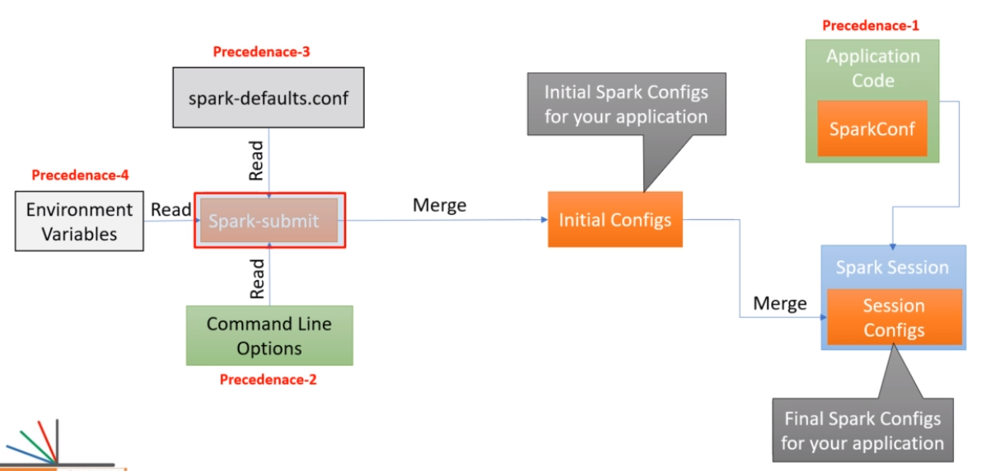

## Configuring Spark

- [SparkSession Config Options](https://spark.apache.org/docs/latest/configuration.html#viewing-spark-properties)

### Configuring the SparkSession Object

- Spark is a highly configurable system which is done via the SparkSession object
- Configuration can be done in one of these ways:
  - Environment variables (lowest priority)
  - SPARK_HOME\conf\spark.defaults.conf
  - spark-submit command line options
  - SparkConf object (highest priority)
- Spark properties can be grouped into two categories.
  - Deployment-related configs
    - for.e.g `spark.driver.memory`, `spark.executor.instances`.
    - This kind of config is going to depend on which cluster manager and deploy mode you choose.
    - These are often set them through the spark-submit command line and avoid setting them from the application.
  - App-related configs
    - for controlling the Spark Application runtime behavior such as spark.task.maxFailures.
    - These are often set them through SparkConf.

#### Environment variables

- for e.g. SPARK_HOME, HADOOP_HOME, PYSPARK_PYTHON
- Generally used by the cluster admins.
- However, there are few exceptions that developers need to be aware of since it is required in order to set up your local development environment.

#### `spark.defaults.conf` file

- this file is for setting default configurations for all apps and mainly used by your cluster admins.
- Can be used this file to configure some JVM variables such as log4j configuration file, log file location, and name.

#### `spark-submit` options

- Spark-submit allows for configuring your appl using command-line options such as `--master`.
- spark-submit can also accept any Spark config using the `--conf` flag.
- Note: If you have a space in your config, then you must enclose it in double-quotes. Otherwise, the double quote is not necessary.

#### SparkConf object

- Highest Priority

``` py
conf = SparkConf()
conf.set("spark.app.name", "Hello Spark")
conf.set("spark.master", "local[3]")

spark = SparkSession,builder
    .config(conf=conf)
    .getOrCreate()

```

#### Configuration Priority



- When you run your spark app, your application will read the environment variable, spark-defaults, and the command-line options.
- Spark will combine all these configs and create a single set of initial configs which go to your application and sit in your Spark Session.
- Importance (low to high): Environment variables < spark.defaults.conf < spark-submit options
- So, if there's same config in spark-defaults and spark-submit, Spark will use the spark-submit config.
- Finally, all these initial configs can be overwritten by you from your application code.

#### Tips on Spark Config

- Leave the environment variables and spark-defaults for your cluster admins.
- Use either spark-submit or SparkConf object
- To avoid hardcoding configurations, one approach is to keep these configurations in a separate file and load it from the file at run-time.

  ``` py
  import configparser
  from pyspark import SparkConf

  def get_spark_app_config():
      spark_conf = SparkConf()
      config = configparser.ConfigParser()
      config.read("spark.conf")

      for (key, val) in config.items("SPARK_APP_CONFIGS"):
          spark_conf.set(key, val)
      return spark_conf

  if __name__ == "__main__":
    conf = get_spark_app_config() 
    
    conf_out - spark.sparkContext.getConf()
    print(conf_out.toDebugString())
       
  ```

  So, the spark.sql.shuffle.partitions is going to set the number of shuffle/sort partitions.
