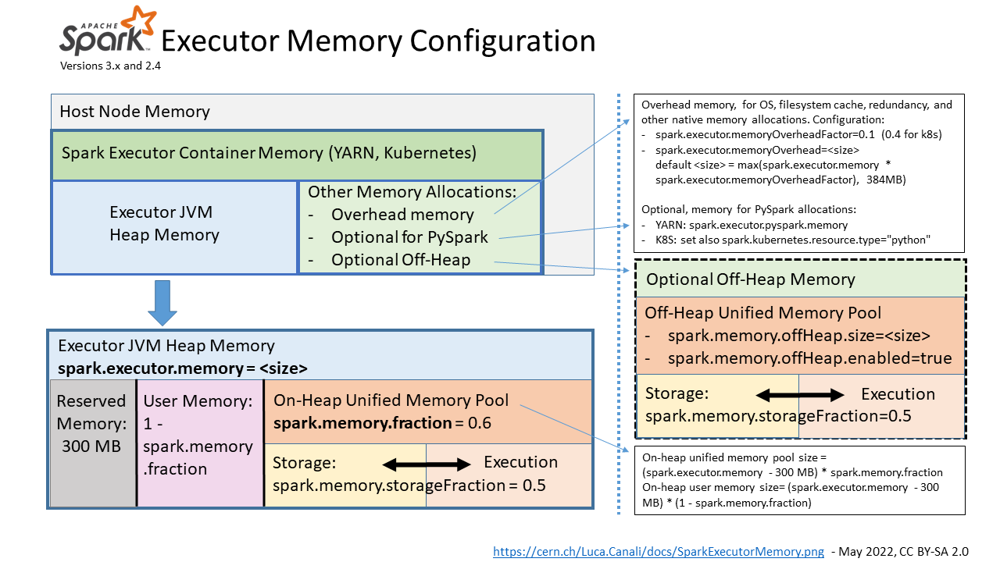
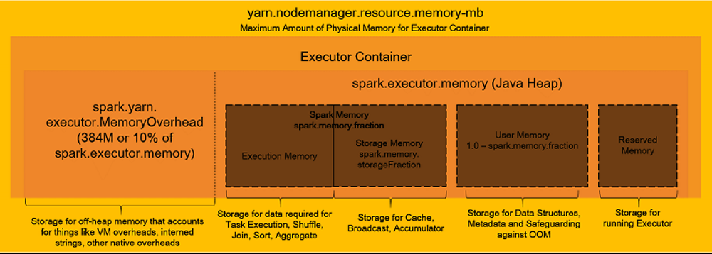

### RECAP: The StartUp Process

- Assume you submitted a spark application in a YARN cluster.
- The YARN RM will allocate an application master (AM) container and start the driver JVM in the container.
- The driver will start with some memory allocated based on what is requested.
- Taking account of the configs for the executor container, the driver requests for the executor containers from the YARN.
  - Config includes memory for the ezecutor container.
- The YARN RM allocates a bunch of executor containers.

### Considerations

- Since containers run on worker node in the YARN cluster, the amount of memory that can be allocated to the container is bound by the available memory on the worker node
- Before ask memory for the driver or executor memory, check with your cluster admin for the maximum allowed value.
- If you are using YARN RM, you should look for the following configurations.
- `yarn.scheduler.maximum-allocation-mb`
- `yarn.nodemanager.resource.memory-mb`

### Config Available

#### Driver Memory Allocation

- `spark.driver.memory`
  - Your Spark driver only uses the JVM heap.
  - The YARN RM will allocate memory as specified
- `spark.driver.memoryOverhead`
  - The overhead memory is used by the container process or any other non JVM process within the container.
  - Default value of spark.driver.memoryOverhead = 0.10
  - The YARN RM will allocate 10% of your requested memory or 384 MB, whatever is higher for container overhead.
- Total memory is the sum of the driver memory and its overhead
- Once allocated,
  - Spark driver JVM cannot use more than the allocated `spark.driver.memory` amount
  - Non-JVM workload in the container cannot exceed the allocated `spark.driver.memoryOverhead` amount
  - The total memory becases the physical memory limit for the Spark driver
  - If any of these limits are violated, you will see an OOM exception.

#### Executor Memory Allocation

- `spark.executor.memory` for JVM Heap Memory
- `spark.executor.memoryOverhead` for overhead memory (Default: 10%)
  - The overhead memory is used for a bunch of things.
  - Used for network buffers, shuffle exchange or reading partition data from remote storage etc.
- `spark.memory.offHeap.size` for Off Heap Memory
- `spark.executor.pyspark.memory` for Pyspark Memory
  - PySpark memory is needed if you are using PySpark
  - It is part of the overhead memory
- Total memory is the sum of the following.
  - Overhead Memory,
  - Heap Memory,
  - Off Heap Memory
  - Pyspark Memory
- Once allocated,
  - Spark executor JVM cannot use more than the allocated `spark.executor.memory` amount
  - Non-JVM workload in the container cannot exceed the allocated `spark.executor.memoryOverhead` amount
  - The total memory becases the physical memory limit for the Spark executor
  - If any of these limits are violated, you will see an OOM exception.
  - If your PySpark consumes more than what can be accommodated in the overhead, you will see an OOM error.
