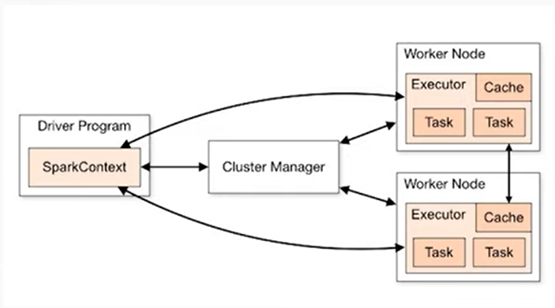

- [Documentation](https://spark.apache.org/docs/2.1.0/api/python/index.html)
- [Tips on using Pyspark](https://www.confessionsofadataguy.com/new-to-pyspark-do-this-not-that/)
- [SparkSession Config Options](https://spark.apache.org/docs/latest/configuration.html#viewing-spark-properties)
- [ETL Best Practices](https://alexioannides.com/2019/07/28/best-practices-for-pyspark-etl-projects/)
- [Pyspark with Delta Lake](https://towardsdatascience.com/hands-on-introduction-to-delta-lake-with-py-spark-b39460a4b1ae)
- [Official Spark Guide](https://spark.apache.org/docs/latest/sql-programming-guide.html)
- [Apache Livy](https://medium.com/itnext/building-real-time-interactions-with-apache-spark-through-apache-livy-53169d87d012)
- [Calling REST_API](https://medium.com/geekculture/how-to-execute-a-rest-api-call-on-apache-spark-the-right-way-in-python-4367f2740e78)


## SparkContext vs SparkSession

link: https://www.sparkcodehub.com/pyspark-sparksession-and-sparkcontext

``` py
from pyspark import SparkContext
from pyspark.sql import SparkSession

sc = SparkContext('local', 'PySparkIntro')
spark = SparkSession.builder.appName('PySparkIntro').getOrCreate()
```



- `SparkContext`
  - is the main entry point for using the Spark Core functionalities. 
  - It connects the cluster manager and coordinates resources across the cluster.
  - meant for fine grained control for low-level RDD operations
- `SparkSession` 
  - is a unified entry point for DataFrame and Dataset API, Structured Streaming, and SQL operations. 
  - It encapsulates SparkContext and several other contexts, such as HiveContext and SQLContext, which were used in previous Spark versions
  - Meant for high level processing tasks

## Resilent Distributed Datasets (RDDs)

```py
# creating a RDD
data = [1, 2, 3, 4, 5]
rdd = sc.paralleize(data)

```

### RDD Transformations
- creates another RDD from an existing RDD
- RDD transformations are lazy. In antoher words, executions are not done immediately. However, their execution plans are recorded
- e.g. map, filter, flatmap

```py
# examples of RDD transformations
squared_rdd = rdd.map(lambda x: x**2)
even_rdd = rdd.filter(lambda x: x % 2 == 0)
```

### RDD Actions
 - triggers the execution of transformations and return results to the driver program
 - eagerly evaluated and initate computation on the rdd
 - e.g. `collect`, `count`, `reduce`

```py
collected_data = squared_rdd.collect()
num_elements = squared_rdd.count()
```

## DataFrame & Dataset APIs

#### Dataset API
- provides a typesafe object-oriented programming interface with the performance optimizations of dataframe AP
- allows us to work with strongly-typed data

```py
from pyspark.sql.types import StructType, StructField, StringType, IntegerType

# defining a schema to specified the column names and data type
schema = StructType([
    StructField('Name', StringType(), True),
    StructField('Age', IntegerType(), True),
    StructField('Salary', IntegerType(), True)
])

# data values
data = [
    ('Alice', 28, 45000),
    ('Bob', 36, 60000),
    ('Cathy', 23, 35000)
]

df = spark.createDataFrame(data, schema)
df = df.alias('employees')
df.show()
```
<br>

#### DataFrame API

- provides a higher-level, more structured way to work with data
- makes working in pyspark more intuitive and efficient

```py
data_file = 'path/to/data.csv'
df = spark.read.csv(data_file, header = True, inferSchema = True)
```

### Working with semi-structured data

```py
# for reading json data
json_data_file = 'path/to/data.json'
df = spark.read.json(json_data_file)

# for reading XML data
xml_data_file = 'path/to.data.xml'
df = spark.read.format('xml').option('rowTag', 'employee').load(xml_data_file)

```

## Data Cleaning / Preprocessing

``` py

# dealing with missing values
data_with_missing = [
    ('Alice', 28, 45000),
    ('Bob', None, 60000),
    ('Cathy', 23, None)
]
df_missing = spark.createDataFrame(data_with_missing, ['Nmae', 'Age', 'Salary'])
mean_age = df_missing.select('Age').agg('Age':'avg')).collect()[0][0]
df_cleaned = df_missing.na.fill(mean_age, subset=['Age'])
df_cleaned.show()


# feature scaling
from pyspark.ml.feature import MinMaxScaler, StandardScaler
from pyspark.ml.feature import VectorAssembler

df = spark.createDataFrame(data, ['Name', 'Age', 'Salary'])
assembler = VectorAssembler(inputCols = ['Age'. 'Salary'], outputCol = 'features')
# combines the row values into an array.
data_for_scaling = assembler.transform(df)
data_for_scaling.show()

scaler_min_max = MinMaxScaler(inputCol = 'features', outputCol = 'scaled_features')
df_min_max = scaler_min_max.fit(data_for_scaling).transform(data_for_scaling)
df_min_max.show()

scaler_std = StandardScaler(inputCol = 'features', outputCol = 'scaled_features', withStd=True, withMean= True)
df_std = scaler_std.fit(data_for_scaling).transform(data_for_scaling)
df_std.show()

```

## Pyspark for Exploratory Data Analysis

```py

data = [
    ('Alice', 28, 45000),
    ('Bob', 36, 60000),
    ('Cathy', 23, 35000)
]
df = spark.createDataFrame(data, ['Name', 'Age', 'Salary'])


# =================Summary Stats=================
from pyspark.sql.functions import mean, stddev

summary_stats = df.describe(['Age','Salary'])
summary_stats.show()


# ===================Data Viz=============
import matplotlib as plt
import pandas as pd

# Converting to pandas dataframe
pd_df = df.toPandas()

# Creating a scatter plot
plt.scatter(pd_df['Age'], pd_df['Salary'])
plt.xlabel('Age')
plt.ylabel('Salary')
plt.title('Age vs Salary')
plt.show()

plt.hist(pd_df['Age'], bins = 10, edgecolor= 'black')
plt.xlabel('Age')
plt.ylabel('Frequency')
plt.title('Age Distribution')
plt.show()


# =================== Correlation Analysis =============
corr_matrix = df.stat.corr('Age', 'Salary')
print(f'Correlation between Age and Salary: {corr_matrix})

```

## Data Transformation

```py
from pyspark.sql.functions import col

df_transformed = df.withColumn('increasedSalary', col['Salary'] * 1.1)
df_transformed.show()

# String manipulation
from pyspark.sql.function import concat, lit

df_transformed = df.withColumn('ModifiedName', concat(col['Name'], lit('-Employee')))
df_transformed.show()

# Filter data
df_filtered = df.filter(col['Age'] > 25)
df_filtered.show()

# Aggregating Data
from pyspark.sql.functions import avg
avg_salary = df.agg(avg(col['Salary'])).collect()[0][0]
print(f'Average Salary: {avg_salary}')

# Group By
from pyspark.sql.function import avg, max

grouped_data = df.groupBy('Age').agg(avg('Salary'), max('Salary'))
grouped_data.show()


# Window functions
from pyspark.sql.functions import Window
from pyspark,sql.functions import sum

window_spec = Window.orderBy('Age')
df_with_cumsum = df.withColumn('CumulativeSalary', sum('Salary').over(window_spec))
df_with_cumsum.show()

```

## User Defined Functions

```py
def add_prefix(name):
    return 'Mr.' + name

from pysparl.sql.functions import udf
from pyspark.sql.types import StringType

# register udf, specifying return type as string
add_prefix_udf = udf(add_prefix, StringType())

# apply udf
df_with_prefix = df.withColumn('PrefixedName', add_prefix_udf('Name'))
df_with_prefix.show()


def calculate_total_income(age, salary):
    return age * salary

from pyspark.sql.types import IntegerType
calculate_total_income_udf = udf(calculate_total_income, IntegerType())
df_with_total_income = df.withColumn('Total_Income', calculate_total_income_udf('Age', 'Salary'))
df_with_total_income.show()
```

## Machine Learning

``` py

spark = SparkSession.builder.appName('SupervisedLearning').getOrCreate()
data = [...]

from pyspark.sql.types import FloatType

schema = StructType([
    StructField('Sqft', IntegerType(), True),
    StructField('Bedrooms', IntegerType(), True),
    StructField('Bathrooms', IntegerType(), True),
    StructField('Price', IntegerType(), True)
])
df = spark.createDataFrame(data, schema)
df.show()

# CLASSIFICATION WITH LOGISTIC REGRESSION ==========================================

from pyspark.ml.feature import VectorAssembler
from pyspark.ml.classification import LogisticRegression
from pyspark.ml import Pipeline

feature_columns = ['Sqft', 'Bedrooms', 'Bathrooms']
assembler = VectorAssembler(inputCols = feature_columns, outputCols = 'features')
df_assembled - assembler.transform(df)

# train test split
train_data, test_data = df_assembled = randomSplit(0.8, 0.2)
lr = LogisticRegression(featuresCol = 'features', labelCol = 'Price')
# creating model
model = lr.fit(train_data)
# predict using model
predictions = model.transform(test_data)
predictions.select('features', 'Price', 'predictions').show()

# REGRESSION WITH LINEAR REGRESSION ==========================================

from pyspark.ml.regression import LinearRegression

lr = LinearRegression(featuresCol = 'features', labelCol = 'Price')

model = lr.fit(train_data)
predictions = model.transform(test_data)
predictions.select('features', 'Price', 'predictions').show()

```

### Unsupervised Learning

```py

data = [...]
schema = StructType([
    StructField('CustomerID', StringType(), True),
    StructField('ElectronicsSpend', IntegerType(), True),
    StructField('FashionSpend', IntegerType(), True),
    StructField('GrocerySpend', IntegerType(), True)
])
df = spark.createDataFrame(data, schema)

# K-MEANS CLUSTERING

from pyspark.ml.clustering import KMeans

feature_columns = ['ElectronicsSpend', 'FashionSpend', 'GrocerySpend']
assembler = VectorAssembler(inputCols = feature_columns, outputCols = 'features')
df_assembled - assembler.transform(df)

kmeans = KMeans(featuresCol = 'features', k = 3)
model = kmeans.fit(train_data)
predictions = model.transform(test_data)
predictions.select('CustomerID', 'features', 'predictions').show()


# PRINCIPAL COMPONENT ANALYSIS
from pyspark.ml.feature import PCA
pca = PCA(k=2, inputCol = 'features', outputCol = 'pca_features')
nodel = pca.fit(df_assembled)
df_pca = model.transform(df_assembled)
df_pca.select('CustomerID', 'pca_features').show(truncate=False)


```
