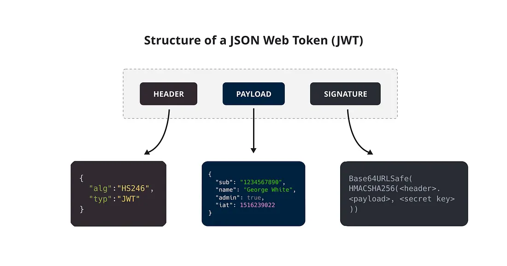
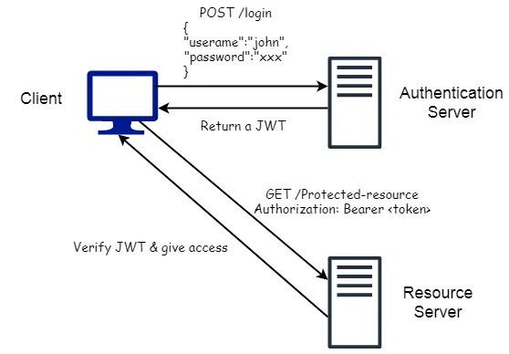
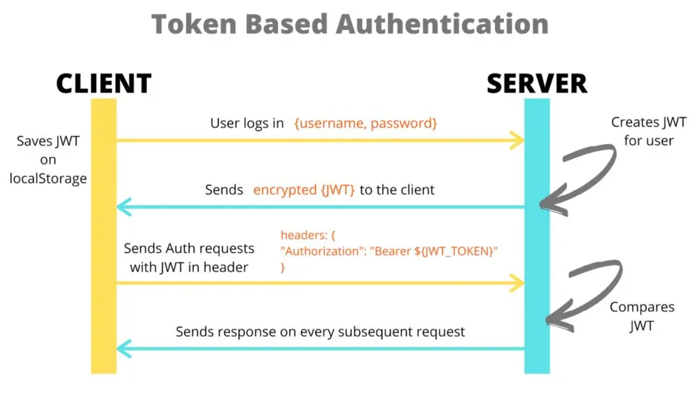

## JWT

### What is JWT

-   A JSON Web Token (JWT), pronounced ‘jot’, is an open standard (RFC 7519) for securely transmitting information between entities as a JSON object.
-   Compact and secure way of exchanging information over the network.
-   It is a signed token and not an encrypted one.
    -   Digitally signed using secret or public/private key pair using RSA or ECDSA.
    -   Can verify the integrity of the claims contained within it but cannot hide that information
    -   Not advisable to put any sensitive information within the token.
-   JWTs are primarily used to authenticate users, authorize access to certain resources, and exchange information securely.

### The Problem

-   HTTP is a stateless protocol i.e. a new request does not remember anything about the previous one. Hence, the need to login and authenticate yourself for each request
-   The solution is the use of a session i.e. an object stored on the server that helps the user to stay logged in or to save any reference to their account.

#### The process flow using sessions

1. User submits a username and a password that are authenticated by the server.
2. If the authentication is successful a session ID is generated for the respective client.
3. The generated session ID is returned to the client and is stored on the server-side as well.
4. the client now just needs to send its session ID along with the request to authenticate itself and retrieve necessary information.
5. The server will then check if the session ID is valid or not.
    - If the session is still valid, it will respond with the requested webpage/data.
    - Else the server will respond with an error message stating that the request made is unauthorized.

#### Problems with Session-based Authentication

1. Scalability

    - The sessions need to be stored on the server, either in memory or in a database.
    - In the current API era, a server can receive a large number of requests, and hence the server needs to be scaled up.
    - Adding new resources can increase the complexity of the infrastructure as well.

1. Session Management

    - The server needs to manage the sessions by keeping track of all the active, inactive (expired, invalidated) sessions.
    - The expired or invalidated sessions need to be removed from the memory.

1. Performance
    - For every request, the server needs to perform a lookup into the memory to check if the provided session object is valid or not.
    - This back and forth can mark down the server.

### The better and effective solution

-   When you send your credentials to the server, the server will return a JSON Web Token.
-   With the JWT, we have unlimited access to resources on the server.
-   The JWT token contains claims like expiration date/time that can be used to check its validity.

### Structure of JSON Web Token



-   A JSON Web Token is nothing but a long encoded text string which is made up of three parts separated by a period.
-   These parts are:
    -   Header
    -   Payload
    -   Signature
-   A typical JWT looks like the following: `header.payload.signature`

#### Header

-   The header consists of two parts:
    -   token type
    -   signing algorithm i.e. `HMAC SHA256` or `RSA`.
-   The token type helps to interpret the token and in this case it’s JWT.
    ```json
    {
        "typ": "JWT",
        "alg": "HS256"
    }
    ```
-   This header is then encoded into base64 to form the first part of the JWT.

#### Payload

-   The payload contain claims which are statements about the user or other data.
    ```json
    # An example of payload:
    {
    "sub": "user123",
    "name": "John",
    "role": "developer",
    "exp": "1606595460",
    }
    ```
-   The payload is then Base64Url encoded to get the second part of the JWT.
-   There are three types of claims: registered, public, and private claims.

##### Registered Claims:

-   Predefined claims which can be used for increasing the security.
-   Not mandatory but recommended.
-   Some of these claims are:
    -   `iss` (Issuer): the issuer of the token.
    -   `sub` (Subject): the subject of the JWT.
    -   `aud` (Audience): the recipients of the JWT
    -   `exp` (Expiration Time): the expiration time on/after which the JWT must not be valid.
        -   Value must be a number containing a NumericDate value and the current date/time must be before the expiration date/time.
    -   `nbf` (Not Before): The time before which the JWT is not be accepted for processing.
        -   The current date/time must be >= not-before date/time
    -   `iat` (Issued At): the time the JWT was issued.
        -   Can be used to determine the age of the JWT.
    -   `jti` (JWT ID): Unique ID for the JWT.
        -   A case-sensitive string
        -   Assigned such that the probability of duplication is negligible.
        -   Used to prevent the JWT from being replayed.

##### Public Claims:

-   Defined by group of people using the JWTs.
-   Whenever any new claim name is defined it is necessary that it should be registered in the IANA “JSON Web Token Registry” or it should contain a collision resistant name to avoid collisions.

##### Private Claims

-   Custom claims defined and created by two parties in order to exchange information between them.

#### Signature

-   Most important part of JWT which helps to verify that the information within the token has not been tampered with.
-   Also used to verify that the sender of the JWT is who it says it is.
-   To create the signature, you need three things:
    -   an encoded header,
    -   an encoded payload
    -   a secret.

1. First, you will take the encoded header and encoded payload and concatenate them with a period separator to form a string. This concatenated string will be hashed using an algorithm specified in the header and a secret key to calculate the signature.

```sh
# Consider the following example where we will be using the RSA algorithm to generate a signature.
RSA(
base64UrlEncode(header) + "." + base64UrlEncode(payload), secret
)
```

Now let’s put all three parts together to get a JSON Web Token.

We have three Base64-URL strings, which can be concatenated with a period between each. The JWT is very compact and can be easily exchanged in HTML and HTTP environments.

-   The header and payload can be easily decoded (since it’s just base64) to retrieve information contained within the token.
-   The signature can be just used to maintain the integrity of the token and not to secure the contained information.
-   Therefore, you should pass any sensitive information in the token and if you want to pass make sure you encrypt the token to secure it.

### How does a JSON Web Token work?




1.  User logs in or attempts to access a protected resource
2.  Server generates a JWT upon successful authentication which is stored by the client usually in local storage or a cookie.
3.  For every subsequent request that requires authentication, the client sends the JWT in the request headers.

    ```py
    # JWT in the Authorization header using the Bearer schema.
    Authorization: Bearer <token>
    ```

4.  The server validates the token by checking the signature and decoding the payload to ensure the user’s authenticity and authorization.
5. If the token is present and is valid the server will allow access to the user.
 

### Advantages of JSON Web Token

#### Stateless
- Since JWTs carry all the necessary information within themselves, the server doesn’t need to maintain session information. 
- This makes JWTs stateless, which reduces server load and simplifies scalability.

#### Compact and Efficient

-   JSON is less verbose than XML and therefore when it is encoded it takes up less space making JWT more compact then SAML.
-   Due to their compact size, JWTs are suitable for transmission over networks and are easily parsed by clients.

#### Security
- JWTs are digitally signed, ensuring data integrity and preventing tampering. Using encryption algorithms enhances the security further.

#### No need of Cookies

-   The token can be stored in the localStorage, indexDB, or some native store. This will provide a protection against CORS and CSRF attacks.

#### Cross-Domain Communication

-   In most programming languages, JSON parsers are popular because they map directly to objects.
-   Contrary, there is no natural document-to-object mapping in XML. This makes it simpler than SAML assertions to operate with JWT.
-   JWTs can be used across different domains or microservices since they don’t rely on cookies or server-side sessions.

#### Best Practices for JWT Implementation
- Secure Storage: Store JWTs in HTTP-only cookies to prevent access from JavaScript, reducing the risk of XSS attacks.
- Token Expiration: Set a reasonable expiration time on JWTs to limit the time window for potential misuse.
- Token Revocation: Have a mechanism to revoke or blacklist compromised tokens to enhance security.
- Use HTTPS: Ensure that all communications between the client and server use HTTPS to prevent eavesdropping and man-in-the-middle attacks.
- Don’t Store Sensitive Data: Avoid storing sensitive data in the JWT payload, as the payload is easily readable once base64-decoded.