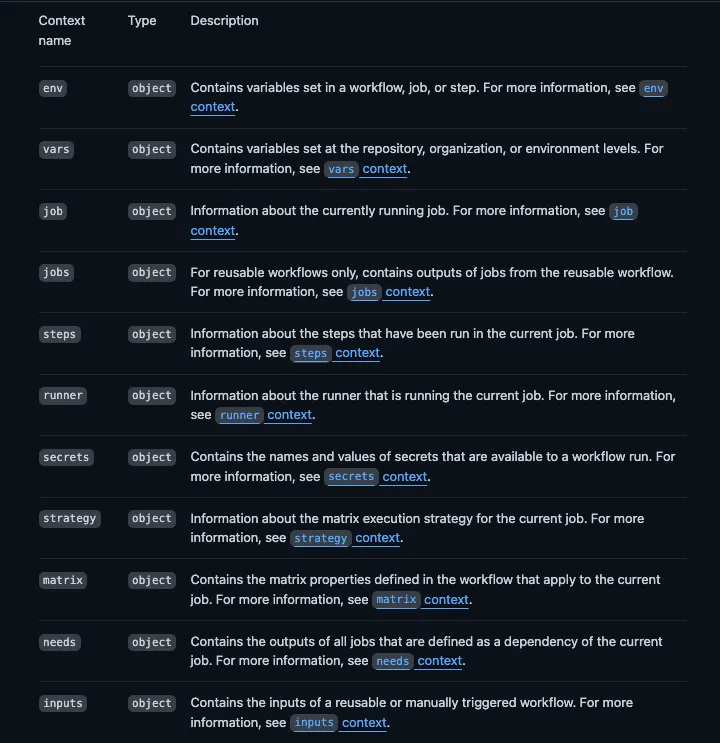
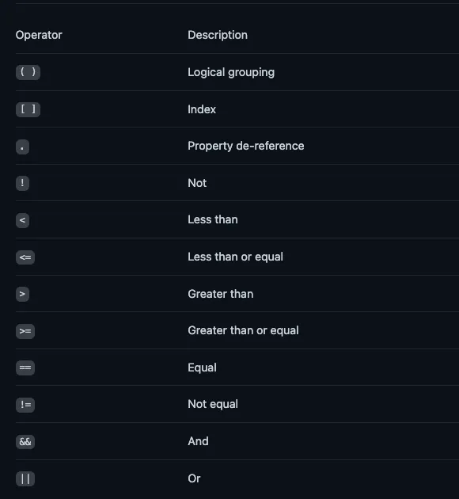

## Context Objects and Expressions

### Context objects

-   In GitHub Actions, a context is a set of pre-defined objects or variables containing relevant information about the environment, events, or other data associated with a workflow run.
-   You can use contexts to access information about steps, workflow runs, jobs, and runner environments.
    
-   Any time you want to access a context from within a workflow file, you need to use a syntax similar to `${{ <context> }}`.
-   The syntax to access a context is simple:

    -   you can either use the github[‘event_name’] index syntax
    -   the github.event_name property dereference syntax.

    ```yaml
    name: Simple Contexts Example
    on: push
    jobs:
    print-info:
        runs-on: ubuntu-latest
        steps:
        - name: Set custom environment variable
            run: echo "CUSTOM_VARIABLE=Hello, World!" >> $GITHUB_ENV
        - name: Print commit author and custom environment variable
            # github.actor provides the username of the person who triggered the push event
            # env.CUSTOM_VARIABLE context refers to the custom environment variable set in the previous step
            run: |
            echo "Commit author: ${{ github.actor }}"
            echo "Custom variable: ${{ env.CUSTOM_VARIABLE }}"
    ```

-   Contexts can be used mostly anywhere in your workflow file.
-   They are often used with expressions to check for specific conditions.
-   The following example uses the `if` statement to validate the github context.
    -   In this case, the job will only run if the result of the expression is approved:
        ```yaml
        if: github.event_name == 'pull_request_review' && github.event.review.state == 'approved'
        ```

### Expressions

-   In Github Actions, Expressions can be used to set variables in a workflow file and access contexts. An expression can also use a combination of literals, functions, contexts, and operators.

#### Literals Expressions

-   Literals are represented by data types such as the following:
    -   boolean: true or false, not case sensitive.
    -   null
    -   number: Any number format that is supported by JSON.
    -   string: Single quotes must be used with strings.

```yaml
env:
    myNull: ${{ null }}
    myBoolean: ${{ false }}
    myIntegerNumber: ${{ 711 }}
    myFloatNumber: ${{ -9.2 }}
    myHexNumber: ${{ 0xff }}
    myExponentialNumber: ${{ -2.99e-2 }}
    myString: Mona the Octocat
    myStringInBraces: ${{ 'It''s open source!' }}
```

#### Operators

-   Operators are used within expressions to perform various operations such as arithmetic, comparison, or logical operations.
-   Expressions are wrapped in double curly braces `{{ }}`.
    ```yaml
    name: Less Than or Equal Operator Example
    on: push
    jobs:
    check_number:
    runs-on: ubuntu-latest
    steps: - name: Check if number is less than or equal to limit
    run: |
    result=$((7<= 19 ? "true" : "false"))
    echo "Is 7 less than or equal to 19? Result: ${{ 7 <= 19 }}"
    echo "Is 7 less than or equal to 19? Result (using shell): $result"
    ```
-   Supported operators in GitHub Actions workflow expressions are:
    

#### Functions

-   Functions are predefined or built-in methods that can be used within expressions to perform various operations or manipulate data.
-   Functions can be used within the double curly braces `{{ }}` that denote an expression.
    -   `startsWith` and `endsWith`: startsWith(‘string’), endsWith(‘string’).
    -   `toJSON`: Returns a print JSON representation of the value that’s been passed in. An example is toJSON(value).
-   There are special conditional functions that help override the behaviour whereby the job stop running when a step fails. See [[tools.cicd.automation.github_actions]] for more info.
    -   `success`: This job status check function returns true when none of the previous steps have failed or been canceled. An example is if: ${{ success() }}.
    -   `always`: This job status check function returns true even when canceled. An example is if: ${{ always() }}.
    -   `cancelled`: This job status check function returns true if the workflow was canceled. An example is if: ${{ cancelled() }}.
    -   `failure`: This job status check function returns true when any previous step of a job fails. An example is if: ${{ failure() }}.
    For example:
    ``` yaml
    # This workflow sets a JSON matrix in one job, and 
    # passes it to the next job using an output and fromJSON.
    name: build
    on: push
    jobs:
    job1:
    runs-on: ubuntu-latest
    outputs:
    matrix: ${{ steps.set-matrix.outputs.matrix }}
    steps: - id: set-matrix
    run: echo "matrix={\"include\":[{\"project\":\"foo\",\"config\":\"Debug\"},{\"project\":\"bar\",\"config\":\"Release\"}]}" >> $GITHUB_OUTPUT
    job2:
    needs: job1
    runs-on: ubuntu-latest
    strategy:
    matrix: ${{ fromJSON(needs.job1.outputs.matrix) }}
    steps: - run: build
    ```

---

#### Getting Github context info

```yaml
name: Output information
on: workflow_dispatch
jobs:
    info:
        runs-on: ubuntu-latest
        steps:
            - name: Output Github Context
                run: echo "${{ toJSON(github) }}"
```
