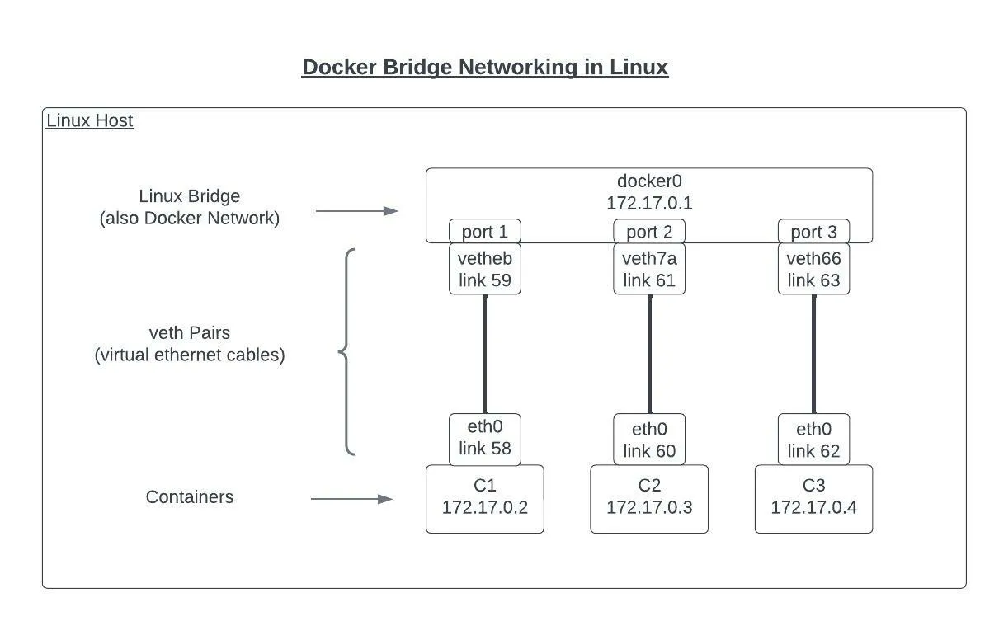
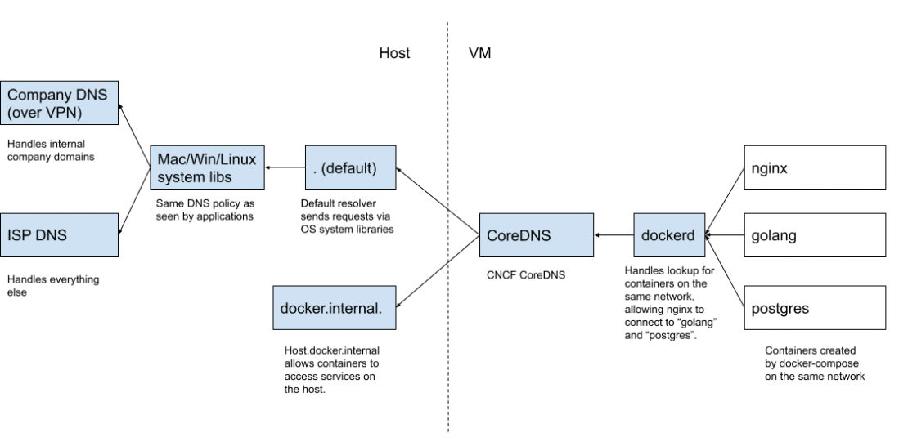

<https://docs.docker.com/network/drivers/bridge/>
<https://docs.docker.com/compose/networking/>
<https://www.baeldung.com/ops/docker-communicating-with-containers-on-same-machine>
https://earthly.dev/blog/docker-networking/

## Docker Network

> ### Terminlogy
>
> -   IP address is the unique address assigned to a device, to identify that device on the internet or a local network.
> -   Network Address Translation (NAT) translates a set of IP addresses into another set of IP address for e.g. converts a private IP address into a public IP address

### The Problem

-   Multi-Container apps are quite common, especially if you're working on "real applications".
-   Often, some of these Containers need to communicate though:
    -   with the world wide web: possible by default
    -   with the host machine: via `host.docker.internal`
    -   with each other
        -   w/o shared network: via IP Address
        -   shared network: via container name

### The container

-   By default, each container is created in its own network namespace, with its own network stack and interfaces that is separate from the host.
-   Each container even has its own IP address.
    -   The IP address assigned to the container’s virtual network interface is typically from a private IP range, such as `172.17.0.0/16` or `10.0.0.0/8`.
    -   This IP address is local to the host’s private network and is only reachable within the host.
-   This means is that each container cannot communicate with anything else. No other containers, processes, and not even the host itself.
-   However, the isolation also allows you to use the same port on the host for different services running in different containers. This is useful when you want to run multiple instances of the same service on a single host, each with its own IP address and port.
-   This isolation helps in providing security boundaries between different containers, as they can't see or interact with each other's network stack unless explicitly configured to do so.

### The network bridge

-   To allow containers on the same host to communicate with other containers, Docker has multiple networking options.the network bridge being the most common
-   A network bridge is a program that connects multiple networks into a larger network.
-   Since each container has its own network namespace, it makes sense to use a bridge to communicate.

    

-   When you start the Docker daemon on a host server, a network bridge is created with the name, `docker0` or `bridge`.
-   When you run a container, a virtual ethernet device (veth) is created on the host system.
-   One end of the veth is connected to the container, and the other is connected to a network bridge on the host.
-   The network bridge acts as a virtual switch, forwarding traffic between the containers.
    -   Containers that are a part of the same network bridge can communicate with one another without issue using their private IP addresses. No need to mess with ports.
-   Best practice is to create a new virtual network for each app:
    -   network "my_web_app" for mysql and php/apache containers
    -   network "my_api" for mongo and nodejs containers

### Exposing Containers to the Internet

-   The nice thing about having each container in its own network namespace is that they don’t have conflicting ports. You can have all your containers listening on port 80.
-   The bad part, however, is that since the container’s network is not connected to the host’s network, the container cannot be reached by the host’s network and vice versa.
-   The easiest way for a container to access the internet is via the host’s network. So, to give your container internet access, you need to expose it to the host.


-   When you expose a container, you tell the host to forward traffic to the container using a port map that connects the container’s port to a unique public port on the host.

    ```bash
    # route network traffic from host port 8080 to container port 80
    docker run my-container -p 8080:80
    ```

-   Routing network traffic is usually done via iptables rules that forward traffic from the host to the container.
-   Some examples of iptable rules include
    -   `DNAT`
        -   This rule changes the destination IP address of a network packet
        -   Redirects traffic destined for the host IP to the container’s IP.
        -   It will redirect all incoming traffic on port 8080 to the container’s IP address (172.17.0.2) on port 80.
    -   `MASQUERADE`
        -   This rule changes the source IP address of a packet to the host’s IP address.
        -   Used when the container needs to initiate outbound connections.
        -   It will change the source IP of packets originating from the container’s IP range (172.17.0.0/16) to the host’s IP, allowing the container to initiate outbound connections.
    -   `ACCEPT`
        -   This rule allows incoming traffic to reach the container on a specific port.
        -   It will allow incoming traffic to the container’s IP address (172.17.0.2) on port 80.

### Using DNS: Managing Changing IP Addresses

-   Article: <https://www.docker.com/blog/how-docker-desktop-networking-works-under-the-hood/>
    

-   Docker has a built-in DNS service.
-   DNS maps the IP address to aliases like, for example, the container name.
-   This makes containers always reachable even though the IP address changes over time.

#### The bridge network


-   Suppose these are the services we are going to run

    ```yaml
    services:
    alpine-app-1:
        container_name: alpine-app-1
        image: alpine-app-1
        build:
            context: ..
            dockerfile: Dockerfile
        tty: true

    alpine-app-2:
        container_name: alpine-app-2
        image: alpine-app-2
        build:
            context: ..
            dockerfile: Dockerfile
        tty: true
    ```

-   Once the containers run, they are assigned to the same network.
-   The Docker network assigns available IPs. In this case, 172.25.0.2 and 172.25.0.3.

    ```bash
      $ docker network inspect dns_default
      ...
      "Containers": {
          "577c6ac4aae4f1e915148ebdc04df9ca997bc919d954ec41334b4a9b14115528": {
              "Name": "alpine-app-1",
              "EndpointID": "247d49a3ccd1590c740b2f4dfc438567219d5edcb6b7d9c1c0ef88c638dba371",
              "MacAddress": "02:42:ac:19:00:03",
              "IPv4Address": "172.25.0.2/16",
              "IPv6Address": ""
          },
          "e16023ac252d73977567a6fb17ce3936413955e135812e9a866d84a3a7a06ef8": {
              "Name": "alpine-app-2",
              "EndpointID": "8bd4907e4fb85e41e2e854bb7c132c31d5ef02a8e7bba3b95065b9c10ec8cbfb",
              "MacAddress": "02:42:ac:19:00:02",
              "IPv4Address": "172.25.0.3/16",
              "IPv6Address": ""
          }
      }
      ...
    ```

-   Docker automatically creates a DNS record for that container, using the container name as the hostname and the IP address of the container as the record's value
-   This enables other containers on the same network to access each other by name, rather than needing to know the IP address of the target container.

    ```bash
      docker inspect --format='{{json .NetworkSettings.Networks}}' alpine-app-2 | jq .
      ...
      {
          "dns_default": {
              "IPAMConfig": null,
              "Links": null,
              "Aliases": [
              "alpine-app-2",
              "alpine-app-2",
              "577c6ac4aae4"
              ],
              "NetworkID": "4a10961e55733500114537a9f8b454d256443b8fd50f8a01ef9ee1208c94dac9",
              "EndpointID": "247d49a3ccd1590c740b2f4dfc438567219d5edcb6b7d9c1c0ef88c638dba371",
              "Gateway": "172.25.0.1",
              "IPAddress": "172.25.0.3",
              "IPPrefixLen": 16,
              "IPv6Gateway": "",
              "GlobalIPv6Address": "",
              "GlobalIPv6PrefixLen": 0,
              "MacAddress": "02:42:ac:19:00:03",
              "DriverOpts": null
          }
      }
      ...
    ```

#### `host.docker.internal`

---

-   Docker creates its isolated network where the containers are running in
-   Apps deployed in same docker network can talk to each other using the container name
-   Apps outside of the docker network will need to connect using local host and the port

## Port: Container vs Host

-   Multiple containers can run on your host machine
-   Host machine has only certain ports available for application
-   Conflict when same port on host machine
-   Will need to assign a free port with the container
