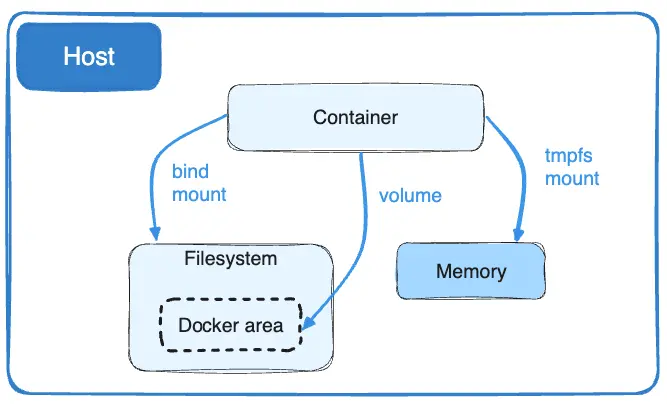
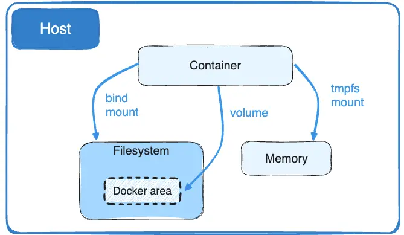
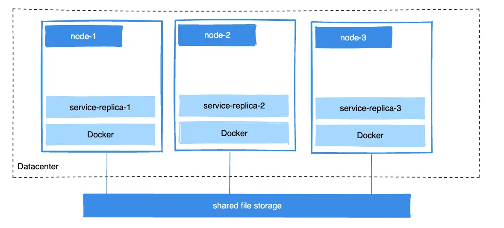

## Volumes

### What is Docker Volumes

-   Docker volume persists container data outside its file system.
-   It allows for sharing data between containers and is useful for storing application, database, and log files

### Why Docker Volume?



-   Docker containers are designed to be ephemeral (temporary)
-   By default, when a container is deleted, all its data will be lost.
-   However, in some use cases, the data processed by the container needs to be persisted.
-   To preserve the data even after deleting the container, we use volumes.
-   Docker provides us two solutions:
    -   Volumes: Make special location outside of container UFS
    -   Bind Mounts: sharing or mounting a host directory, or file, into a container.

#### Data Volumes


-   stored in the host filesystem that is managed by Docker.
-   When a new container is created from image, a new volume location is created and assigned to a specified directory within the container
-   Data stored in this location will outlive the container until it's manually deleted
-   Removing a container does not remove the volumes
-   `docker image inspect` to check if a data volume was assigned in the image, `docker container inspect` for containers
-   There are two types:
    -   Anonymous Volumes
    -   Named Volumes

##### Anonymous Volume

```bash
docker run -d -p 80:80 -v /var/log/nginx nginx:latest
```

-   Anonymous volumes are similar to named volumes in that they are not given a name.
-   When a container is started without specifying a volume name or bind mount, they are created automatically.

##### Named Volume

```bash
docker volume create my_data
docker run -d -p 80:80 -v my_data:/var/log/nginx nginx:latest
```

-   created and managed by Docker
-   provide a convenient way to persist data across container restarts and removals.
-   Named volumes are more portable than bind mounts and can be easily shared between containers i.e. mounting the same volume to different containers

#### Bind Mounts



```bash
docker run -d -p 80:80 -v /home/user/my_project:/app nginx:latest
```

-   To provide data persistence, the file system on the host is plugged into the container's file system
-   Bind mounts map a directory or file on the host system to a directory or file within the container.
-   This means that data written on the container's file system is replicated on the host's file directory
-   This volume type is useful for transferring configuration files or source code between the host and container.

### Creating and Managing Docker Volumes:

#### Dockerfile:

-   `VOLUME` command in the dockerfile can also be used to create data volumes

#### Docker CLI:

-   The Docker command-line interface can be used to create and manage volumes (CLI).
-   The commands below demonstrate common tasks:

    -   Create a named volume: `docker volume create my_volume`
    -   List volumes: `docker volume ls`
    -   Inspect a volume: `docker volume inspect my_volume`
    -   Remove a volume: `docker volume rm my_volume`

-   Unused volumes eat up disk space and cause clutter. To remove all unused volumes, use the `docker volume prune` command.

#### Docker Compose:

-   In a `docker-compose.yml` file, you can create and manage volumes, making it simple to define your application’s entire infrastructure in a single file.

```yaml
version: "3"
services:
    web:
        image: my_web_app:latest
        volumes: # bind mount for a web application
            - .:/app
    db:
        image: postgres:latest
        volumes:
            - db_data:/var/lib/postgresql/data

volumes:
    db_data: # named volume db data for a PostgreSQL container
```

### Backup and Restore Strategies for Docker Volumes:

-   Backups should be performed on a regular basis to ensure data integrity and recovery in the event of a disaster.
-   To backup and restore Docker volumes, you can use a variety of methods, such as creating a.sql file or a.tar.gz archive.

-   Backup
    ```bash
    docker run --rm -v db_data:/volume -v $(pwd):/backup alpine tar cvf /backup/db_data_backup.tar /volume
    ```
-   Restore
    ```bash
    docker run --rm -v db_data:/volume -v $(pwd):/backup alpine tar xvf /backup/db_data_backup.tar -C /volume
    ```

### Sharing Data between Containers:



-   Docker volumes make data sharing between containers simple.
    -   for e.g. When building fault-tolerant applications, you may need to configure multiple replicas of the same service to have access to the same files.
-   To share configuration files, application data, or other resources between multiple containers, use named volumes or bind mounts.

```bash
# sharing a named volume app data between two containers
# so that they can both access the same data.

docker volume create app_data
docker run -d --name container1 -v app_data:/shared_data my_image:latest
docker run -d --name container2 --volumes-from container1 my_image:latest
```

### Best Practices for Working with Docker Volumes:

##### Use named volumes:

-   Easier to manage and reference.
-   Simple to backup, restore, and share between containers.

##### Separate data and containers:

-   Keep the data in your app in volumes and the containers stateless.
-   This allows you to update, replace, or scale containers while maintaining data integrity.

##### Use Docker Compose:

-   Docker Compose makes it easier to manage containers, volumes, and networks.
-   For easy management and version control, define your volumes in a `docker-compose.yml` file.

##### Use the correct volume driver:

-   Docker supports a variety of volume drivers, including local, nfs, and third-party plugins.
-   Select the volume driver that best meets your needs and performance expectations.

##### Backup volumes on a regular basis:

-   To avoid data loss, backup your volumes on a regular basis.
-   To ensure that you always have a recent backup of your data, use automatic backup tools or scripts.

##### Remove unused volumes:

-   Use the `docker volume prune` to remove unused volumes regularly to free up disk space.

##### Use .dockerignore:

-   To exclude unnecessary files and directories from your Docker context, use a `.dockerignore` file.
-   This helps to reduce image size and improve build times.

##### Protect your volumes:

-   Set appropriate permissions and ownership to restrict access to your volumes.
-   When mounting a volume, use the:ro flag to make it read-only, reducing the risk of data modification by accident.

### Automating the backup process

-   Shell scripts, cron jobs, and Docker commands can be used to automate the backup process for Docker volumes.
-   For example, we’ll write a shell script that backs up a Docker volume automatically and schedule it with a cron job.

1. Create a shell script `backup_docker_volume.sh`:

    - This script makes a compressed archive of the volume’s contents using the busybox image.
    - Replace
        - `VOLUME_NAME` with the name of the volume you want to backup and
        - `BACKUP_DIR` with the backup directory you want to use.

    ```bash
    #!/bin/bash

    # Variables
    VOLUME*NAME="db_data"
    BACKUP_DIR="/backups"
    TIMESTAMP=$(date +"%Y%m%d*%H%M%S")
    BACKUP*FILENAME="backup*${VOLUME_NAME}_${TIMESTAMP}.tar.gz"

    # Create the backup directory if it doesn't exist
    mkdir -p "${BACKUP_DIR}"

    # Use Docker to run a temporary container with the volume attached
    # The container will create a compressed archive of the volume's contents

    docker run --rm \
    -v "${VOLUME_NAME}:/volume_data" \
    -v "${BACKUP_DIR}:/backup" \
    busybox tar -czf "/backup/${BACKUP_FILENAME}" -C "/volume_data" .

    echo "Backup of ${VOLUME_NAME} created: ${BACKUP_DIR}/${BACKUP_FILENAME}"
    ```

2. Make the script executable:

    ```bash
    chmod +x backup_docker_volume.sh
    ```

3. Schedule the script using a cron job:
    ```bash
    crontab -e
    ```
    - Then, to schedule the backup script, add a new line. To run the script every day at 3 a.m., for example, add the following line:
        ```bash
        0 3 \* \* \* /path/to/backup_docker_volume.sh >> /path/to/backup.log 2>&1
        ```
    - Replace `/path/to/backup_docker_volume.sh` with the script’s actual path. The output of the script will be redirected to a log file named `/path/to/backup.log` by this cron job. Replace this path with the location of your desired log file.

-   Save your changes and exit the crontab editor. The backup script will now run on the specified schedule automatically.

-   You can ensure that your data is secure and up to date by automating the backup process for Docker volumes, lowering the risk of data loss and simplifying the overall backup process.

#### How to use the backed up data

-   To use the backed-up data, you must first restore it to a Docker volume from the backup archive.
-   Here’s how to restore data from a backup archive to a Docker volume step by step:

    1. Identify the backup file you want to restore:
        - Find the backup file you want to restore, typically a `.tar.gz` file created by the backup process, such as `backup_db_data_20230101_030000.tar.gz`.
    2. Create a new Docker volume (optional):

        - If you want to restore the data to a new volume or you have removed the original volume, create a new volume using the following command:
            ```bash
            docker volume create new_volume_name
            ```

    3. Restore the data to the Docker volume:

        - Run a temporary container with the target volume and the backup directory mounted, and then extract the contents of the backup archive to the target volume:

            ```bash
            docker run --rm \
            -v new_volume_name:/volume_data \
            -v /path/to/backup_directory:/backup \
            busybox tar -xzf "/backup/backup_db_data_20230101_030000.tar.gz" -C "/volume_data"
            ```

        - Replace new_volume_name with the name of the volume you want to restore the data to, /path/to/backup_directory with the path to the directory containing the backup file, and backup_db_data_20230101_030000.tar.gz with the name of the backup file.

    4. Verify the restored data:

        - You can verify that the data has been restored correctly by running a temporary container and inspecting the contents of the restored volume:

            ```bash
            docker run --rm -it \
            -v new_volume_name:/volume_data \
            busybox ls -l /volume_data
            ```

    5. Use the restored data:

        - Now that you have restored the data to a Docker volume, you can use it by attaching the volume to a new or existing container.
        - Update the docker run or docker-compose.yml file to use the restored volume.

        - If you are using Docker Compose, update the volumes section for the desired service:

            ```yaml
            services:
            db:
            ...
            volumes: - new_volume_name:/var/lib/mysql
            ```

        - After restoring the data, you can start your containers as usual, and they will use the restored data from the backup archive.

### Related Topics

#### Shell Differences for Path Expansion

-   With Docker CLI, you can always use a full file path on any OS
-   but often you'll see me and others use a "parameter expansion" like `$(pwd)` which means "print working directory".
-   Each shell may do this differently:
    -   For PowerShell use: ${pwd}
    -   For cmd.exe "Command Prompt use: %cd%
    -   Linux/macOS bash, sh, zsh, and Windows Docker Toolbox Quickstart Terminal use: $(pwd)
-   Note, if you have spaces in your path, you'll usually need to quote the whole path in the docker command.

#### File Permissions Across Multiple Containers

At some point you'll have file permissions problems with container apps not having the permissions they need. Maybe you want multiple containers to access the same volume(s). Or maybe you're bind-mounting existing files into a container.

Note that the below info is about pure Linux hosts, like production server setups. If you're using Docker Desktop locally, it will translate permissions from your host (macOS & Windows) into the container (Linux) automatically, but when working on pure Linux servers with just dockerd, no translation is made.

##### How file permissions work across multiple containers accessing the same volume or bind-mount

-   File ownership between containers and the host are just numbers.
-   They stay consistent no matter how you run them.
-   Sometimes you see friendly user names in commands like ls but those are just name-to-number aliases that you'll see in `/etc/passwd` and `/etc/group`.
-   Your host has those files, and usually, your containers will have their own. They are usually different. These files are really just for humans to see friendly names.
-   The Linux Kernel only cares about IDs, which are attached to each file and directory in the file system itself, and those IDs are the same no matter which process accesses them.

-   When a container is just accessing its own files, this isn't usually an issue.
-   But for multiple containers accessing the same volume or bind-mount, problems can arise in two ways:

1. Problem one: The `/etc/passwd` is different across containers. Creating a named user in one container and running as that user may use ID 700, but that same name in another container with a different `/etc/passwd` may use a different ID for that same username. That's why I only care about IDs when trying to sync up permissions. You'll see this confusion if you're running a container on a Linux VM and it had a volume or bind-mount. If you do an ls on those files from the host, it may show them owned by ubuntu or node or systemd, etc. Then if you run ls inside the container, it may show a different friendly username. The IDs are the same in both cases, but the host will have a different passwd file than the container, and show you different friendly names. Different names are fine, because it's only ID that counts. Two processes trying to access the same file must have a matching user ID or group ID.

2. Problem two: Your two containers are running as different users. Maybe the user/group IDs and/or the USER statement in your Dockerfiles are different, and the two containers are technically running under different IDs. Different apps will end up running as different IDs. For example, the node base image creates a user called node with ID of 1000, but the NGINX image creates an nginx user as ID 101. Also, some apps spin-off sub-processes as different users. NGINX starts its main process (PID 1) as root (ID 0) but spawns sub-processes as the nginx user (ID 101), which keeps it more secure.

-   So for troubleshooting, this is what I do:

    -   Use the command ps aux in each container to see a list of processes and usernames. The process needs a matching user ID or group ID to access the files in question.

    -   Find the UID/GID in each containers `/etc/passwd` and `/etc/group` to translate names to numbers. You'll likely find there a miss-match, where one containers process originally wrote the files with its UID/GID and the other containers process is running as a different UID/GID.

    -   Figure out a way to ensure both containers are running with either a matching user ID or group ID. This is often easier to manage in your own custom app (when using a language base image like python or node) rather than trying to change a 3rd party app's container (like nginx or postgres)... but it all depends. This may mean creating a new user in one Dockerfile and setting the startup user with USER. (see USER docs) The node default image has a good example of the commands for creating a user and group with hard-coded IDs:

```
RUN groupadd --gid 1000 node \\
        && useradd --uid 1000 --gid node --shell /bin/bash --create-home node
USER 1000:1000
```

-   NOTE: When setting a Dockerfile's USER, use numbers, which work better in Kubernetes than using names.
-   NOTE 2: If ps doesn't work in your container, you may need to install it. In debian-based images with apt, you can add it with apt-get update && apt-get install procps


### Docker Compose Watch