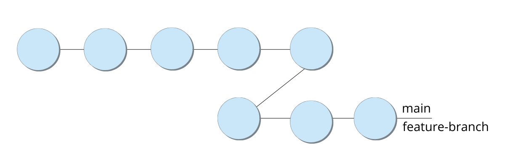
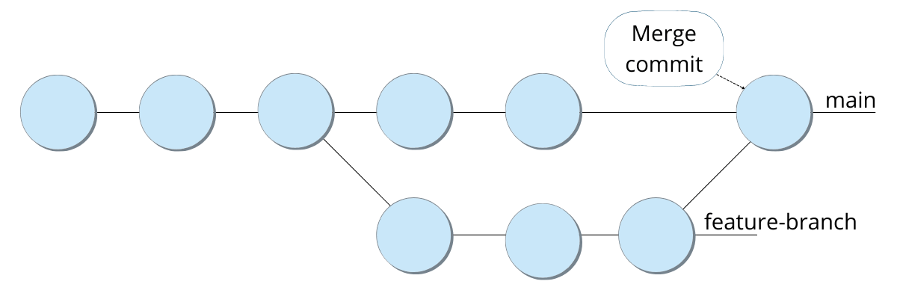
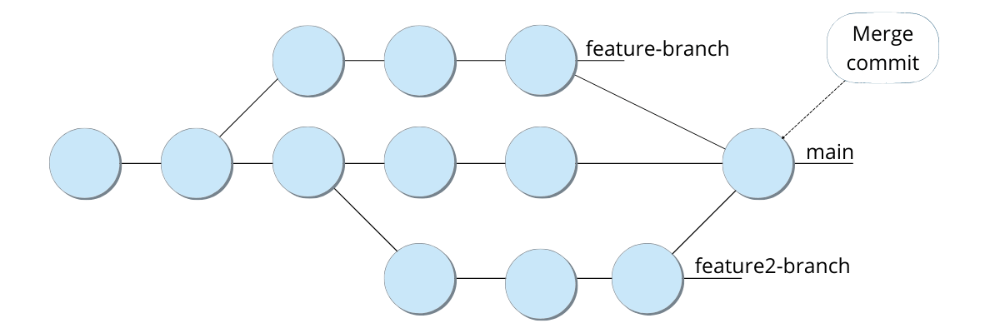

### Combining Branches with `git merge`

-   With this arrangement, work can continue independently.
    -   A master branch is the main project branch which contains the latest deployed statues of your website,
    -   A feature branch is where new features are worked on and developed
        -   Created based on the master branch, and so hold all previous commits
        -   Once the feature is done, it's added to the master branch.
-   Once developers have completed work on project features and pull requests approved, it’s time to merge those requests into the master branch.
-   When doing so, Git has to find a base commit shared by two or more commits and then connect the two branches.
-   Git has several ways to go about this, known as merge strategies.
-   Once a common base commit is found, Git combines the base commits shared by the commit pointers into a new merge commit. i.e. **a commit is added to the existing history**
-   This merge commit is almost exactly like the regular commits—except that it has two parent commits.

### How Merge Works

- When Git performs a merge, it looks for three commits
  1. common ancestor commit
  2. last commit on branch A
  3. last commit on branch B
- A Fast-Foward Merge: Both Branches share the exact same history
- In a most realistic scenario
  - Most branches move forward differently
  - Here, Git will have to create a new commit containing the difference between the two branches called a merge commit
  -

#### Types of Merge Strategies

##### Explicit merge

-   Explicit merges are considered as the default merge type.
-   It is called explicit because it **creates a new merge commit** changing the history and displaying where the merge was invoked.
-   The merge commit content is also considered as explicit as it displays the parent commits of the merge commit.

##### Implicit merge via rebase or fast-forward merge

-   The implicit merges **do not create a merge commit**.
-   They just **take a number of commits** from the specified branch HEAD and **put them to the top of the target branch**.
-   They are triggered by rebase events or fast forward merges.

##### Squash on merge without explicit merge

-   Squash is another type of implicit merge.
-   A squash merge takes the commits from the target branch and squashes them into one commit which then is applied to the HEAD of the merge base branch.
-   Squash can be executed during an interactive rebase.
-   The commit history of the target branches becomes a squashed branch commit when squashed and merged.

#### Merge Strategies

https://www.geeksforgeeks.org/merge-strategies-in-git/

##### The fast-forward merge

**Main advantage: Fast and clean if there’s a linear path to the target branch.**



-   The fast-forward merge strategy is a type of implicit merge. It’s used quite commonly, thanks to its simplicity.
-   Technically no “merging” happening here i.e. no new commit
-   This merge strategy can be used when there’s a linear path from the tip of the current branch all the way to the target branch.
    -   for e.g. where there is no additional commit in the master branch after creating the feature branch.
-   All it does is move the current branch’s tip up to the target branch’s tip, hence the “fast-forward” moniker.
    -   the fast-forward merge simply moves the HEAD forward to the feature branch's HEAD to commit here, but it does not create a new commit.
    -   both histories are combined since you can reach any of the target branch’s commits through the current branch.
-   `--no-ff`

##### Recursive merge

**Main advantage: Simple and easy for two-way merges.**



-   Recursive merges are the default for any merges that aren’t fast-forward merges (covered later).
-   Typically, the recursive merge occurs if you have changes in the feature branch, and if you also have new commits in your master branch.
-   These types of merges operate on two different heads using a three-way merge algorithm.
    -   Why three-way?
        -   Both branch tips (main, feature)
        -   Their common ancestor also needed to resolve any conflicts
-   The merge commit ends up having two parents once the merge is complete.
-   The recursive strategy can detect and handle merges that involve renaming, but it can’t make use of detected copies.

##### Resolve merge

**Main advantage: Helps with criss-cross merges and complex “regular” merges.**

-   Resolve is generally considered a safe and fast merge strategy.
-   However, it can only resolve two heads—your current branch and the one you’re pulling from—with a three-way merge algorithm.
-   Resolve is suitable for criss-cross merge situations as well as “regular” merges where the merge history might be complex.

##### Octopus merge

**Main advantage: Merging multiple branches for similar features into another branch.**



-   The octopus merge is the default git merge strategy when you’re dealing with more than two heads i.e. you’re merging more than one branch into another branch.
-   However, octopus merges refuse the attempted merge if any merge conflicts require manual resolution.
-   Consequently, octopus merges are mostly used for bundling branch heads for similar features into one merge.

##### Ours merge

**Main advantage: Faster merging of multiple branches that were built for unneeded features.**

-   Like the octopus merge, the ours merge strategy can deal with any number of branches.
-   However, when you perform the ours merge, the resulting tree will always be that of the current branch head.
-   That means changes on all the other branches have been ignored (that’s where the “ours” comes from).
-   Ours can be used to supersede old development histories from unneeded feature branches.

##### Subtree merge

**Main advantage: Good for managing multiple repositories in one.**

The subtree merge modifies the recursive merge strategy. It's best explained with an example.

Let’s say you attempt to merge tree X with tree Y. If tree Y corresponds with one of tree X’s subtrees—making it a tree X child—tree Y is changed to match up with tree X’s structure.

This merge strategy also applies this adjustment to tree X’s and tree Y’s common ancestor tree.


### Merge Conflicts
- Merge conflicts happen when you merge branches that have competing commits, and Git needs your help to decide which changes to incorporate in the final merge. 
  - Most of the time, Git will figure things out of its own
  - However, when contradictory changes occur (for e.g. same line is changed in two different ways), Git cannot know what's correct
- Git can merge the changes automatically only if the commits are on different lines or branches.
- Note that you can always undo and start fresh

  ``` bash
  git merge --abort
  git rebase --abort
  ```

- To solve a conflict, simply clean up the files

#### Types of Git Merge Conflicts
There are two points when a merge can enter a conflicted state:

1. Git fails to start the merge
   - when there are changes in either the working directory or staging area of the current project. 
   - Git fails because these pending changes could be written over by the commits that are being merged in. 
   - Here, it is not due to conflicts with other developer's, but conflicts with pending local changes. 
   - The local state will need to be stabilized using git stash, git checkout, git commit or git reset. 
   - A merge failure on start will output the following error message:
    ``` bash
    error: Entry '<fileName>' not uptodate. Cannot merge. (Changes in working directory)
    ```
2. Git fails during the merge
   - A failure DURING a merge indicates a conflict between the current local branch and the branch being merged. 
   - This indicates a conflict with another developers code. 
   - Git will do its best to merge the files but will leave things for you to resolve manually in the conflicted files. 
   - A mid-merge failure will output the following error message:
    ``` bash
    error: Entry '<fileName>' would be overwritten by merge. Cannot merge. (Changes in staging area)
    ```
#### How to Resolve Merge Conflicts in Git?
- There are a few steps that could reduce the steps needed to resolve merge conflicts in Git.

- The easiest way to resolve a conflicted file is to open it and make any necessary changes
- After editing the file, we can use the git add a command to stage the new merged content
- The final step is to create a new commit with the help of the git commit command
- Git will create a new merge commit to finalize the merge


#### Git Commands to Resolve Conflicts
- `git log —-merge`: list of commits that are causing the conflict
- `git diff`: identify the differences between the states repositories or files
- `git checkout`: for undo-ing the changes made to the file, or for changing branches
- `git reset — mixed`: used to undo changes to the working directory and staging area
- `git merge —-abort`: stop merge process and revert back to state prior to merge

1. git reset
The git reset command is used at the time of merge conflict to reset the conflicted files to their original state

#### [Automate Solutions to Fix Merge Conflicts:`git rerere`](https://medium.com/gitconnected/the-git-rerere-command-automate-solutions-to-fix-merge-conflicts-d501a9ab9007)

### Cherry Picking
- `git cherry-pick`` is a useful tool allowing you to ** over** from anywhere in your repository and append it to the HEAD of the current branch. 
- Icredibly useful tool, but not always the best practice. 
- This is because the command creates duplicate commits which can create a messy history and in the majority of cases a merge or rebase would be more beneficial. 

#### Use Cases
- Team collaboration: Bring in shared code into a feature branch either required or useful for developer to continue his work
- Bug hotfixes: Commits containing the bug fix can be cherry-picked directly to the main branch to fix the bug before it effects more users.
- Undoing changes and restoring lost commits
Sometimes a feature branch may go stale and not get merged into main. Sometimes a pull request might get closed without merging. Git never loses those commits and through commands like git log and git reflog they can be found and cherry picked back to life.

