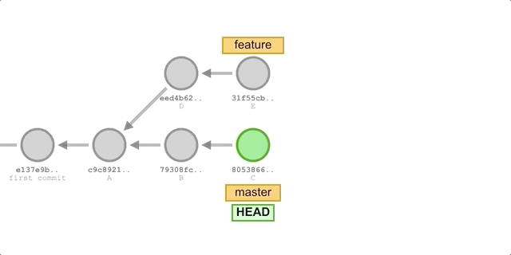

### [Rewriting history with `git rebase`](https://medium.com/@ddwen/a-detailed-guide-to-understand-how-git-rebase-works-2848e980e5e4)

-   Rebasing is the process of moving or combining a sequence of commits to a new base commit i.e. changing the base of your branch from one commit to another making it appear as if you'd created your branch from a different commit.
-   Internally, Git accomplishes this by creating new commits and applying them to the specified base.
-   It's very important to understand that even though the branch looks the same, it's composed of entirely new commits.

#### Why `git rebase`


-   To keep the commit history clean
    -   Suppose we create a Feature branch from Master’s commit A for new feature development, then A is the base end of Feature.
    -   Then Master added two new commits B and C, and Feature added two new commits D and E.
    -   Now for some reason, for example, the development of new features depends on commits B and C, and we need to integrate the two new commits of Master into the Feature branch.
    -   In order to keep the commit history clean, we can switch to the Feature branch to perform the rebase operation: `git rebase master`
    -   A common use case is to integrate the latest changes from master in the feature branch.

> #### So why keep your commit history clean?
>
> 1.  Satisfy the cleanliness of some developers.
> 2.  When you need to go back to the commit history for some bug, it is easier to locate which commit the bug was introduced from.
>
> -   Especially when you need to use git bisect to troubleshoot bugs from dozens or hundreds of commits, or when there are some large feature branches that need to frequently pull updates from the remote master branch.
> -   Using rebase to integrate the remote changes into the local repository is a better option.
> -   The result of pulling remote changes with merge is that every time you want to get the latest progress on the project, there will be a redundant merge commit.
> -   And the result of using rebase is more in line with our intent: I want to build on other people’s completed work with my changes.

#### The execution process of rebase

1. first find the nearest common ancestor commit A of these two branches (that is, the current branch Feature, the target base branch Master of the rebase operation).
2. Then compare the previous commits (D and E) of the current branch relative to the ancestor commit
3. extract the corresponding modifications and save them as temporary files
4. then point the current branch to the commit Cpointed to by the target base Master.
5. Finally, using this as the new base end, the modifications previously saved as temporary files are applied sequentially.

-   We can also understand the above as changing the base of the Feature branch from commit A to commit C, which looks like the branch was created from commit C, and commits D and E.
-   Internally Git copies the contents of commits D and E, creates new commits D’ and E’ and applies them to a specific base (A→B→C).
-   Although the new Feature branch looks the same as before, it is made up of brand new commits.
-   The essence of the rebase operation is to discard some existing commits, and then correspondingly create some new commits that are identical in content but are actually different.

#### Difference between rebase and merge.

-   The above scenarios can also be achieved using merge, but using rebase allows us to maintain a linear and cleaner commit history. Suppose we have the following branches:

    ```raw
    A---B---C  (main)
     \
      D---E  (feature)
    ```

-   Now we will use the `merge` and `rebase` respectively to integrate the B and C commits of the master branch into the feature branch, add a commit F to the feature branch, then merge the feature branch into the master, and finally compare the commits formed by the two methods differ in history.

##### Using merge
-   The execution process is shown in the following figure:
    
    -   `git checkout feature`: Switch to the feature branch.
    -   `git merge master`: To merge updates from the master branch.
    -   `git add . && git commit -m “commit F”`: Add a new commit F.
    -   `git checkout master && git merge feature`: Switch back to the master branch and perform a fast-forward merge.

- We will get the following commit history:
    ``` bash
    * 6fa5484 (HEAD -> master, feature) commit F
    *   875906b Merge branch 'master' into feature
    |\  
    | | 5b05585 commit E
    | | f5b0fc0 commit D
    * * d017dff commit C
    * * 9df916f commit B
    |/  
    * cb932a6 commit A
    ```
##### Using rebase

    -   `git checkout feature`: Switch to the feature branch.
    -   `git rebase master`: 
    -   `git add . && git commit -m “commit F”`: Add a new commit F.
    -   `git checkout master && git merge feature`: Switch back to the master branch and perform a fast-forward merge.
-   We will get the following commit history:
    ``` bash
    * 74199ce (HEAD -> master, feature) commit F
    * e7c7111 commit E
    * d9623b0 commit D
    * 73deeed commit C
    * c50221f commit B
    * ef13725 commit A
    ```
It can be seen that the commit history formed by using the rebase method is completely linear and compared to the merge method, there is one less merge commit, which looks cleaner.    


#### Tips on rebase
- So **never do a rebase on a public branch** (that is, there are other people developing on this branch), otherwise someone else doing a `git pull` will merge a confusing local history of commits, which will be pushed back to the remote branch. The remote submission history will be disrupted, and in severe cases, it may pose a risk to your personal safety.
- Not friendly to novices, novices are likely to “lose” some commits by mistake in interactive mode (but they can actually be retrieved).
- If you use rebase frequently to integrate updates to the master branch, a potential consequence is that you will encounter more and more conflicts that need to be merged.
- Although you can handle these conflicts during the rebase process, this is not a permanent solution, and it is more recommended to frequently merge into the master branch and then create new feature branches, rather than using a long-lived feature branch.