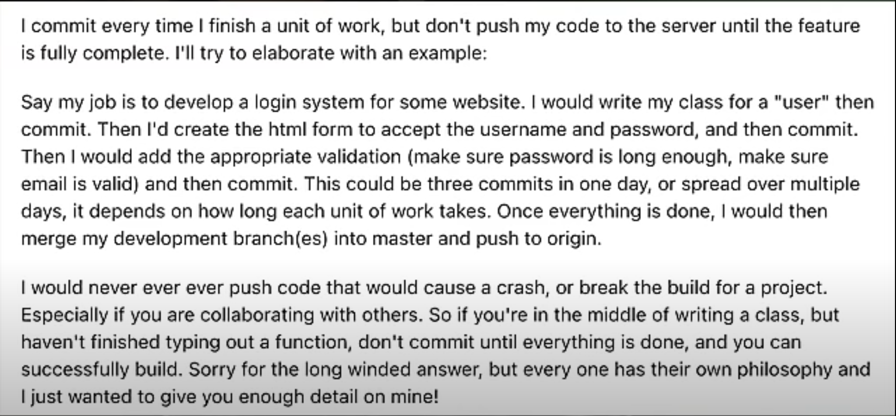

 How is this not the norm? I thought everyone works like this.
1. Create, groom, schedule and assign an issue in JIRA.
2. Create a 'feature' branch from master/develop.
3. Breakdown issue into smaller tasks.
4. Code, test, commit for single task (ideally) or multiple related tasks.
5. Push remote branch.
6. Raise a PR to merge 'feature' branch into master/develop.
7. Implement review comments, test, commit, get approvals.
8. Merge