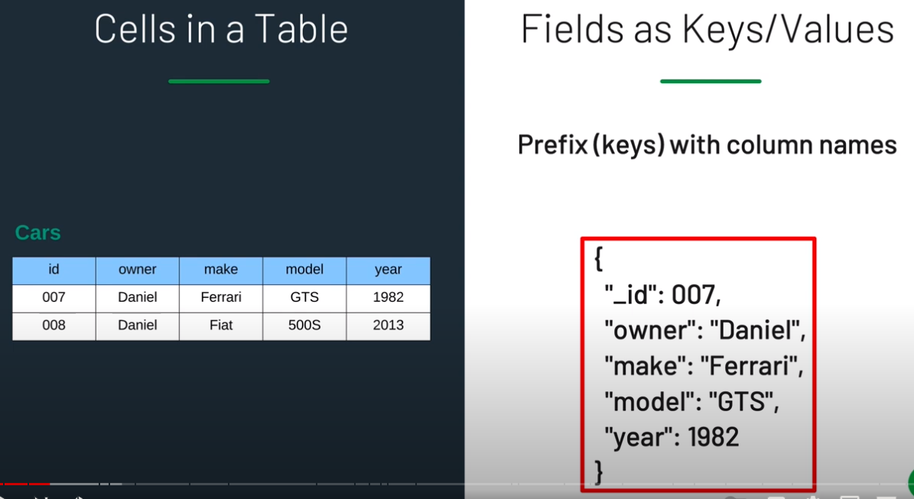
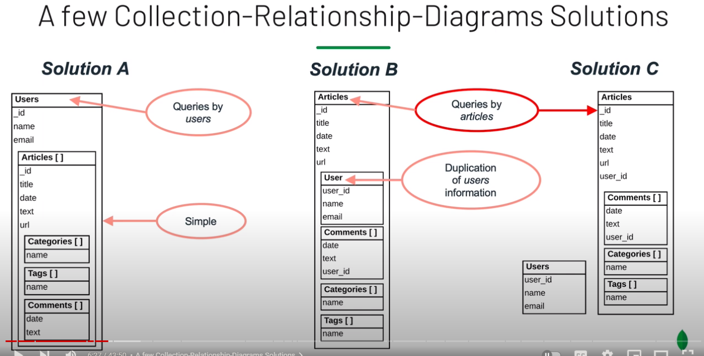

## Document vs Tabular
### The Document Model
- Fields as Key-Value Pairs
<br>



- Documents with different shapes/fields can co-exist side by side
- Sub Documents that support relationships between entities

```raw
# One to one relationships
{
    owner: "Daniel",
    make: "Ferrari",
    engine: {
        power: 660hp,
        consumption: 10mpg
    } 
}

# One to Many relationship
# All relevant info in one document vs in different tables in RDBMS
{
    "_id": 007
    "owner": "Daniel",
    "make": "Ferrari",
    "wheels": [
        {"partNo": 234819},
        {"partNo": 281928},
        {"partNo": 392838},
        {"partNo": 928938}
    ]
}

```

- Arrays
- JSON/BSON: Format that is easy to read
  - Flexibility in the structure allows for different solutions that optimizes for different use cases 

<br>



## Methodology
1. Describe the Workload. 
   - Considerations: Assumptions, Queries, Indexes, Data Sizing, Operations
   - List the Operations
   - Quantity / Qualify Operations. Most Frequent? Most Important?
   - System constraints? Sizing disk space?
2. Identify and Model the Relationships
   - Consideration: Embed or link? Collections / Fields
   - Type of relationships? One-to-one, one-to-many, many-to-many
   - Embeding vs referencing? Duplication of info?
3. Apply Patterns
   - Considerations: recognize and apply patterns

## Schema Design Patterns
### Schema Versioning Pattern

