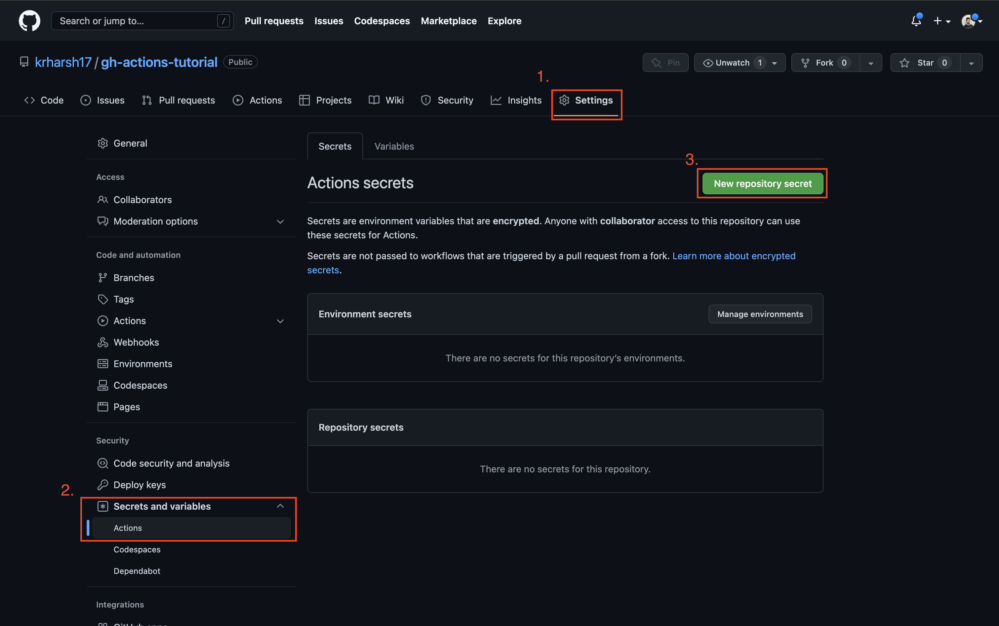

## Environment Variables and Secrets

### When to Use Environment Variables and Secrets

-   **Secrets** are the most secure method of storing sensitive configuration data.
    -   It’s recommended that you use secrets to store any keys, certificates, or other sensitive information that control access to resources or permissions in your systems.
-   **Environment variables** are beneficial when storing nonsensitive environment-specific data, like resource locators, domain information, and other environment details.
-   **Hardcoded information** should only be opted for in cases where you’re not looking to secure and reuse a piece of information.
    -   If you have a small project that may not be used or changed much, you can consider hardcoding the information in it to save time and effort when building the app. However, you should not do this for a production-level application.

### Environment variables

-   Can be defined on Workflow, Job or Step level
-   Can be used in code and in the workflow
-   GitHub Actions also provides a couple of default environment variables that are set automatically: See [here](https://docs.github.com/en/actions/learn-github-actions/environment-variables#default-environment-variables)
    -   These environment variable can, for example, give you quick access to the repository to which the workflow belongs, the name of the event that triggered the workflow and many other things.
-   Using environment variables in code

    ```yaml
    name: Deploy Project
    on: [push, workflow_dispatch]
    env:  # available on workflow level, to all jobs
        MONGODB_DB_NAME: <SOME_VALUE>
    jobs:
        test:
            env:   # Env vars here available on job level
                MONGODB_CLUSTER_ADDRESS: <SOME_VALUE>
                MONGODB_USERNAME: <SOME_VALUE>
                MONGODB_PASSWORD: <SOME_VALUE>
                PORT: 8080
            runs-on: ubuntu-latest
            steps:
                - name: Get Code
                    uses: actions/checkout@v3
                - name: Install NodeJS
                    uses: actions/setup-node@v3
                    with:
                        node-version: 18
                - name: Install dependencies
                    run: npm ci
                - name: Run server
                    # to get env var, use the '$VARIABLE_NAME' syntax
                    run: npm start & npx wait-on http://127.0.0.1:$PORT
                - name: Run tests
                    run: npm test
                - name: Output Information
                    # The 'env' context objects stored the env vars for this job
                    run: echo "MONGODB_USERNAME: ${{ env.MONGODB_USERNAME }}"
        deploy:
            needs: test
            runs-on: ubuntu-latest
            steps:
                - name: Output Information
                    run: |
                    echo "MONGODB_USERNAME: ${{ env.MONGODB_USERNAME }}" # should return blank
                    echo "MONGO_DB_NAME: $MONGODB_DB_NAME" # should return value set for that env var
    ```

### Secrets

-   Some environment variable values should never be exposed i.e. psswords
-   For such cases, we can use secrets.
-   To set secrets, go to your repo > Settings > Security > Secrets > Actions
    > Note: These secrets can be stored on repository level or via Environments
    
    
-   To access these secrets, use the `secrets` context object
    ```yaml
    name: Deploy Project
    on: [push, workflow_dispatch]
    env:
        MONGODB_DB_NAME: <SOME_VALUE>
    jobs:
        test:
            env:
                MONGODB_CLUSTER_ADDRESS: <SOME_VALUE>
                MONGODB_USERNAME: ${{ secrets.MONGOEB_USERNAME }}  # retrieving secret values set
                MONGODB_PASSWORD: ${{ secrets.MONGOEB_PASSWORD }}
                PORT: 8080
            runs-on: ubuntu-latest
            steps:
                - name: Get Code
                    uses: actions/checkout@v3
                - name: Install NodeJS
                    uses: actions/setup-node@v3
                    with:
                        node-version: 18
                - name: Install dependencies
                    run: npm ci
                - name: Run server
                    # to get env var, use the '$VARIABLE_NAME' syntax
                    run: npm start & npx wait-on http://127.0.0.1:$PORT
                - name: Run tests
                    run: npm test
                - name: Output Information
                    # The 'env' context objects stored the env vars for this job
                    run: echo "MONGODB_USERNAME: ${{ env.MONGODB_USERNAME }}"
        deploy:
            needs: test
            runs-on: ubuntu-latest
            steps:
                - name: Output Information
                    run: |
                    echo "MONGODB_USERNAME: ${{ env.MONGODB_USERNAME }}" # should return blank
                    echo "MONGO_DB_NAME: $MONGODB_DB_NAME" # should return value set for that env var
    ```

### Repository Environments

-   GitHub allows for setting up different environments for a repository and workflow jobs can then reference these environments.
-   Jobs referencing a certain environment can get access to configuration that are only available in that environment
-   Can Add special protection rules i.e. only events related to certain branches can use an environments

    ```yaml
    name: Deploy Project
    on: [push, workflow_dispatch]
    env:
        MONGODB_DB_NAME: <SOME_VALUE>
    jobs:
        test:
            environment: testing   # 'test' job will run in testing environment
            env:
                MONGODB_CLUSTER_ADDRESS: <SOME_VALUE>
                MONGODB_USERNAME: ${{ secrets.MONGOEB_USERNAME }}
                MONGODB_PASSWORD: ${{ secrets.MONGOEB_PASSWORD }}
                PORT: 8080
            runs-on: ubuntu-latest
            steps:
                - name: Get Code
                    uses: actions/checkout@v3

    ```
