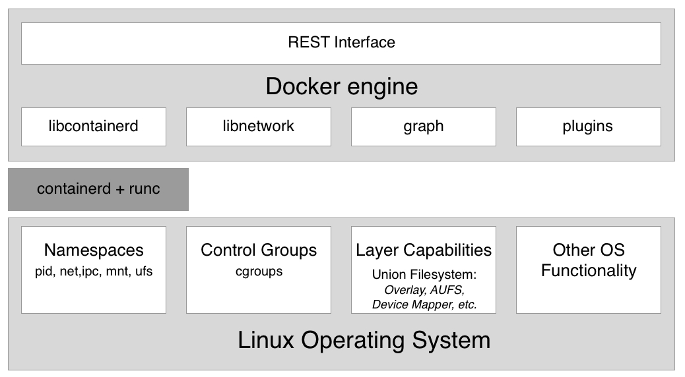

## Containers

### What is Container?

-   A way to package application with all the necessary dependencies and configuration
-   Portable aritifact, easily shared and moved around
-   Nakes development and deployment more efficient
-   one command to install the app
-   Technically, made up of layers of images
    -   i.e linus base image, application image at the top
    -   To run the imsge, use `docker run <image_name>`
    -   If the image is not available, it auto downloads from DockerHub.
    -   When the image is runned, a container is created
    -   When a container is restarted, data is lost (No data persistence itself)

### Where do containers live?

-   Container Repository
-   Public Repository for Docker: DockerHub

### Image vs Container

-   An image
    -   The application we want to run
    -   The actual package / artifact that can be moved around
-   A container
    -   An instance of that image running as a process
    -   the running environment for the Docker Image
    -   You can have many containers running off the same immage

### Container vs Virtual Machine

-   Virtual Machines share the hardware resources
-   Containers shares the same OS Kernel and hardware resources

### Starting Docker Containers

-   Start a new container from an image using the `docker container run` command
-   `docker container run --publish 80:80 --detach nginx`
    1. looks for image locally. if it doesn't find it, looks in Docker Hub
    2. Downloads image from Docker Hub (default: latest version)
    3. Creates new container from that image
    4. Opens port 80 on the host IP
    5. Routes traffic to the container IP port 80
    6. Starts container by using the CMD in the image Dockerfile
    -   Note that if host port(left number) is being used, you'll get a "bind" error

>**Container not starting with `docker run`**
>
>..."Containers are not virtual machines. They will not run unless you run a command inside. You **did not provide any command that would run indefinitely in the foreground, so the container runs the default command which is python, but there is no parameter, no python script to run, so it stops immediately.** If you want to keep it running, you either need to define a command that would keep the container running, or you need to ask for an interactive terminal using the `-i` and `-t` flags which you can use together like `-it`"...
>https://forums.docker.com/t/running-a-simple-python-container-in-docker/128563

### Monitoring Containers

-   `docker container top` to show process list in one container
-   `docker container inspect` to show details of one container config
-   `docker container stats` for live performance stats for all containers

### Getting a Shell

-   `docker container run -it --name nginx bash` to give you a terminal inside the new container. Start new container interactively. Use `exit` to stop
-   `docker container exec -it` to run additional command via terminal in existing container

### Internals of Containers

-   Docker uses a client-server based architecture model.
-   The Docker client communicates with the Docker daemon, which does process the lifting of the building, running, and distributing Docker containers.
-   The command line interface client uses the Docker REST API to interact with the Docker daemon through using CLI commands.
-   Many other Docker applications also use the API and CLI.
-   The docker daemon process is used to control and manage the containers.
-   The Docker daemon listens to only Docker API requests and handles Docker images, containers, networks, and volumes.
-   It also communicates with other daemons to manage Docker services.

#### Namespaces

-   Docker makes use of kernel namespaces to provide the isolated workspace called the container.
-   When you run a container, Docker creates a set of namespaces for that container.
-   These namespaces provide a layer of isolation.
-   Each aspect of a container runs in a separate namespace and its access is limited to that namespace.

-   Docker Engine uses the following namespaces on Linux:
    -   PID namespace for process isolation.
    -   NET namespace for managing network interfaces.
    -   IPC namespace for managing access to IPC resources.
    -   MNT namespace for managing filesystem mount points.
    -   UTS namespace for isolating kernel and version identifiers.

#### Cgroups

-   Docker also makes use of kernel control groups for resource allocation and isolation.
-   A cgroup limits an application to a specific set of resources.
-   Control groups allow Docker Engine to share available hardware resources to containers and optionally enforce limits and constraints.

-   Docker Engine uses the following cgroups:
    -   Memory cgroup for managing accounting, limits and notifications.
    -   HugeTBL cgroup for accounting usage of huge pages by process group.
    -   CPU group for managing user / system CPU time and usage.
    -   CPUSet cgroup for binding a group to specific CPU. Useful for real time applications and NUMA systems with localized memory per CPU.
    -   BlkIO cgroup for measuring & limiting amount of blckIO by group.
    -   net_cls and net_prio cgroup for tagging the traffic control.
    -   Devices cgroup for reading / writing access devices.
    -   Freezer cgroup for freezing a group. Useful for cluster batch scheduling, process migration and debugging without affecting prtrace.

#### Union File Systems

-   Union file systems operate by creating layers, making them very lightweight and fast.
-   Docker Engine uses UnionFS to provide the building blocks for containers.
-   Docker Engine can use multiple UnionFS variants, including AUFS, btrfs, vfs, and devicemapper.

#### Container Format

-   Docker Engine combines the namespaces, control groups and UnionFS into a wrapper called a container format. The default container format is libcontainer.
