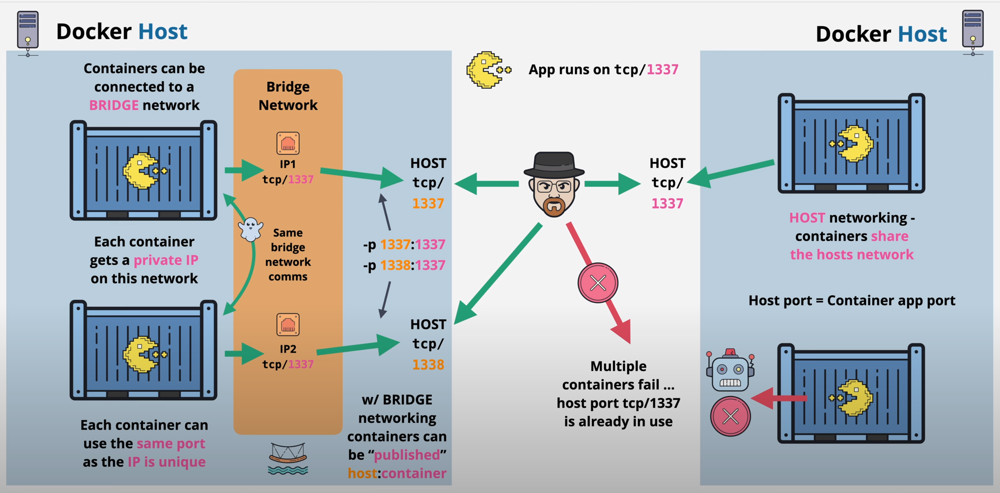

- [Docker docs](docs.docker.com)

## Commands

- General structure:

  ``` bash
  # new "management commands" format
  docker <command> <sub-command> (options)
  ```

- Note that the old method still works: `docker <command> (options)`
- for e.g. `docker run` is same as `docker container run`


    -   Create a named volume: `docker volume create my_volume`
    -   List volumes: `docker volume ls`
    -   Inspect a volume: `docker volume inspect my_volume`
    -   Remove a volume: `docker volume rm my_volume`

-   Unused volumes eat up disk space and cause clutter. To remove all unused volumes, use the `docker volume prune` command.


>### Reference
>
>#### System
>
>- `docker version`: check your version and that docker is working
>- `docker info`: shows most config values for the docker engine
>- `docker login <SERVER_URL>`: Defaults to logging in DockerHub, but can overrider by adding server url
>- `docker logout <SERVER_URL>`: Always logout from shared machines/servers when done to protect your acct
>- `ps aux`: show me all running processes
>
>#### Volumes: `docker volume`
>
>- `ls`: Show all volumes available 
>- `create [OPTIONS] <VOL_NAME`: Create a named volume. Required to do this before `docker run` to use custom drivers and labels
>- `inspect <VOL_NAME>`: returns JSON metadata about the volume
>- `rm <VOL_NAME>`: remove volumes
>- `prune `: Removes all currently unused volumes
>
>#### Images: `docker image`
>
>- `ls`: Show all images downloaded
>- `history <CONT>:<TAG>`: Shows layers of changes made in images. Same as `docker history`
>- `inspect <CONT>`: returns JSON metadata about the image. Same as `docker inspect`
>- `tag <SRC_IMG[:TAG]> <NEW_IMG[:TAG]>`: Assign one or more tags to an image. Default tag is 'latest'. Same as `docker tag`
>- `push `: Uploads changed layers to a image registry. Default: DockerHub
>
>#### Containers: `docker container`
>
>- `exec <CONT>`: run additional process in running container
>- `inspect <CONT>`: show metadata about the container. Same as `docker inspect`
>   - `--format`: common option for formatting output of commands using GO templates
>- `logs <CONT>`: shows logs for a specific container. Same as `docker logs`
>   - `--help`: see all log options
>- `ls`: list running containers. same as `docker ps`
>   - `--env`: pass in environment variables
>- `rm <CONT_ID_1 CONT_ID_2 ...>`: remove containers
>   - `-f`: force remove
>- `run [OPTIONS] [COMMAND] [ARG...]`: starts a **new** container from an image. same as `docker run`
>   - `--detach`: run it in the background
>   - `--name <NAME>`: assign name to container
>   - `-p, --publish`: publish ports. Always in HOST:CONTAINER format
>   - `-t`: pseudo tty i.e. simulate a real terminal
>   - `-i, --interactive`: keep session open to receive terminal input
>   - `--network <NETWORK>`: attach container to network. Default network if unspecified
>- `start`: start an existing stopped container
>- `stats`: show live performance statistics for all containers. Saem as `docker stats`
>- `stop <CONT>` stops the container process w/o removing it. Same as `docker stop`
>- `top <CONT>`: list the running processes in a container
>- `port <CONT>`: shows which ports are forwarding traffic to the container
>
>#### Network: `docker network`
>
>- `ls`: Show all networks created
>- `inspect <NETWORK>`: show containers attached to that network
>- `create [OPTIONS] <NETWORK>`: Spawns a new virtual network for you to attach containers to
>   - `--driver`:
>- `connect [OPTIONS] <NETWORK> <CONT>`: Connects a container to a network.
>- `disconnect [OPTIONS] <NETWORK> <CONT>`: Disconnects a container from a network. The container must be running.

### Docker Networks

- Docker supports networking as first-class entities.
- Therefore docker network has its own life cycle and is not bound to other docker objects.
- We can manage and interact with networking by using `docker network` command.

#### Docker Networks Defaults

- Each container connected to a private virtual network 'bridge'
- Each virtual network routes through NAT firewall on host IP
  - Network Address Translation (NAT) translates a set of IP addresses into another set of IP address for e.g. converts a private IP address into a public IP address
  - The Docker daemon configures the host IP address on its default interface to allow the container interact access or access to the rest of the network
- All container on a virtual network can talk to each other without `-p`
- Best practice is to create a new virtual network for each app:
  - network "my_web_app" for mysql and php/apache containers
  - network "my_api" for mongo and nodejs containers
- Defaults work well in many cases, yet easy to swap out parts to customize it
- for e.g.
  - Making new virtual networks
  - Attach containers to more than one virtual network (or none)
    - A container that is attached to multiple networks can connect with the containers of these networks.
  - Skip virtual networks and use host IP (`--net=host`)
  - Use diffrent Docker network drivers to gain new abilities

#### Public and Private Communications in Containers



- `docker container port <CONT>` to check ports
- `docker container inspect --format "{{.NetworkSettings.IPAddress}}" webhost` to get IP Address

#### CLI Management Commands

- `docker network ls` to show networks
  - `--network bridge`: default Docker virtual network which is NAT'ed behind the host IP
  - `--network host`: gain performance by skipping vitual networks but sacrifices security of container model
  - `--network none`: removes eth0 and only leaves you with localhost interface in container
  - network driver: Built-in or 3rd party extensions that provide virtual network features (Default: `bridge`)
- `docker network inspect` to inspect a network
- `docker network create --driver` to create a network
- `docker network connect` to attach a network to container
- `docker network disconnet` to detach a network from container

#### Default Security

- Create your apps so frontend/backend sit on same Docker network
- Their inter-communication never leaves host
- All externally exposed ports closed by default
- You must manually expose via `-p` which is better default security
- This gets even better with Swarm and Overlay networks


