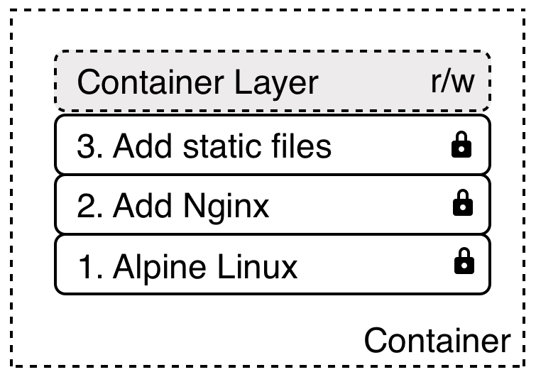

## Images

### What's in an image

- App binaries and dependencies
- Metadat about the image data and how to run the image
- Official definition: an ordered collection of root filesystem changes and the corresponding execution parameter for use within a container runtime
- Not a complete OS. No kernel, kernel modules (.e.g drivers)
- Can be as small as one file (your app binary) like a golanf static binary
- Can be as big as a Ubuntu distro with apt, and Apache, PHP and more installed

### Image Layers

- Images are designed using the union file system concept of making layers about the changes
- Each images is made of a stack of immutable or read-only layers. Max: 127 layers
- Every image starts with a blank layer (known as scratch)
- With each set of changes that happens after that on the file system in the image, a read-only layer that represent filesystem differences is created
- Each layer gets its own unqiue SHA that helps the system identify if that layer is available in the cache or a new layer that needs to be downloaded
- The caching of images layers helps with saving time and space because we dont need to download layers we already have
  - Only one copy of each image layer is stored on our file system. Saves storage
  - We also do not need to upload/download any layer tha we already have. Saves on transfer time.

### Container Layers

- Layers are stacked on top of each other to form a base for a container’s root filesystem.
- The Docker storage driver is responsible for stacking these layers and providing a single unified view.
- When the Docker engine creates a container from an image, it adds a read/write layer on top of this stack of immutable layers.
- All changes made to the running container, such as creating new files, modifying existing files or deleting files, are written to this thin writable container layer.
- When the container is deleted the writable layer is also deleted. The underlying image remains unchanged.
- This allows multiple containers can share access to the same underlying image and yet have their own data state.

The Docker storage driver is responsible for enabling and managing both the image layers and the writable container layer. Two key technologies behind Docker image and container management are stackable image layers and copy-on-write (CoW).

### [Copy-on-Write](https://adaptive.svbtle.com/fundamentals-of-docker-storage)

- Copy-on-write is a similar strategy of sharing and copying, in which the system processes that **need access to the same data share the same instance of that data** rather than having their own copy.
- if any one process wants to modify or write to the data, only then does the operating system make a copy of the data for that process to use.
- Only the process that needs to write has access to the data copy. All other processes continue to use the original data.
- This CoW strategy optimizes both image disk space usage and the performance of container start times.

### Image Tagging and Pushing to Docker Hub

- A tag is a pointer to a specific image commit into the repository
- General format: `<USER>/:<TAG>`. Default tag is 'latest' if unspecified
- Only official repositories/images don't have account names in front of the image name since they live at the root namespace of the registry
- Since tags are just labels that point to an actual image ID, we can have many tags pointing to the same image
- To make a new 'label', we can just re-tag existing images

### Uploading to DockerHub

1. Ensure you are logged into the repository
   - `docker login` to log into DockerHub
   - Under the hood, Docker writes to `.docker/config.json`, storing an authentication key that allows local Docker CLI to access DockerHub
2. `docker image push ` to upload image

- Note: for private repos, create the repo first before pushing the image into it

### Creating Images: The Dockerfile

<https://www.youtube.com/watch?v=C1GE07UEFDo&ab_channel=BretFisherDockerandDevOps>
<https://www.youtube.com/watch?v=EmCRj5O4UZE&ab_channel=SchoolofDevops>
<https://www.youtube.com/@Smacacademy/search?query=docker%20image%20build>

- To use the Dockerfile: `docker build -f <Dockerfile>`
- Order of these commands matters.
- FROM (required)
  - package managers i.e. apt, yum are one of the reasons to build containers FROM debian, Ubuntu, Fedora, CentOS
- ENV: Set enviroment variables
  - Preferred way to inject key/value since they work everywhere, on every OS and config
- RUN: Execute shell commands
  - Usually for install software with a package repository or doing some unzipping, file edits inside the container
  - Can also run shell scripts that were copied into the container earlier
  - chaining commands with '`&&`' in order to fit all these changes in one single layer. Saves space and time.
  - NOTE: Proper way to do logging insider a container is to not log to a log file BUT to ensure everything we want to be captured in the logs is spit out to stdout and stderr. Docker will handle to rest.
