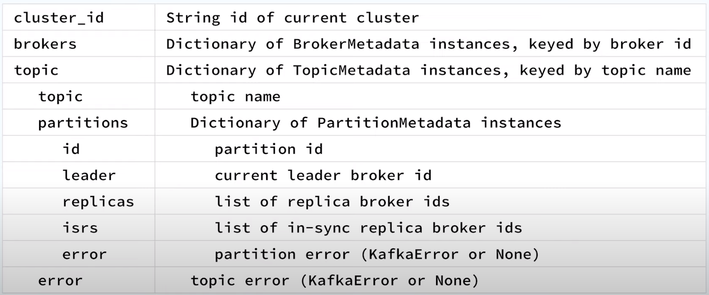
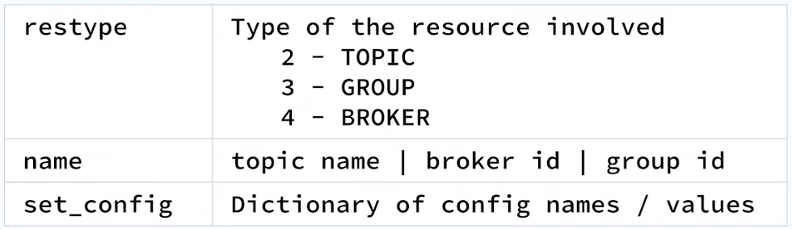
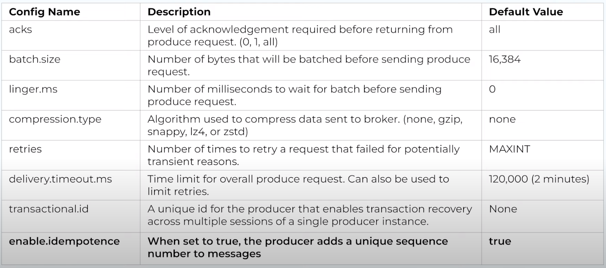
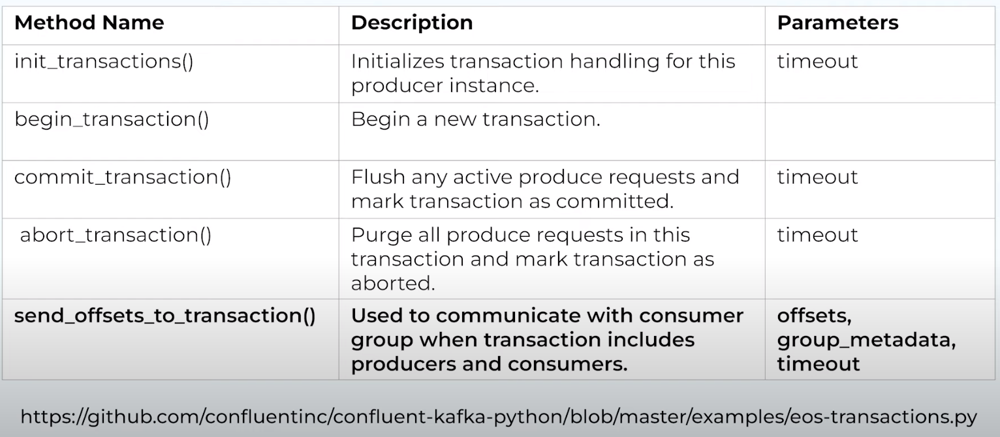
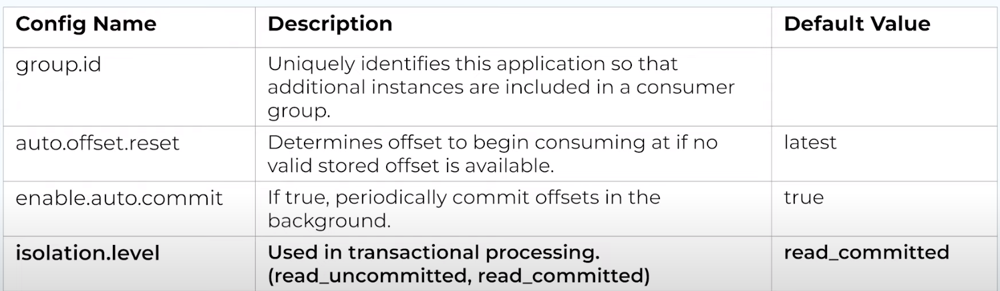
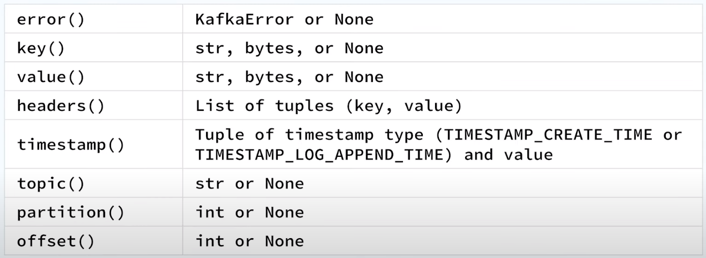

##### Source: 
- <https://www.youtube.com/playlist?list=PLa7VYi0yPIH1odVnZC430071CVD_4Sx1e>
  
##### Examples:

- <https://github.com/confluentinc/confluent-kafka-python/tree/master/examples>
- <https://medium.com/@mrugankray/create-avro-producer-for-kafka-using-python-f9029d9b2802>

## AdminClient

### Creating Topics

``` py
from confluent_kafka.admin import AdminClient, NewTopic

config = {'bootstrap.servers': 'localhost:9092'}
admin = AdminClient(config)

# creating topic
# replication_factor limited by number of brokers
topic = NewTopic('youtube', num_partitions=3, replication_factor=1)

# returns dict of futures. Keys of futures show the topics created
topic_results = admin.create_topics([topic])
print(topic_results.values)

# get list of topics for cluster
# pass in topic name to get details of that topic
# returns a ClusterMetadata object
cluster_metadata = admin.list_topics()

# remove topic
# returns dict of futures. Keys of futures show the topics created
topic_results = admin.delete_topics([topic1, topic2])

```

#### ClusterMetadata class: Working with topics



```py
cluster_metadata = admin.list_topics()
for topic in iter(cluster_metadata.topics.values()):
    print(f'{topic}')
    for p in iter(topic.partitions.values()):
        print(f'partition: {p.id}, isrs: {p.isrs}')

```

#### To check if topic has been created

```bash
# get list of topics
./kafka-topics.sh --bootstrap-server localhost:9092 --list

# get details of topics 'youtube;
./kafka-topics.sh --bootstrap-server localhost:9092 --describe --topic youtube
```

### Working with Configurations

``` py
# -------- describe_configs(config_resources) ------------

# Create a ConfigResource referring to topic1
resource = ConfigResource('TOPIC', 'topic1')
result_dict = describe_configs([resource])

# check topic retention config value
config_entries = result_dict[resource].result()
retention - config_entries['retention.ms']
print(f'{retention.name} is set up tp {retention.value}')


# -------- alter_configs(config_resources) ------------
# config to set retention period to 1 day
config_dict = {'retention.ms': '86400000'}

resource = ConfigResource('TOPIC', 'topic1', config_dict)
result_dict = alter_configs([resource])

# wait for future to complete
result_dict[resource].result()

```

#### ConfigResource Class: Working with Configurations



## Producer Class

#### Common configuration settings



#### Creating A Producer

``` py
from confluent_kafka import Producer
config = {
    'bootstrap.servers': 'localhost'
}
producer = Producer(config)

arr = [1, 2, 3, 4, 5, 6, 7, 8, 9, 10]
for val in arr:
    message = f"Sending the number, {val}"

    # .producer(topic, [val], [key], [partition], [on_delivery], [timestamp], [headers])
    producer.produce(
        topic="youtube",
        val=message.encode('utf-8'),
        # triggers callback function when msg is sent
        callback= lambda err, msg: print(f"Message sent to topic {msg.topic()}, partition {msg.partition()}")
    )
    producer.flush()
```

#### Other Common Methods



## Consumer Class

#### Common configuration settings



#### Creating A Consumer

```py
from confluent_kafka import Consumer

config = {
    'bootstrap.servers': 'localhost',
    'group,id': 'G1',   # consumer group id
    'auto.offset.reset': 'latest' #'earliest' will get all messages sent
}
consumer = Consumer(config)

# Upon subscription, a partition is assigned to the consumer
# which will trigger this callback function
def assignment_callback(consumer, topic_partitions):
    for tp in topic_partitions:
        print(tp.topic, tp.partition, tp.offset)

# Subscribe to topic
consumer.subscribe(['youtube'], on_assign=assignment_callback)

while True:
    event = consumer.poll(timeout=1.0) # timeout in seconds
    if event is None:
        print("No Messages...")
        continue
    if event.error():
        print(f"Error: {event.error()}")
        continue
    else: 
        key = event.key().decode('utf-8')
        val = event.value().decode('utf-8')
        print(f"Received message: {val}")

        consumer.commit(event) # if auto-commit=False
```

#### The Message Class



#### To see consumer details in consumer group

```bash
# get list of consumers within group G1
./kafka-consumer-groups.sh --bootstrap-server localhost:9092 --group G1 --describe
```

## Schema Registry

- Serializers: Convert data into bytes to be stored in Kafka topics
- Deserialzers: Convert bytes from Kafka topics into useable data
- SchemaRegistryClient: Provide access to the schema registry

#### SchemaRegistryClient

```py
sr_client = SchemaRegistryClient({
    'url': '<SCHEMA_REGISTRY_ENDPOINT',
    'basic.auth.user.info': '<SR_USERNAME:SR_PASSWORD'
})
```

#### Serializers

```py
# JSONSerializer

# due to __call__ method, it can be used like a function
serializer = JSONSerializer(
                schema_str,
                schema_registry_client,
                to_dict=obj_to_dict   # func to turn json to dict
)

# ProtobufSerializer
serializer = ProtobufSerializer(
                obj_pb2.Obj,
                schema_registry_client,
                {'use.deprecated.format': False}
)

# AvroSerializer
# Popular for Kafka use cases
serializer = AVROSerializer(
                schema_registry_client,
                schema_str,
                to_dict=obj_to_dict   # func to turn json to dict
)

# Using Serializer
key = string_serializer(str(uuid4()))
val = serializer(obj, SerializationContext(topic, MessageField.VALUE))

producer.produce(topic=topic, key-key, value=val)
```

#### Deserializers

```py
# JSONDeserializer

# due to __call__ method, it can be used like a function
serializer = JSONSerializer(
                schema_str,
                from_dict=dict_to_obj   # func to turn json to dict
)

# ProtobufDeserializer
serializer = ProtobufSerializer(
                obj_pb2.Obj,
                {'use.deprecated.format': False}
)

# AvroDeserializer
# Popular for Kafka use cases
serializer = AVROSerializer(
                schema_registry_client,
                schema_str,
                from_dict=dict_to_obj   # func to turn json to dict
)

# Using Serializer
obj = deserializer(
        event.value(),
        SerializationContext(
            event.topic(),
            MessageField.VALUE
        )
    )

producer.produce(topic=topic, key-key, value=val)
```

## [Helper Classes](https://github.com/hueiyuan/pycon-kafka/tree/main)

<br>

**`kafka.py`**

``` py

import json
import certifi
from uuid import uuid4
from datetime import datetime
from dataclasses import dataclass
from typing import List, Dict

from confluent_kafka import KafkaException

# confluent kafka producer and avro serializer
from confluent_kafka import SerializingProducer
from confluent_kafka.schema_registry.avro import AvroSerializer

# confluent kafka consumer and avro deserializer
from confluent_kafka import DeserializingConsumer
from confluent_kafka.schema_registry.avro import AvroDeserializer


@dataclass
class KafkaProducer:
    kafka_brokers: str
    avro_serializer: AvroSerializer

    def __post_init__(self):
        producer_config = {
            "bootstrap.servers": "SSL://" + self.kafka_brokers,
            "security.protocol": "SSL",
            "ssl.ca.location": certifi.where(),
            "batch.size": 1024 * 1024 * 2,
            "message.max.bytes": 1024 * 1024 * 2,
            "linger.ms": 10000,
            "sticky.partitioning.linger.ms": 20000,
            "compression.type": "lz4",
            "error_cb": self.__error_callback_func,
            "value.serializer": self.avro_serializer,
        }

        self.producer = SerializingProducer(producer_config)

    def __error_callback_func(self, kafka_error) -> KafkaException:
        raise KafkaException(kafka_error)

    def __delivery_func(self, err, msg):
        if err is not None:
            print("Message delivery failed: {}".format(err))
            raise KafkaException(err)

        msg_callback_infomation = {
            "latency": msg.latency(),
            "kafka_offset": msg.offset(),
            "topic_partition": msg.partition(),
            "data_tag": msg.topic(),
            "produce_kafka_time": datetime.fromtimestamp(
                msg.timestamp()[1] / 1e3
            ).strftime("%Y-%m-%d %H:%M:%S.%f"),
        }

    def send_message(self, topic: str, example_dataset: List[Dict]) -> None:
        for data in example_dataset:
            self.producer.poll(0)

            self.producer.produce(
                topic=topic, value=data, on_delivery=self.__delivery_func
            )

        print("\nFlushing records...")
        self.producer.flush()


@dataclass
class KafkaConsumer:
    kafka_brokers: str
    group_id: str
    avro_deserializer: AvroDeserializer

    def __post_init__(self):
        consumer_config = {
            "bootstrap.servers": "SSL://" + self.kafka_brokers,
            "security.protocol": "SSL",
            "ssl.ca.location": certifi.where(),
            "value.deserializer": self.avro_deserializer,
            "group.id": self.group_id,
            "error_cb": self.__error_callback_func,
            "auto.offset.reset": "earliest",
        }

        self.consumer = DeserializingConsumer(consumer_config)

    def __error_callback_func(self, kafka_error) -> KafkaException:
        raise KafkaException(kafka_error)

    def consume_messages(self, topic: str) -> None:
        self.consumer.subscribe([topic])

        while True:
            try:
                msg = self.consumer.poll(1.0)
                if msg is None:
                    continue

                data_msg = msg.value()
                if data_msg is not None:
                    print(data_msg)
            except KeyboardInterrupt:
                break

        self.consumer.close()
```

<br>

**`schema_registry.py`**

``` py
from dataclasses import dataclass

from confluent_kafka.schema_registry import SchemaRegistryClient
from confluent_kafka.schema_registry.avro import AvroSerializer
from confluent_kafka.schema_registry.avro import AvroDeserializer


@dataclass
class SchemaRegistry:
    schema_registry_endpoint: str
    auth_info: str

    def __post_init__(self):
        schema_config = {
            "url": self.schema_registry_endpoint,
            "basic.auth.user.info": self.auth_info,
        }

        self.sr_client = SchemaRegistryClient(schema_config)

    def get_serializer(self, schema_str: str) -> AvroSerializer:
        return AvroSerializer(
            schema_registry_client=self.sr_client, schema_str=schema_str
        )

    def get_deserializer(self, schema_str: str) -> AvroDeserializer:
        return AvroDeserializer(
            schema_registry_client=self.sr_client, schema_str=schema_str
        )
```

#### Implementation

<br>

**`producer.py`**

``` py
import os
import json
import argparse

from pycon_kafka.helpers.kafka_helper import KafkaProducer
from pycon_kafka.helpers.schema_registry_helper import SchemaRegistry

from dotenv import load_dotenv
load_dotenv()

SR_USR = os.getenv('SCHEMA_REGISTRY_USERNAME')
SR_PWD = os.getenv('SCHEMA_REGISTRY_PASSWORD')

EXAMPLE_TOPIC = 'test-topic'
EXAMPLE_SCHEMA_STR = """
    {
        "namespace": "schema_registry.examples.serialization.avro",
        "name": "User",
        "type": "record",
        "fields": [
            {
                "name": "name", 
                "type": "string"
            },
            {
                "name": "sex", 
                "type": "string"
            },
            {
                "name": "phone_number", 
                "type": "string"
            },
            {
                "name": "interest", 
                "type": [
                    "string",
                    "null"
                ],
       "default": "null"
            }
        ]
    }
"""

def main(args):
    schema_registry_client = SchemaRegistry(
        schema_registry_endpoint=args.schema_registry_endpoint,
        auth_info=f'{SR_USR}:{SR_PWD}'
    )
    
    corresponding_avro_serializer = schema_registry_client.get_serializer(
        schema_str=EXAMPLE_SCHEMA_STR
    )
    
    producer = KafkaProducer(
        kafka_brokers= args.kafka_brokers,
        avro_serializer=corresponding_avro_serializer
    )
    
    with open('./example_data/example.json') as f:
        example_dataset = json.load(f)
    
    producer.send_message(
        topic=EXAMPLE_TOPIC, 
        example_dataset=example_dataset
    )
    
        
if __name__ == '__main__':
    parser = argparse.ArgumentParser(description="Kafka Consumer with schema registy example")
    parser.add_argument('--schema-registry-endpoint', 
                        action="store",
                        type=str,
                        required=True,
                        help="schema registry endpoint")
    
    parser.add_argument('--kafka-brokers', 
                        action="store",
                        type=str,
                        required=True,
                        help="kafka brokers endpoint")
    
    main(parser.parse_args())
```

<br>

**`consumer.py`**

``` py
import os
import argparse

from pycon_kafka.helpers.kafka_helper import KafkaConsumer
from pycon_kafka.helpers.schema_registry_helper import SchemaRegistry

from dotenv import load_dotenv
load_dotenv()

SR_USR = os.getenv('SCHEMA_REGISTRY_USERNAME')
SR_PWD = os.getenv('SCHEMA_REGISTRY_PASSWORD')

EXAMPLE_TOPIC = 'test-topic'
EXAMPLE_SCHEMA_STR = """
    {
        "namespace": "schema_registry.examples.serialization.avro",
        "name": "User",
        "type": "record",
        "fields": [
            {
                "name": "name", 
                "type": "string"
            },
            {
                "name": "sex", 
                "type": "string"
            },
            {
                "name": "phone_number", 
                "type": "string"
            },
            {
                "name": "interest", 
                "type": [
                    "string",
                    "null"
                ],
       "default": "null"
            }
        ]
    }
"""
    
def main(args):
    schema_registry_client = SchemaRegistry(
        schema_registry_endpoint=args.schema_registry_endpoint,
        auth_info=f'{SR_USR}:{SR_PWD}'
    )
    
    corresponding_avro_deserializer = schema_registry_client.get_deserializer(
        schema_str=EXAMPLE_SCHEMA_STR
    )
    
    consumer = KafkaConsumer(
        kafka_brokers=args.kafka_brokers,
        group_id=args.consumer_group_id,
        avro_deserializer=corresponding_avro_deserializer
    )
    
    consumer.consume_messages(EXAMPLE_TOPIC)
    
        
if __name__ == '__main__':
    parser = argparse.ArgumentParser(description="Kafka Consumer with schema registy example")
    parser.add_argument('--schema-registry-endpoint', 
                        action="store",
                        type=str,
                        required=True,
                        help="schema registry endpoint")
    
    parser.add_argument('--kafka-brokers', 
                        action="store",
                        type=str,
                        required=True,
                        help="kafka brokers endpoint")
    
    parser.add_argument('--consumer-group-id', 
                        action="store",
                        type=str,
                        required=True,
                        help="consumer group id")
    
    main(parser.parse_args())
```
