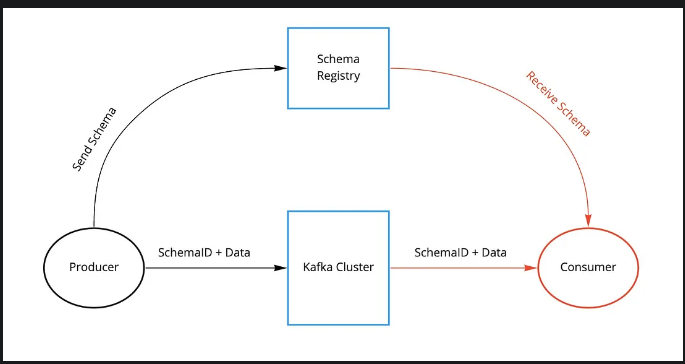
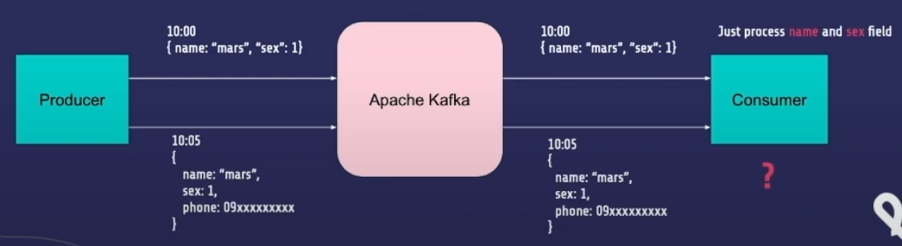
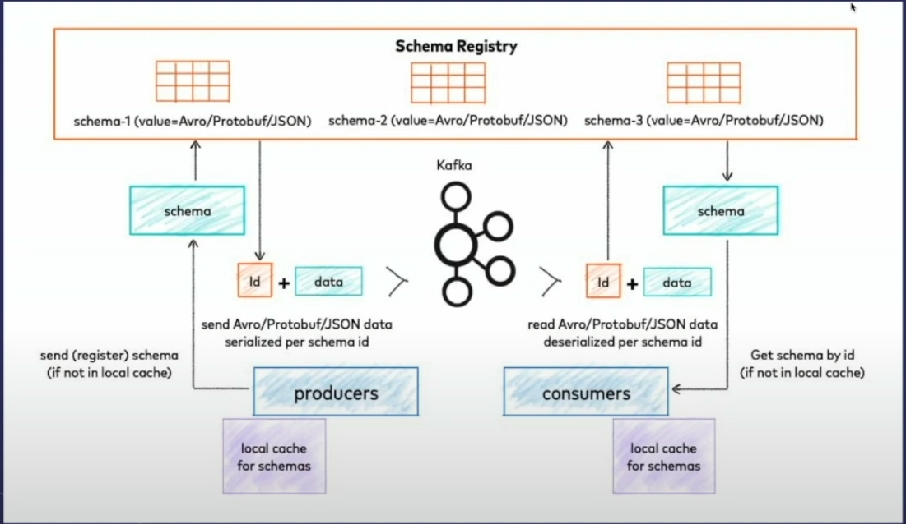
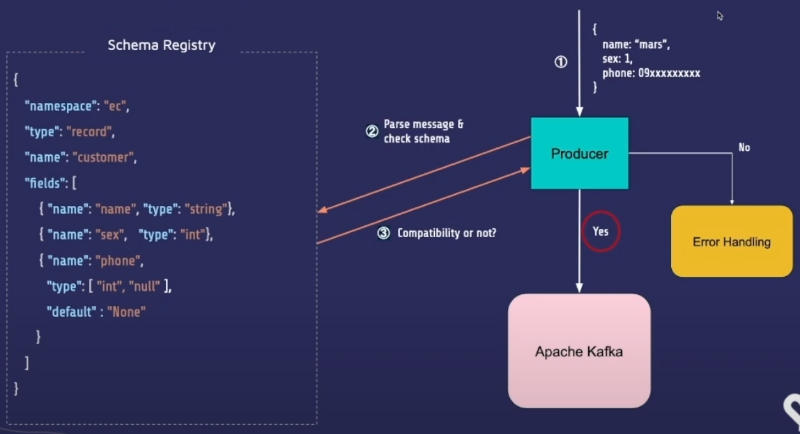

- Link: <https://docs.confluent.io/platform/current/schema-registry/index.html>
- Medium Article: <https://medium.com/slalom-technology/introduction-to-schema-registry-in-kafka-915ccf06b902>
- <https://www.youtube.com/watch?v=X0HryRZ7BnQ&ab_channel=PyConTaiwan>

## What is Schema Registry?

- Schema Registry provides a centralized repository for managing and validating schemas for topic message data, and for serialization and deserialization of the data over the network.
- It is an application that resides outside of your Kafka cluster and handles the distribution of schemas to the producer and consumer by storing a copy of schema in its local cache.



## Why Schema Registry

- Kafka, at its core, only transfers data in byte format.
- Kafka has no knowledge of the data it's transferring
- There is also no data verification that’s being done at the Kafka cluster level.
- Due to the decoupled nature of Kafka, producers and consumers do not communicate with each other directly.
- However, the consumer still needs to know the type of data the producer is sending in order to deserialize it.
- Schema Register provide an alternative channel for producers to share info about the schema with consumer who require it



```diff
+ make sure sceham about ingressed messages are in with expectations
+ Avoid unnecessary errors from schema
+ Save schema format as internal topic in kafka cluster
+ Maintain schema version and guarantee compatibility
+ has many schema compatibility strategies
```

## How it works



#### The Producer end

- With the schema registry in place, the producer, before sending the data to Kafka, talks to the schema registry first and checks if the schema is available.
- If it doesn’t find the schema then it registers and caches it in the schema registry.
- Once the producer gets the schema, it will serialize the data with the schema and send it to Kafka in binary format prepended with a unique schema ID.



#### The consumer end

- When the consumer processes this message, it will communicate with the schema registry using the schema ID it got from the producer and deserialize it using the same schema.
- If there is a schema mismatch, the schema registry will throw an error letting the producer know that it’s breaking the schema agreement.

#### Conclusion

- Producers and consumers to Kafka topics can use schemas to ensure data consistency and compatibility as schemas evolve.
- Schema Registry is a key component for data governance, helping to ensure data quality, adherence to standards, visibility into data lineage, audit capabilities, collaboration across teams, efficient application development protocols, and system performance.

## Data Serialization Formats

- Wiki Reference: <https://en.wikipedia.org/wiki/Comparison_of_data-serialization_formats>

### Things to consider when choosing the right data format

- If the serialization format is binary.
- If we can use schemas to enforce strict data structures. (Schema Interface Description Language (IDL))
- AVRO would be a good choice

## Schema Evolution

- With time, our AVRO schemas will evolve. We will add new fields or update existing fields.
- This is resolved by versioning each schema change.
  - When a schema is first created, it gets a unique schema ID and a version number.
  - With time, our schemas will evolve, we add new changes and if changes are compatible, we get a new schema ID and our version number increments.
- There are two ways to tell if a schema is compatible:
  - by using a maven plugin (in Java) or
  - by simply making a REST call.
  - This compatibility check compares schema on the local machine with the schema on the schema registry.

### Types of Compatibility

#### Forward

- Producer side schema evolution: Add field | Delete optional field
- Producer always produce the newest schema messages
- Consumer can just use the latest version to consume message

#### Forward Transitive

- Producer side schema evolution: Add field | Delete optional
- Producer always produce the newest schema messages
- Consumer can use all previous versions to consume messages

#### Backward

- Consumer side schema evolution: Add optional field | Delete field
- Producer can just use the latest version to produce message
- Consumer always produce the newest schema messages to consume message

#### Backward Transitive

- Consumer side schema evolution: Add optional field | Delete field
- Producer can use all previous versions to produce message
- Consumer always produce the newest schema messages to consume message

## Implementation
### Python packages
``` py
pip install python-schema-registry-client
```

#### Register Schema

``` py

client = SchemaRegistryClient(url="http://127.0.0.1:8081")

class User(BaseModel):
    ts: datetime.datetime
    name: str
    country: str
    age: int


schema_id = client.register("USERS-value", User.schema_json(), schema_type="JSON")

print(schema_id)
```

#### Checking compatibility (producer side)
- Same check can also be done on the consumer side
- If check test, an exception is raised

``` py

client = SchemaRegistryClient(url="http://127.0.0.1:8081")

# Get the latest schema from the registry and serialize the message with it
compatibility = client.test_compatibility("USERS-value", data.schema_json(), schema_type="JSON")
if not compatibility:
   raise Exception("Schema is not compatible with the latest version")
```

---

```py
# https://github.com/soumilshah1995/kafka-debezium-python/blob/main/kafka-code/python-consumer.py
# Context: Change Data Capture

try:
    import kafka
    import json
    import requests
    import os
    import sys
    from json import dumps
    from kafka import KafkaProducer

    from kafka import KafkaConsumer
    from confluent_kafka.schema_registry import SchemaRegistryClient
    import io
    from confluent_kafka import Consumer, KafkaError
    from avro.io import DatumReader, BinaryDecoder
    import avro.schema

    from confluent_kafka.avro.serializer.message_serializer import MessageSerializer
    from confluent_kafka.avro.cached_schema_registry_client import CachedSchemaRegistryClient
    from confluent_kafka.avro.serializer import (
          SerializerError,  # noqa
          KeySerializerError,
          ValueSerializerError
    )

    print("ALL ok")
except Exception as e:
    print("Error : {} ".format(e))

SCHEME_REGISTERY = "http://schema-registry:8081"
TOPIC = "postgres.public.sales"
BROKER = "localhost:9092"

schema = """
{
   "type":"record",
   "name":"Envelope",
   "namespace":"postgres.public.sales",
   "fields":[
      {
         "name":"before",
         "type":[
            "null",
            {
               "type":"record",
               "name":"Value",
               "fields":[
                  {
                     "name":"invoiceid",
                     "type":"int"
                  },
                  {
                     "name":"itemid",
                     "type":"int"
                  },
                  {
                     "name":"category",
                     "type":[
                        "null",
                        "string"
                     ],
                     "default":null
                  },
                  {
                     "name":"price",
                     "type":[
                        "null",
                        {
                           "type":"record",
                           "name":"VariableScaleDecimal",
                           "namespace":"io.debezium.data",
                           "fields":[
                              {
                                 "name":"scale",
                                 "type":"int"
                              },
                              {
                                 "name":"value",
                                 "type":"bytes"
                              }
                           ],
                           "connect.doc":"Variable scaled decimal",
                           "connect.version":1,
                           "connect.name":"io.debezium.data.VariableScaleDecimal"
                        }
                     ],
                     "doc":"Variable scaled decimal",
                     "default":null
                  },
                  {
                     "name":"quantity",
                     "type":"int"
                  },
                  {
                     "name":"orderdate",
                     "type":[
                        "null",
                        {
                           "type":"long",
                           "connect.version":1,
                           "connect.name":"io.debezium.time.MicroTimestamp"
                        }
                     ],
                     "default":null
                  },
                  {
                     "name":"destinationstate",
                     "type":[
                        "null",
                        "string"
                     ],
                     "default":null
                  },
                  {
                     "name":"shippingtype",
                     "type":[
                        "null",
                        "string"
                     ],
                     "default":null
                  },
                  {
                     "name":"referral",
                     "type":[
                        "null",
                        "string"
                     ],
                     "default":null
                  }
               ],
               "connect.name":"postgres.public.sales.Value"
            }
         ],
         "default":null
      },
      {
         "name":"after",
         "type":[
            "null",
            "Value"
         ],
         "default":null
      },
      {
         "name":"source",
         "type":{
            "type":"record",
            "name":"Source",
            "namespace":"io.debezium.connector.postgresql",
            "fields":[
               {
                  "name":"version",
                  "type":"string"
               },
               {
                  "name":"connector",
                  "type":"string"
               },
               {
                  "name":"name",
                  "type":"string"
               },
               {
                  "name":"ts_ms",
                  "type":"long"
               },
               {
                  "name":"snapshot",
                  "type":[
                     {
                        "type":"string",
                        "connect.version":1,
                        "connect.parameters":{
                           "allowed":"true,last,false"
                        },
                        "connect.default":"false",
                        "connect.name":"io.debezium.data.Enum"
                     },
                     "null"
                  ],
                  "default":"false"
               },
               {
                  "name":"db",
                  "type":"string"
               },
               {
                  "name":"schema",
                  "type":"string"
               },
               {
                  "name":"table",
                  "type":"string"
               },
               {
                  "name":"txId",
                  "type":[
                     "null",
                     "long"
                  ],
                  "default":null
               },
               {
                  "name":"lsn",
                  "type":[
                     "null",
                     "long"
                  ],
                  "default":null
               },
               {
                  "name":"xmin",
                  "type":[
                     "null",
                     "long"
                  ],
                  "default":null
               }
            ],
            "connect.name":"io.debezium.connector.postgresql.Source"
         }
      },
      {
         "name":"op",
         "type":"string"
      },
      {
         "name":"ts_ms",
         "type":[
            "null",
            "long"
         ],
         "default":null
      },
      {
         "name":"transaction",
         "type":[
            "null",
            {
               "type":"record",
               "name":"ConnectDefault",
               "namespace":"io.confluent.connect.avro",
               "fields":[
                  {
                     "name":"id",
                     "type":"string"
                  },
                  {
                     "name":"total_order",
                     "type":"long"
                  },
                  {
                     "name":"data_collection_order",
                     "type":"long"
                  }
               ]
            }
         ],
         "default":null
      }
   ],
   "connect.name":"postgres.public.sales.Envelope"
}
"""


schema = avro.schema.Parse(schema)
reader = DatumReader(schema)


def decode_method_2(msg_value):
    message_bytes = io.BytesIO(msg_value)
    message_bytes.seek(5)
    decoder = BinaryDecoder(message_bytes)
    event_dict = reader.read(decoder)
    return event_dict


def fetch_schema():
    from confluent_kafka.schema_registry import SchemaRegistryClient
    sr = SchemaRegistryClient({"url": 'http://localhost:8081'})
    subjects = sr.get_subjects()
    for subject in subjects:
        schema = sr.get_latest_version(subject)
        print(schema.version)
        print(schema.schema_id)
        print(schema.schema.schema_str)


def main():
    print("Listening *****************")

    consumer = KafkaConsumer(
        TOPIC,
        bootstrap_servers=[BROKER],
        auto_offset_reset='latest',
        enable_auto_commit=False,
        group_id="some group"
    )

    for msg in consumer:
        msg_value = msg.value
        print("\n")
        print("decode_method_2", decode_method_2(msg_value))
        print("\n")

main()

```

``` py
# 3rd party library imported
from confluent_kafka.schema_registry import SchemaRegistryClient
from confluent_kafka.schema_registry import Schema

# imort from constants
from constants import SCHEMA_STR

schema_registry_url = 'http://localhost:8083'
kafka_topic = 'test-blog'
schema_registry_subject = f"{kafka_topic}-value"

def get_schema_from_schema_registry(schema_registry_url, schema_registry_subject):
    sr = SchemaRegistryClient({'url': schema_registry_url})
    latest_version = sr.get_latest_version(schema_registry_subject)

    return sr, latest_version

def register_schema(schema_registry_url, schema_registry_subject, schema_str):
    sr = SchemaRegistryClient({'url': schema_registry_url})
    schema = Schema(schema_str, schema_type="AVRO")
    schema_id = sr.register_schema(subject_name=schema_registry_subject, schema=schema)

    return schema_id

def update_schema(schema_registry_url, schema_registry_subject, schema_str):
    sr = SchemaRegistryClient({'url': schema_registry_url})
    versions_deleted_list = sr.delete_subject(schema_registry_subject)
    print(f"versions of schema deleted list: {versions_deleted_list}")

    schema_id = register_schema(schema_registry_url, schema_registry_subject, schema_str)
    return schema_id

schema_id = register_schema(schema_registry_url, schema_registry_subject, SCHEMA_STR)
print(schema_id)

sr, latest_version = get_schema_from_schema_registry(schema_registry_url, schema_registry_subject)
print(latest_version.schema.schema_str)

```
