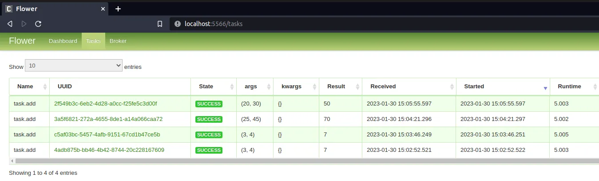

## Executors

-   Defines how tasks are executed. Note that it does not do the execution of task
-   Many types i.e. local Executor, Celery, Kubernetes
-   Related Parameters
    -   executor:

### The default config

### The Sequential Executor

-   The sequential executor is the executor by default when you install airflow manually.
-   With this executor, the scheduler runs one task at a time.
-   Usually used only for making experiments or debugging issues.
-   To configure this executor, you just need to modify the executor setting with the sequential executor
    ```raw
    executor = SequentialExecutor
    ```

### The Local Executor

-   The local executor is one step further than the sequential executor, as it allows you to execute multiple tasks at the same time on a single machine
-   , it means that you end up with the same, for instance, but with a different database.

In this time we are going to use either PostgreSQL, my SQL, Oracle DB or whatever you want, but not the SQL database.

-   To configure this executable:
    ```raw
    executor=LocalExecutor
    sql_alchemy_conn=postgresql+psycopg2://<USER>:<PWD>@<HOST>/<DB>
    ```
-   The local executable doesn't scale very well, as it depends on the machine on which it runs so you are limited by the resources that the machine has.

### The Celery Executor

The silver executor is nice to start sketching out the number of tasks that you can execute at the same time.

-   The celery executor allows the execution of multiple tasks at the same time using a celery cluster on multiple machines.
-   On top of the web server, the scheduler and the metadata database, there are additional components.
    -   the workers, which are machines in charge of executing your tasks.
        -   for e.g. you have three workers, so three machines to execute your tasks.
        -   If you need more resources to execute more tasks, you just need to add a new airflow worker
    -   the celery queue
        -   composed of two things:
            -   the result backend where the airflow workers store the status of the tasks that have been executed
            -   the broker, which is a queue where the scheduler sends the task to execute and the workers pull the tasks out of that queue to execute them.
-   Will require to install the celery queue which may be Redis or RabbitMQ.
-   Also need to define to additional configuration settings
    ```raw
    executor=CeleryExecutor
    sql_alchemy_conn=postgresql+psycopg2://<USER>:<PWD>@<HOST>/<DB>
    celery_result_backend=postgresql+psycopg2://<USER>:<PWD>@<HOST>/<DB>
    celery_broker_url=redis://:@redis:6379/0
    ```

#### How things work?

-   For example, you want to trigger this DAG
-   The scheduler sends the first task to the broker, and then one of the workers pulls out the tasks from the broker in order to execute it.
-   Once it's done, the state of the task is stored into the result backend, which is the same database of airflow. You can use another database if you want.
-   the task is deemed completed.

### Monitoring tasks with Flower



-   Flower is a web based tool used to manage and monitor celery clusters.
    -   It has a UI that monitors all the workers on celery.
        = It gives clear statistics on the active tasks, processed tasks showing whether the task was successful or not, and also tells the load average of the tasks.
    -   It also maintains the name of the task, the arguments, the result, and the time taken to complete the task.
-   To access flower, use `docker compose --profile flower up -d` and go to http://localhost:5555


https://medium.com/apache-airflow/unsticking-airflow-stuck-queued-tasks-are-no-more-in-2-6-0-6f40a1a22835
https://www.restack.io/docs/airflow-knowledge-apache-airflow-queue-management


