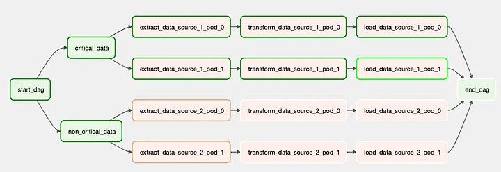

https://towardsdatascience.com/3-steps-to-build-airflow-pipelines-with-efficient-resource-utilisation-b9f399d29fb3

>### TL'DR
>- Airflow Pools for capping resource allocation to a group of tasks based on a predefined metric.
>- Parallelism & Concurrency for efficiently scaling the pipelines to utilise the available infrastructure fully.
>- Priority Weights for prioritising and allocating resources to crucial tasks before others.

### Airflow Pools

-   Pools are a way of limiting the number of concurrent instances of a specific type of task. This is great if you have a lot of workers in parallel, but you don’t want to overwhelm a source or destination.
-   These resources are typically used for tasks that require external connections or limited resources, such as database connections, API calls, or other third-party services.
-   Pools help manage and limit the concurrency of these resource-consuming tasks within your workflow.
-   Pools in Airflow are particularly useful when you want to prevent overloading external systems or services, as well as ensuring that multiple tasks do not interfere with each other when using shared resources.
-   For instance, if you have a pool of database connections, you can specify the maximum number of concurrent tasks that can access the database at once, preventing potential bottlenecks.
-   For example, with the default airflow config settings, and a DAG with 50 tasks to pull data from a REST API, when the DAG starts, you would get 16 workers hitting the API at once and you may get some throttling errors back from your API. You can create a pool and give it a limit of 5. Then assign all of the tasks to that pool. Even though you have plenty of free workers, only 5 will run at one time.

### How it works

-   A pool in Airflow can is an area where processes run.
-   It contains slots that operators in Airflow can use once assigned to a pool.
-   A task can use one or more slots based on its configuration and can only be assigned to one pool
-   Once capacity is reached, runnable tasks get queued and their state will show as such in the UI.
-   As slots free up, queued tasks start running based on the `priority_weight` (of the task and its descendants).
-   If you assign a task to a pool that doesn't exist, then the task isn't scheduled when the DAG runs.
-   NOTE: if tasks are not given a pool, they are assigned to a default pool `default_pool`. default_pool is initialised with 128 slots and can changed through the UI or CLI (though it cannot be removed).
-   Running all tasks in a single pool is problematic.
    -   For e,g,, if the airflow instance is utilising all slots in a pool and requires running more tasks, in that case, the tasks are queued and wait for the ongoing processes to complete.

### Creating an Airflow Pool

```py
from airflow.models import Base
from airflow.utils.db import provide_session
from airflow.utils.sqlalchemy import create_session

@provide_session # ensures a session is provided to the function
def create_pool(session=None):
    from airflow.models.pool import Pool

    pool_name = "my_db_pool"
    max_connections = 5  # Set the maximum number of connections
    pool = Pool(pool_name, max_active=max_connections)
    session.merge(pool)
    session.commit()
```

-   Airflow UI: Go to Admin > Pools to create and manage your pools
-   Airflow CLI: Run `airflow pools` command with the `set` subcommand to create a new pool. 
    -   See the [Airflow CLI documentation](https://airflow.apache.org/docs/apache-airflow/stable/cli-and-env-variables-ref.html#pools) for the full list of pool commands. 
    -   With the Airflow CLI, you can also import pools from a JSON file with the import subcommand. 
    -   This can be useful if you have a large number of pools to define and doing so programmatically would be more efficient.

- Airflow REST API: 
  - This option is available with Airflow version 2.0 and later. 
  - To create a pool, submit a POST request with the name and number of slots as the payload. For more information on working with pools from the API, see the [API documentation](https://airflow.apache.org/docs/apache-airflow/stable/stable-rest-api-ref.html#operation/post_pool).

### Using an Airflow Pool

-   Once created, we can allocate tasks to pools using the `pool` attribute inside an operator.
-   We can have operators within the same DAG or multiple DAGs assigned to different pools based on logical differences.
-   Moreover, if some tasks require more resources than others within a pool, we can allocate more resources to those tasks using the `pool_slots` attribute inside an operator.
-   We are able to allocate the tasks to different pools based on their criticality.
-   Additionally we assign more pool_slots to essential tasks to let Airflow know that those tasks require more resources.

```py
# Here, my_task PythonOperator will use the my_db_pool for resource management.

from airflow import DAG
from airflow.operators.python import PythonOperator
from datetime import datetime

def my_database_task():
    # Your database task logic here

with DAG("my_dag", start_date=datetime(2023, 10, 1)) as dag:
    my_task = PythonOperator(
        task_id="my_task",
        python_callable=my_database_task,
        pool="my_db_pool"  # Set the pool name
    )

    do_something_critical = PythonOperator(
        task_id = f"do_something_critical",
        python_callable = _do_something_critical,
        dag = dag,
        pool = "data_pipelines_critical_pool", # Set the pool name
        pool_slots = 3
    )

    do_something_non_critical = PythonOperator(
        task_id = f"do_something_non_critical",
        python_callable = _do_something_non_critical,
        dag = dag,
        pool = "data_pipelines_non_critical_pool", # Set the pool name
        pool_slots = 1
    )
```
- Can also be done via TaskFlow API:
  ``` py
  @task(task_id="task_a", pool="single_task_pool")
  def sleep_function():
  ```
### Monitoring and Managing Pools

-   Airflow provides a web interface for monitoring and managing pools.
-   To access it, navigate to the Airflow web UI and go to the Admin section. There, you’ll find a Pools tab, which allows you to view and manage your existing pools, adjust their resource limits, and create new ones.

### Priority Weight

-   These configurations allow us to prioritise a certain tasks over others.

    -   `priority_weight`: The priority weight is an operator’s attribute that assigns priority to each task.

        ```py
        extract_data_source_1 = PythonOperator(
            task_id = f"extract_data_source_1",
            python_callable = _do_something,
            dag = dag,
            pool = "data_pipelines_pool",
            pool_slots = 1,
            priority_weight = 5
        )

        extract_data_source_2 = PythonOperator(
            task_id = f"extract_data_source_2",
            python_callable = _do_something,
            dag = dag,
            pool = "data_pipelines_pool",
            pool_slots = 1,
            priority_weight = 2
        )
        ```

    -   `weight_rule`: The weight rule determines the method for computing weights for the tasks.

        ```py
        args = { 
            "owner" : "Vachan", 
            "start_date" :  airflow.utils.dates.days_ago(1), 
            "retries" : 2,
            "weight_rule":"upstream" # <- Here
        }

        dag =  DAG(
            dag_id = "datapipeline",
            description = "Understanding weight rules in airflow",
            default_args = args,
            schedule_interval = None,
            tags = ["blog","pools"]
        )
        ```
-   For `weight_rule`, there are three ways of computing weights:

    1. Absolute
        - It allows the Airflow instance to prioritise tasks based on priority_weight assigned to each task.
        - For e.g.
            - priority_weight = 2 for all critical_data branch
            - priority_weight = 1 for all non_critical_data branch
        - Now, for DAG below, all tasks with higher priority_weights, i.e. critical_data tasks, are scheduled and executed first.
    2. Upstream
        - Using an upstream weight rule allows the Airflow instance to prioritise upstream tasks in a DAG by assigning the weight of an operation equal to the sum of weights of its downstream tasks.
        - For e.g. priority_weight = 1 for all tasks
        - Now, for DAG below, the task load_data_source_1_pod_0 would have a priority_weight of 5, that is 4 for downstream tasks and 1 for itself.
    3. Downstream:
       -   Using a downstream weight rule allows the Airflow instance to prioritise downstream tasks in a DAG by assigning the weight of an operation equal to the sum of weights of its upstream tasks.
       -   For e.g. priority_weight = 1 for all tasks
       -   Now, for DAG below, the task extract_data_source_1_pod_0 would have a priority_weight of 4, that is 3 for the upstream tasks and 1 for itself.

-   If operators in a DAG get assigned to different pools, then the tasks in each pool with higher priority are executed first. A
-   higher priority_weights implies that Airflow will run those tasks before serving any other queued job.

#### Deferred Operator


### Configuration: Concurrency

-   Airflow has several parameters to tune your tasks and DAGs concurrency.
-   Concurrency defines the number of tasks and DAG Runs that you can execute at the same time (in parallel)

#### `parallelism / AIRFLOW__CORE__PARALELISM`

-   This defines the maximum number of task instances that can run in Airflow per scheduler.
-   By default, you can execute up to 32 tasks at the same time. If you have 2 schedulers: 2 x 32 = 64 tasks.

#### `max_active_tasks_per_dag / AIRFLOW**CORE**MAX_ACTIVE_TASKS_PER_DAG`

-   This defines the maximum number of task instances allowed to run concurrently in each DAG.
-   By default, you can execute up to 16 tasks at the same time for a given DAG across all DAG Runs.

#### `max_active_runs_per_dag / AIRFLOW**CORE**MAX_ACTIVE_RUNS_PER_DAG`

-   This defines the maximum number of active DAG runs per DAG. By default, you can have up to 16 DAG runs per DAG running at the same time.

#### `Dag_concurrency`

-   It is defined as the maximum number of tasks that can be executed simultaneously in a DAG.
-   Analogous to Parallelism, dag concurrency can affect the resource utilisation of a workflow.
-   Where Parallelism affects the queuing of tasks at the Airflow level i.e. across all DAGs, dag_concurrency affects the queuing of processes at the DAG level.
