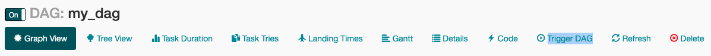

## DAG Parameters: Scheduling

-   start_date: The timestamp from which the scheduler will attempt to backfill
-   schedule_interval: How often a DAG run
-   end_date: The timestamp from which a DAG ends

## Triggering DAG Run

-   Prior version 2.2, data_interval_start = logical_date = execution_date
    -   Execution Date: logical datetime in which the DAG is executed
-   DAG is triggered **AFTER** start_date/last_run + schedule_interval
    -   For e.g.
        -   start_time: 2022/01/01 10AM , schedule_interval: 10 mins
        -   2022/01/01 10:00: Nothing happens
        -   2022/01/01 10:10: DAG triggered - start_date / data_interval_start: 10:00, data_interval_end: 10:10
        -   2022/01/01 10:20: DAG triggered - data_interval_start: 10:10, data_interval_end: 10:20

## Scheduling using CRON

-   CRON Presets: https://airflow.apache.org/docs/apache-airflow/stable/core-concepts/dag-run.html
-   CRON Editor: https://crontab.guru/
-   NOTE: schedule_interval getting deprecated

```py
# before version 2.4 (deprecated)

with DAG(schedule_interval='@daily')

with DAG(timetable=myTimetable)

# version 2.4 and after
# works with timetable, cron expression, time delta object, dataset
with DAG(schedule=...)

```

```py
from datetime import datetime, timedelta

from airflow import DAG
from airflow.operators.bash import BashOperator


default_args = {
    'owner': 'coder2j',
    'retries': 5,
    'retry_delay': timedelta(minutes=5)
}

with DAG(
    default_args=default_args,
    dag_id="dag_with_cron_expression_v04",
    start_date=datetime(2021, 11, 1),
    schedule_interval='0 3 * * Tue-Fri'     # <<< CRON expression here
) as dag:
    task1 = BashOperator(
        task_id='task1',
        bash_command="echo dag with cron expression!"
    )
    task1
```

## Manual Triggers

> NOTE: Remember to set `schedule_interval=None` on the DAG.
-   **UI**:
    -   Click the "Trigger DAG" button either on the main DAG or a specific DAG.
        
-   CLI:
    -   Run `airflow trigger_dag <dag_id>`, see [here](https://airflow.apache.org/docs/stable/cli.html#trigger_dag).
    -   Note that later versions of airflow, use `airflow dags trigger <dag_id>`
-   API:
    -   Call `POST /api/experimental/dags/<dag_id>/dag_runs`, see [here](https://airflow.apache.org/docs/stable/api.html#post--api-experimental-dags--DAG_ID--dag_runs).
-   Operator:
    -   Use the TriggerDagRunOperator, see [here](https://airflow.apache.org/docs/apache-airflow/stable/_api/airflow/operators/trigger_dagrun/index.html#airflow.operators.trigger_dagrun.TriggerDagRunOperator) and an [example](https://github.com/apache/airflow/blob/master/airflow/example_dags/example_trigger_controller_dag.py).

## Data-aware scheduling via datasets

-   New in version 2.4.
-   Docs: https://airflow.apache.org/docs/apache-airflow/stable/authoring-and-scheduling/datasets.html
-   In addition to scheduling DAGs based upon time, they can also be scheduled based upon a task updating a dataset.
-   Properties:
    -   URI:
        -   Unique identifier of dataset
        -   Path to the dataset
        -   Only composed of ASCII characters
        -   URI schema cannot be 'airflow' i.e. no 'airflow://'
        -   Case sensitive

        ```py
        from airflow import Dataset

        # valid datasets
        schemeless = Dataset("/pathfile.txt")
        csv_file = Dataset("file.csv")

        # invalid datasets
        reserved = Dataset("airflow://file.txt")
        not_ascii = Dataset("file_dataŝet")
        ```

    -   extra: JSON dictionary to store extra info

        ```py
        from airflow import Dataset

        my_file = Dataset(
            "s3://dataset/file.csv",
            extra={'owner': 'james'}
        )
        ```

### Limitations

-   DAGs can only use Datasets in the same Airflow instance.\
-   Consumer DAGs are triggered every time a task that updates datasets completes successfully. Airflow doesn't check whether the data has been effectively updated.
-   You can't combine different schedules like datasets with cron expressions.
-   If two tasks update the same dataset, as soon as one is done, that triggers the Consumer DAG immediately without waiting for the second task to complete.
-   Airflow monitors datasets only within the context of DAGs and Tasks. If an external tool updates the actual data represented by a Dataset, Airflow has no way of knowing that.

### Producer DAG

Once mentioned dataset updates, DAGs that depend on the mentioned dataset will be triggered

```py
# producer.py
from airflow import DAG, Dataset
from airflow.decorators import task

from datetime import datetime

my_file = Dataset("/tmp/my_file.txt")

with DAG(
    dag_id="producer",
    scheduler="@daily",
    start_date=datetime(2022, 1, 1),
    catchup=False
):

    @task(outlet=[my_file])   # indicates task updates dataset
    def update_dataset():
        with open(my_file.uri, "a+") as f:
            f.write("producer update")

    update_dataset()
```

### Consumer DAG

```py
# consumer.py
from airflow import DAG, Dataset
from airflow.decorators import task

from datetime import datetime

my_file = Dataset("/tmp/my_file.txt")

with DAG(
    dag_id="consumer",
    scheduler=[my_file],    # triggers when dataset is updated
    start_date=datetime(2022, 1, 1),
    catchup=False
):

    @task
    def read_dataset():
        with open(my_file.uri, "r") as f:
            print(f.read())

    read_dataset()
```

### Multiple datasets

```py
#--------------------- producer.py --------------------
from airflow import DAG, Dataset
from airflow.decorators import task

from datetime import datetime

my_file = Dataset("/tmp/my_file.txt")
my_file_2 = Dataset("/tmp/my_file_2.txt")

with DAG(
    dag_id="producer",
    scheduler="@daily",
    start_date=datetime(2022, 1, 1),
    catchup=False
):

    @task(outlet=[my_file])   # indicates task updates dataset
    def update_dataset():
        with open(my_file.uri, "a+") as f:
            f.write("producer update")

    @task(outlet=[my_file_2])   # indicates task updates dataset
    def update_dataset_2():
        with open(my_file_2.uri, "a+") as f:
            f.write("producer update")

    update_dataset() >> update_dataset_2()

# ------------------ consumer.py ---------------------
from airflow import DAG, Dataset
from airflow.decorators import task

from datetime import datetime

my_file = Dataset("/tmp/my_file.txt")
my_file_2 = Dataset("/tmp/my_file_2.txt")

with DAG(
    dag_id="consumer",
    scheduler=[my_file, my_file_2],    # triggers when dataset is updated
    start_date=datetime(2022, 1, 1),
    catchup=False
):

    @task   # indicates task updates dataset
    def read_dataset():
        with open(my_file.uri, "r") as f:
            print(f.read())

    read_dataset()
```
