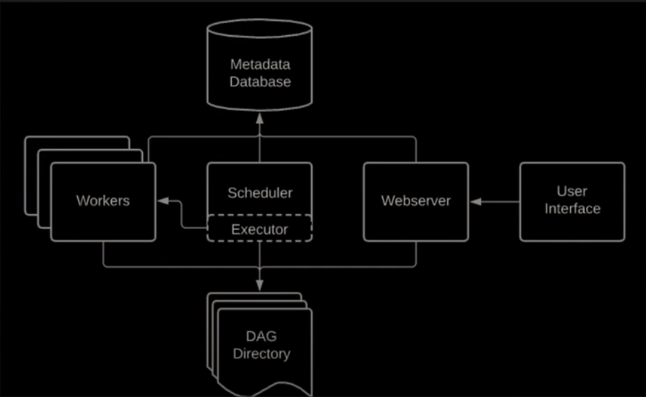
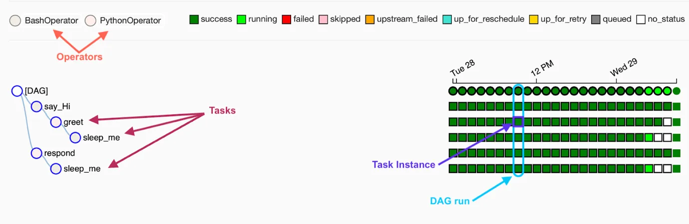
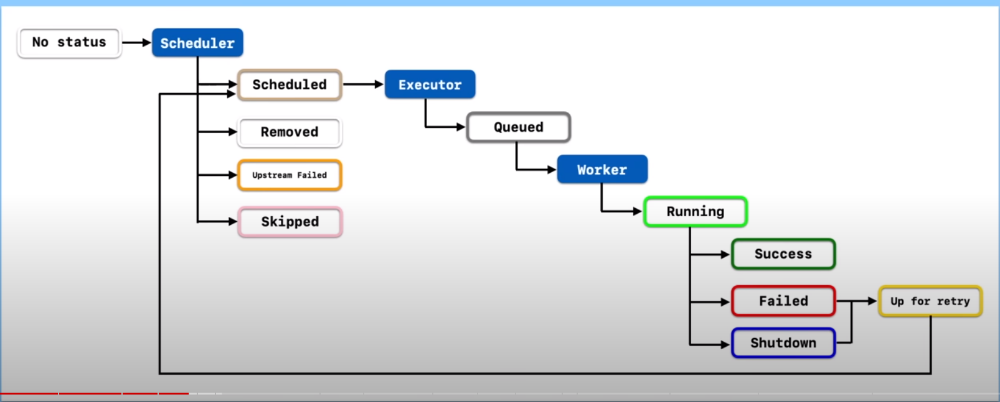

## Links

-   Debug Tips: <https://www.youtube.com/watch?v=5QxqqeOxJhI&list=PLwFJcsJ61oujAqYpMp1kdUBcPG0sE0QMT&index=15&ab_channel=coder2j>
-   Email Alerts: <https://www.youtube.com/watch?v=D18G7hW8418&list=PLwFJcsJ61oujAqYpMp1kdUBcPG0sE0QMT&index=18&ab_channel=coder2j>
-   Bad & Best Practices: <https://www.youtube.com/watch?v=LBoT1DzGFS4&ab_channel=PlainSchwarz>
-   Trigger DAGs via REST API: <https://brocktibert.com/post/trigger-airflow-dags-via-the-rest-api/>
https://www.cloudwalker.io/2020/12/21/airflow-dynamic-tasks/
https://docs.astronomer.io/learn
https://www.restack.io/docs/airflow-knowledge-apache-airflow-queue-management
https://github.com/jghoman/awesome-apache-airflow

## Airflow Connections

### Postgres Operator

-   NOTE: for host field, if using docker application, `localhost` doesn't work, try `host.docker.internal` instead
-   TIP: Recommended to delete data before inserting data to prevent duplication of primary keys

```py
from datetime import datetime, timedelta

from airflow import DAG
from airflow.providers.postgres.operators.postgres import PostgresOperator


default_args = {
    'owner': 'coder2j',
    'retries': 5,
    'retry_delay': timedelta(minutes=5)
}


with DAG(
    dag_id='dag_with_postgres_operator_v03',
    default_args=default_args,
    start_date=datetime(2021, 12, 19),
    schedule_interval='0 0 * * *'
) as dag:
    task1 = PostgresOperator(
        task_id='create_postgres_table',
        postgres_conn_id='postgres_localhost',
        sql="""
            create table if not exists dag_runs (
                dt date,
                dag_id character varying,
                primary key (dt, dag_id)
            )
        """
    )

    # the curly bracket notation is for airflow macros
    task2 = PostgresOperator(
        task_id='insert_into_table',
        postgres_conn_id='postgres_localhost',
        sql="""
            insert into dag_runs (dt, dag_id) values ('{{ ds }}', '{{ dag.dag_id }}')
        """
    )

    task3 = PostgresOperator(
        task_id='delete_data_from_table',
        postgres_conn_id='postgres_localhost',
        sql="""
            delete from dag_runs where dt = '{{ ds }}' and dag_id = '{{ dag.dag_id }}';
        """
    )
    task1 >> task3 >> task2
```

### What is Airflow?

-   A open source platforn on which to create, schedule and monitor workflows
-   NOT a data streaming solution. Triggering pipelines every second does not work!!
-   NOT data processing framework. You end up with memory errors

### Installation

-   Airflow is built in a modular way
-   Airflow Core: `pip install apache-airflow`
-   Installing additional providers adds new functionalites e.g. `pip install apache-airflow-providers-amazon`

```sh
# code taken from official Airflow GitHub repo
# change python version accordingly
pip install 'apache-airflow==2.6.3' \
 --constraint "https://raw.githubusercontent.com/apache/airflow/constraints-2.6.3/constraints-3.8.txt"

# initialize database for Airflow
# to have everything install within the current directory
export AIRFLOW_HOME=.

# this create a sqlite db, log folder and some config files
airflow db init

#---------------------------------------------------------------

# to see the fields required
airflow users create --help
# create user
airflow users create
    --username admin
    --firstname <FIRST_NAME>
    --lastname <LAST_NAME>
    --role Admin
    --email <EMAIL>

# start airflow webserver
airflow webserver -p 8080

#------------------------------------------------------------

# if scheduler is not running error
export AIRFLOW_HOME=.
airflow scheduler

```

### Core Components



#### Web Server
- A flask python web server that allows you to access the interface to track your tasks and workflows (like your route and stops). 
- The Airflow web UI provides a visual pipeline map:
  - View planned workflows and dependencies (DAG diagrams)
  - Monitor current task execution status
  - Access logs to diagnose failures
  - Modify workflows by dragging nodes 
  - Share editable maps with others (permission controls)
- The web server enables monitoring and troubleshooting workflows interactively through pipeline visualization.

#### Scheduler: 
- **Critical** component
- Does the scheduling of tasks, pipelines
- The scheduler keeps track of all your tasks and their dependencies. 
- The scheduler sequences pipeline tasks based on dependencies:
  - Plans execution order respecting dependencies
  - Sets precise task timing 
  - Dynamically handles delays and failures
  - Continuously optimizes execution plan
- The scheduler is the brain orchestrating task execution to complete workflows reliably.

#### Metadata Database
- Database that stored metadata regarding pipelines, tasks, users
- It maintains records of all your tasks, their statuses, and other details to ensure the web server and the scheduler are updated and in sync. 
- It captures extensive workflow execution data:
  - Logs each activity along the journey (task instances, logs)
  - Records dag runs stats
  - pipeline run history
  - Documentation for future improvements
- The metadata database provides visibility into current and historical runs.

-   Triggerer: Triggers tasks based on scheduling and dependencies.
####  Executor
- Defines how tasks are executed. Note that it does not do the execution of task
- It executes the tasks
- Executors provide different runtime environments for task execution:
  - LocalExecutor for test drives (local Docker containers)
  - Kubernetes Executor for structured trips (Kubernetes pods)
  - CeleryExecutor for distributed journeys
  - SparkExecutor for batch processing
  - Custom execs like Lambda
- Executors allow for robustly running tasks on different computing infrastructures.

-   Other Componenets:
    -   **Queue**: Your tasks will be pushed into it in order to execute them in the right order
    -   **Worker**: Does the execution of tasks

### Architecture

-   Single Node Architecture:
    -   Everything in one node, on one machine
    -   Queue is part of the Executor, which in turn is part of the Scheduler
-   Multi Node Architecture:
    -   Usually for production
    -   Node 1: Web Server, Scheduler, Executor(Part of scheduler)
    -   Node 2: Metastore, Queue (External to executor, usually RabbitMQ, Redis)
    -   Additional Worker Nodes
    -   Can scale up processing power by increasing number of worker nodes

### Core Concepts

-   `DAGs`
    -   Directed Acyclic Graphs
    -   A collections of `tasks` to be exected
    -   `Tasks` are executed by `Operators`
-   Operator
    -   template for a predefined task
    -   3 types:
        -   Action Operators: Executes an action
        -   Transfer Operators: Transfers data from point to point
        -   Sensor Operators: Wait for a condition to be met
-   Execution Date: logical datetime in which the DAG is executed
-   Task Instance: A execution of a task at a specfic point in time
-   Dag Run: instantiation of a DAG which contain task instances




## Task Lifecycle



-   Available statuses
    -   `no_status`: scheduler created empty task instance
        -   `schedule`: scheduler determined task instance needs to run
            -   `queued`: schedule sent task to executor to run on the queue
                -   `running`: worker picked up task and is now running it
                    -   `success`: task completed without error
                    -   `failed`: task failed
                    -   `shutdown`: task aborted
                        -   `up_for_retry`: rerun task
                        -   `up_for_reschedule`: reschedule task every certain time interval
        -   `upstream_failed`: task's upstream task failed
        -   `skipped`: task is skipped
        -   `removed`: task is removed

### Execution Flow

-   Add `dag.py` in DAG Directory
-   Scheduler scans DAG Directory
    -   New dags might take up to 5 mins to detect
    -   Changes to existing dags might take up to 30 secs
-   Scheduler runs dag. Creates the dagrun object, with state `Running`
-   First task to execute becomes a task instance object.Status from `None` to `Scheduled`
-   The task instance object is sent into the Queue of the executor. State changes to `Queued`
-   Executor creates a subprocess to run task. State=`Running`
-   Once task is done, state changes to `Success`/`Failed` based on outcome
-   Scheduler checks
    -   if there is no tasks to execute: DAG is done. DagRun status=`Success`