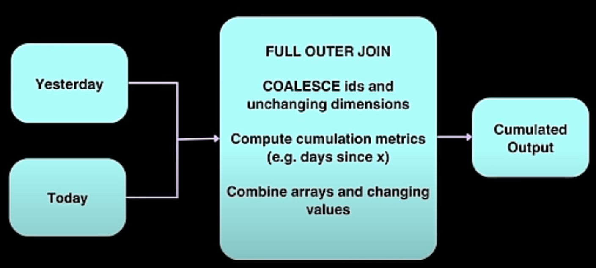

### Knowing your Consumer
- Data Analyst / Data Scientists
  - Should be very easy to query. Not many complex data types
- Other Data engineers
  - Should be compact and probably harder to query
  - Nested types are okay
- ML Models
  - Depends on the model and how it's trained
- Customers / Executives
  - Should be a very easy to interpret chart

> Mismatch of needs = Less Business Value
> Some of the biggest problems in data engineering occur when data is modeled for the wrong consumer!

- OLTP and OLAP is a CONTINUUM
  ``` 
  Production Database Snapshots -> Master Data -> OLAP Cubes -> Metrics
  ```

https://github.com/EcZachly/cumulative-table-design
  
### Cumulative Table Design



- Core components
  - 2 dataframes (yesterday and today)
  - FULL OUTER JOIN the two dataframes together
  - COALSCE values to keep everything around
  - Hang onto all of history
- Uses
  - Growth Analytics
  - State Transition Tracking
- NOTE: Set a limit to the number of data point stored within the array e.g. monthly
- Strengths:
  - Historical analysis without shuffle (i.e. just need to sum or look into the array)
  - Easy "transition" analysis
- Drawbacks:
  - Can only be backfilled sequentially
  - Handling PII data can be a mess since deleted/inactive users get carried forward

### Compactness vs Usability Tradeoff
- Usability generally matters more over compactness
- The most usable tables usually
  - Have no complex data types
  - Can be easily manipulated with WHERE and GROUP BY
  - Great for when analytics is the main consumer and the majority of consumers are less technical
- The most compact tables (not human readable)
  - are compressed to be as small as possible and can't be queried directly until decoded
  - For online systems where latency and data volumes matter a lot. Consumers are usually highly techincal.
- The middle ground tables
  - Use complex data types(e.g. ARRAY, MAP and STRUCT), making querying tricker but also compacting more
  - Upstream staging / master data where the majority of consumer are other data engineer

### Struct vs Array vs Map
- Struct: 
  - Keys are rigidly defined. Compression is good.
  - Values can be any type
- Array:
  - Ordinal
  - List of values that all have to be the same type
- Map:
  - Keys are loosely defined. Compression is okay
  - Values all have to be the same type

### Temporal Cardinality
