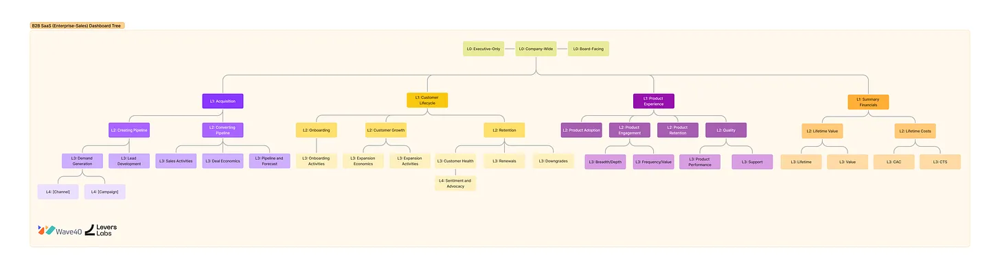

### What are dashboard trees
- The dashboard tree is a bounded and cascading set of dashboards that define and relate key input and output metrics for the business.
  - bounded means we’re not allowing dashboard sprawl
  - cascading means there’s a hierarchical order that helps build context
  - relating key inputs and outputs means there’s a logical relationship among them
- The structure of the dashboards reveals how the business works. 

### Implementation

1. Build a metrics tree 
    - See [[tools.storage.data_modeling.metrics.metric_tree]]
    - Start from the top metric you care about. 
    - Then you continue building metrics trees using all the available metrics in the business. At this point they will be disconnected, but that’s ok.

1. Connect all the metric trees and separate them into zones that form the levels.
   - Start with the customer journey and roughly follow the org structure. 
   - It’s important that dashboard trees not follow org structure too rigidly because it changes.

