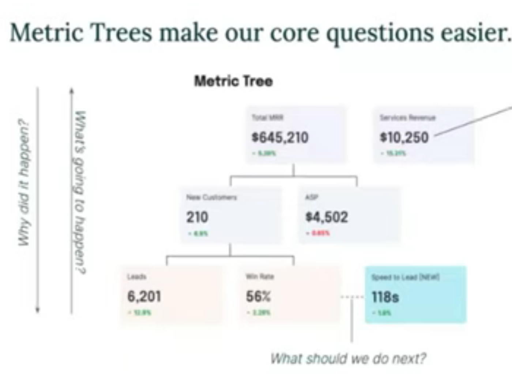
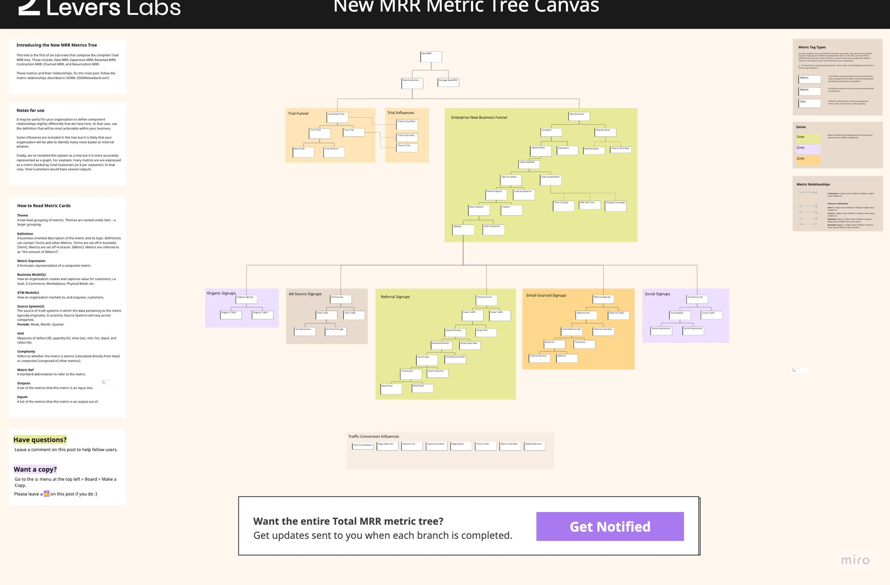

- SOMA Metrics:
    - https://www.youtube.com/watch?v=7EINkkJsNkI&t=29s
    - https://sqlpatterns.com/p/implementing-a-metrics-stack
    - https://sqlpatterns.com/p/modeling-data-for-soma-metrics
    - https://sqlpatterns.com/p/soma-data-modeling-patterns
    - https://github.com/Levers-Labs/SOMA-B2B-SaaS/tree/main
- https://www.youtube.com/watch?v=NarooyurrOo

### Why data?

-   The bulk of the value comes from answering these questions
    -   Descriptive analytics: Why happened?
    -   Root Cause Analysis: Why did it happen?
    -   Predictive Analysis: What's going to happen?
    -   Prescriptive Analytics: What should we do next?

#### How can we answer these questions easily, quickly and often?

-   Organizations are simply input-output systems
    -   i.e. just ways of translating inputs into value-denominated assets
    -   can be described by a fundamental formula comprised of:
        -   metrics: business facts on how value is created / captured,
        -   relationships: how metrics relate with one another
        -   weights: expresses the significance of different relationships on metrics

> The purpose of data teams is to help companies define, understand, evolve and operationalize their growth model.
>
> -   Data teams help with identifying growth levers
> -   Operation teams pull the growth levels

### Metric Trees

-   Logical representation of a business’ growth model in a graph form.
-   Comprised of
    -   input metrics,
    -   output metrics
    -   relationships among metrics
-   Every tree has a “north star” output metric and multiple input metrics.
-   Output metrics decompose into two types of inputs
    -   components:
    -   influences
        

#### Creating Metrics Trees

1. Define North Stars
    - Most top level metrics in the company. They are the metrics that all other metrics derive their legitimacy.
    - 3 types:
        - Customer Value (e.g Retention)
        - Financial (e.g. Revenue)
        - Strategic (e.g. Market Share)
    - Metrics Tree usually start with $$$ e.g. revenue
2. Recursively break down inputs
    - Here we add component metrics which are deterministic and mathematical related (formulas)
        - i.e. `Revenue = Customers X AvgSellingPrice`: Customers and ASP are components of Revenue
    - Lead metrics are metrics that cannot be broken down further
3. Map out relationships
    - Influences are metrics that have causal or correlational relatopnship
    - Usually empirically derived
    - The relationship can fluctuate across time
4. Add metadata
    - edge: add properties such as strength, confidence
    - nodes: add dimensions to slice by

