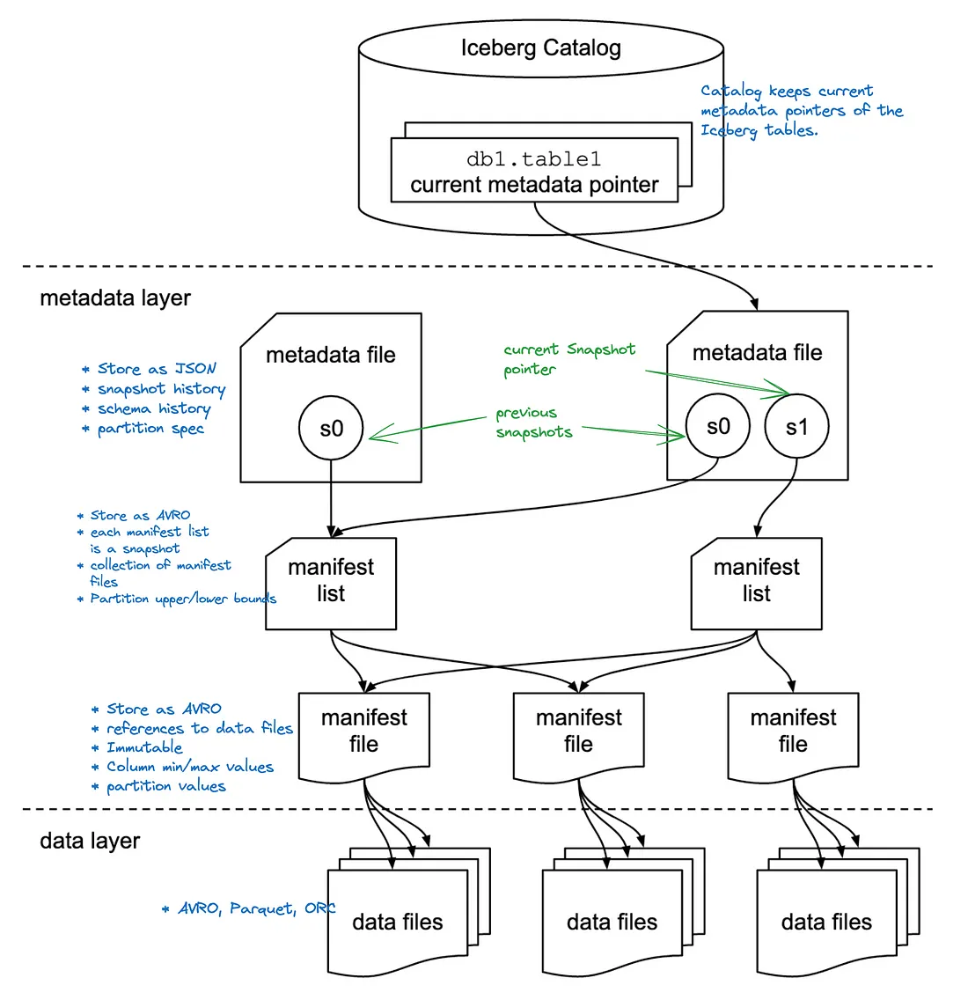

<https://www.youtube.com/watch?v=nWwQMlrjhy0>

- [Iceberg with Spark](https://medium.com/@geekfrosty/apache-iceberg-architecture-demystified-e19b5cae9975)

### What is Iceberg

- Apache Iceberg is an Open Table Format
  - Defines a table as a canonical list of files, providing metadata on which files make up the table (instead of directories with the Hive table format).
  - This allows for features like ACID Transactions, consistent reads, safe writes by multiple readers and writers at the same time, Time Travel, easy schema evolution without rewriting the entire table, and more.
- Iceberg is a framework that allows you to manipulate data over immutable file formats like Parquet, Avro and ORC as if they are tables.

### The Hive Standard Dilemma

- Before Apache Iceberg came into the picture, the Apache Hive table standard was widely used for organizing and querying data within Netflix's data lake.

#### Apache Hive

- Apache Hive, a widely-used data warehousing and SQL-like query language tool in the Hadoop ecosystem, traditionally tracked tables using a directory-centric approach.
- In this schema, tables were essentially represented as directories within the Hadoop Distributed File System (HDFS).
- Each table directory contained subdirectories for partitions, and metadata such as schema and statistics were stored in the Hive Metastore, a separate database.

#### Limitation of Apache Hive

- However, it was not without its shortcomings.

  - **Stale Table Statistics**:
    - Table statistics were not generated on every query
    - Instead you had to regularly run `ANALYZE TABLE` queries to update table stats.
  - **ACID Guarantees on Updates**:
    - The Hive standard struggled with providing ACID (Atomicity, Consistency, Isolation, Durability) guarantees on updates that spanned more than one partition.
    - This posed a significant challenge for Netflix as they needed reliable data updates and consistency.
  - **Slow Speed Due to File Listing**:
    - The Hive Metastore's approach of tracking tables as directories and sub-directory partitions led to slow file listing operations.
    - This hindered the speed and efficiency of queries, which was a critical concern for a company like Netflix that relies on real-time data processing.

#### Enter Apache Iceberg

- Apache Iceberg was created to address the limitations of the Hive standard.

  - **Tracking Tables as Lists of Individual Files**:
    - Apache Iceberg tracks tables as lists of individual files.
    - Groups of Individual files are tracked in "manifests" which also contain file statistics that can be used for pruning individual files from query plans.
  - **Leveraging Manifest Lists for Snapshots**:
    - Each table snapshot is represented by a "manifest list" which list all the manifests relevant to the snapshot of the table.
    - This file would also have manifest level stats for each manifest listed which could be used to prune whole manifests before pruning individual files.
  - **Enabling Time-Travel with Multiple Snapshots**:
    - Each snapshot captures the state of the data at a particular point in time. This feature enables time-travel queries, allowing users to access historical versions of the dataset effortlessly.
  - **Ensuring Up-to-Date Table Statistics**:
    - Apache Iceberg's metadata-rich approach ensures up-to-date table statistics, addressing the issue of stale statistics that plagued the Hive standard. Accurate statistics are crucial for query optimization and performance.
  - **Optimistic Concurrency Control for ACID Transactions**:
    - To provide ACID guarantees on data updates, Apache Iceberg employs optimistic concurrency control mechanisms.
    - This means that updates can be made concurrently while maintaining data consistency and integrity, even when affecting multiple partitions.

### How Apache Iceberg Works

- Apache Iceberg table has three different layers: Catalog Layer, Metadata Layer, and Data Layer.



#### Data Layer

- The layer where the actual data for the table is stored and is primarily made of data files.
- File-format agnostic and supports Parquet (default), ORC and Avro.
  - Provides the flexibility to choose the underlying file format based on the use case
    - Parquet for a large-scale OLAP analytics table
    - Avro for a low-latency streaming analytics table.
- The data layer is backed by a distributed file system i.e. HDFS or a cloud object storage i.e. AWS S3 that are extremely scalable and low-cost

#### Metadata Layer

- Contains all of the metadata files for an Iceberg table.
- It has a tree structure that tracks the data files and metadata about them along with the details of the operation that made them.
  - Having data files spread over in two layers, allows Iceberg to read metadata of very large tables just from a single node client application, without needing a distributed SQL engine.
- The files in this layer are immutable files so everytime an insert, merge, upsert or delete operation happens on the table, a new set of files are written (for the latest version).
  - This behavior is called snapshotting and its what makes time travel possible.

##### Manifest files

- An Avro file that keeps links to a collection of data files.
- It stores partition details and column statistics for each data file.
  - A data file can belong only to a single partition. Otherwise file level partition pruning will not work.
  - Statistics can be used for min/max filtering to skip files that do not contain query-relevant values.

##### Manifest List

- An Avro file which tracks all the manifest files of a table in a particular time
- Also stores upper and lower partition bounds of each manifest file facilitating accelerated scan planning.
- A Manifest list file is a snapshot of an Iceberg Table as it contains the details of the snapshot along with `snapshot_id` that has added it.
- Used to apply partition pruning, allowing queries to skip manifests with partition values that are irrelevant to the query.

##### Metadata.json

- The entry point of an Iceberg table.
- This file contains details about the table, such as its partitioning scheme, schema, and a historical list of snapshots.
- Stored as a Json file and evolves (by introducing a new version) every time when table metadata gets changed.
- This file maintains
  - the snapshot history by keeping references to the latest manifest list as well as the preceding ones.
  - schema and partition definitions along with their history as well.

#### Catalog Layer

- The layer that tracks the list of tables and references the location of the latest metadata, specifically pointing to the current metadata.json file.
- Stores the current metadata pointer and provide atomic guarantees,
- there are different backends that can serve as the Iceberg catalog like Hadoop, AWS S3, Hive, AWS Glue Catalog and more.
- These different implementations store the current metadata pointer differently.

---

### Insert and deletes

Following illustration further depicts how Iceberg metadata behaves with insert and deletes. The key highlight is that all the files, both data and metadata, are immutable. Every change will result in a new version of a file.

insert and delete operation (designed with excalidraw.io)
Step 1: Create table statement and it populates table metadata.json file.

Step 2: Insert operation which creates the manifest list, manifest and the data files. The same time metadata.json file evolves into the next version and keeps pointing to the manifest.

Step 3: One more insert statement results in creating new data files and the evolved manifest list contains the reference to associated manifest file.

Step 4: Delete operation on Copy-On-Write (COW) mode. The diagram illustrates data is being deleted from the data file created in Step 3. When table is configured with COW mode, deletes result in copying un-deleted rows of a data file to a new file that is referenced by a new manifest file. The source file is marked as deleted in a another new manifest file. The delete marker is only informational and will not be used for scan planning. Hence there is no point storing it in a manifest that store existing files. The original link to the manifest-01.avro file is dropped from the manifest list.

The delete/update operations on COW mode can be expensive because it involves copying data to new files. This mode is particularly well-suited for analytical workloads, where writes are less frequent( they will be large batches) and the table is required to be optimized towards reads.

To have support for more frequent update/delete workloads, like streaming, Iceberg introduced Merge-On-Read (MOR) mode in format version 2. In this mode, delete operation will not result in any changes to the existing data files. Instead it will either write the positions of the deleted rows to a file called positional delete file or it will write predicate used in the delete operation to a file called equality delete file.

As an example, if we delete rows where id = 3 in the following table, positional and equality delete files would look like below.

``` raw
1: id | 2: category | 3: name
-------|-------------|---------
 1     | marsupial   | Koala
 2     | toy         | Teddy
 3     | NULL        | Grizzly
 4     | NULL        | Polar


positional_delete_file.parquet

file_path     | pos   |
--------------|-------|
xx/yy.parquet | 33253 |
xx/yy.parquet | 45231 |
aa/bb.parquet | 12412 |


equality_delete_file.parquet

1: id
-------
 3
```

While positional delete files need to read through the data files to locate positions, the equality delete files simply persists the predicate which contributes to the much more efficient delete operations in the expense of reduced read performance later.

MOR configured tables handle updates by combining delete operation followed by an insert operation. The delete will remove impacted rows from the data file and insert adds a new data file with updated rows.

The delete files also get tracked via manifests similar to the data files. However both delete files and data files are not tracked in a single manifest file, as scan planning reads delete files first, Iceberg distinguish delete manifests from existing manifests by keeping them separate.

The COR and MOR can be configured by write.delete.mode, write.update.mode and write.merge.mode properties.

### Feature walkthrough

#### Transaction isolation

According to the docs — “An atomic swap of one table metadata file for another provides the basis for serializable isolation” . The file rename functionality is a suitable atomic swap operation which is supported in blob storages as well as in file systems.

Iceberg transaction isolation is based on optimistic concurrency. Hence, the writers must retry their update/delete operations, if there is already a more recent table metadata version in place than the one in use.

Iceberg supports two isolation levels, serializable and snapshot, that can be configured with write.delete.isolation-level, write.update.isolation-level and write.merge.isolation-level properties.

#### Schema Evolution

Iceberg schema keeps track of fields using field IDs rather using the field name directly. This allows to have schema changes without much of a hassle. See column projection for more details.

Following is a metadata output of a parquet file in Iceberg using parquet-tools . The second column with the field id = 2, has been dropped previously and later re-introduced with the same name, which introduced a new field with the field id = 4. This file is created by an insert after the drop column operation took place. The previous parquet files still have the field id = 2, but hidden from consumers by the column projection. The data files are immutable once written.

``` sh
File path:  00000-8-aa2c5b04-b0dd-49a7-b7ba-fb5b5900e704-00001.parquet
Created by: parquet-mr version 1.13.1 (build db4183109d5b734ec5930d870cdae161e408ddba)
Properties:
  iceberg.schema: {"type":"struct","schema-id":0,"fields":[{"id":1,"name":"customer_id","required":true,"type":"int"},{"id":3,"name":"order_date","required":true,"type":"date"},{"id":4,"name":"name","required":true,"type":"string"}]}
Schema:
message table {
  required int32 customer_id = 1;
  required int32 order_date (DATE) = 3;
  required binary name (STRING) = 4;
}
```

Although I am not sure about the schema-id in the properties, according to the metatada.json it could be schema-id = 2. Besides schema-id pointer within data files is not needed as long as table metadata.json points to the correct schema version.

#### Hidden Partitions

Iceberg tables defines partitions using a constuct called partition spec. Partition spec is an expression which uses a transformer function applied over a table column. The Spark SQL partition clause provided below will yield the following partition specification.

``` sql
PARTITIONED BY (months(order_date), customer_id)
```

``` json
  "partition-specs" : [ {
    "spec-id" : 0,
    "fields" : [ {
      "name" : "order_date_month",
      "transform" : "month",
      "source-id" : 3,
      "field-id" : 1000
    }, {
      "name" : "customer_id",
      "transform" : "identity",
      "source-id" : 1,
      "field-id" : 1001
    } ]
  } ]
```  

Both month and identity are transformer functions. The partition spec is kept in metadata.json file while actual partition values are stored as a tuple in manifest files.

The most important feature of iceberg partitions is that users are not required to specify the partition clause from the queries. Even when the query does not include fields that were used in the transformation functions, Iceberg automatically figures the partitions to search based on the column statistics in manifest-list and manifest files. This hidden partitioning implementation of Iceberg is very advantageous for the users because they can write an effective queries even without having any knowledge about the underlying partitioning scheme.

#### Partition Evolution

Imagine the hassle of rewriting a whole table to repartition a hive table 🙂. Iceberg offers more flexible partition management where users are allowed to modify the partition spec without any data movement. By design, old data will still follow the old partition spec, while new data will be written accordance to the new spec.

This is visually represented below where a query spawns multiple plans for evolved partition specs.

Partition spec evolution ( Iceberg docs )

#### Time Travel

- The key idea of Iceberg design was to track all the data files in a table over time.
- Since all the manifest and data files are immutable, going back in time is simple as introducing a new metadata.json file with a pointer to a snapshot(manifest-list.avro file) in the past.

- With Spark SQL, we can see the table history and the snapshots using Iceberg metadata tables.

    ``` sql
    SELECT * FROM <schema>.<table_name>.history;
    SELECT * FROM <schema>.<table_name>.refs;
    ```

- Reverting to the previous snapshot is possible with a simple procedure call.

    ``` sql
    CALL iceberg.system.rollback_to_snapshot('<schema>.<table_name>', snapshot_id)
    ```
