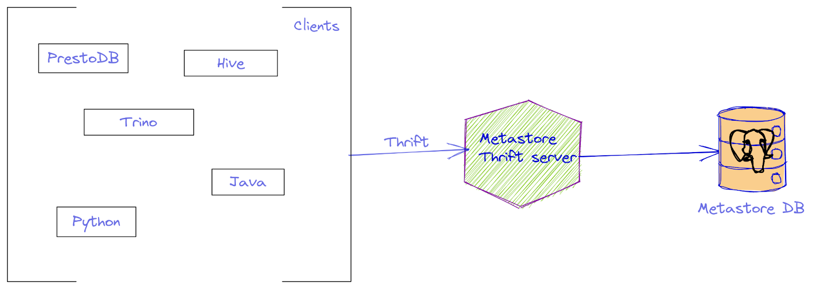
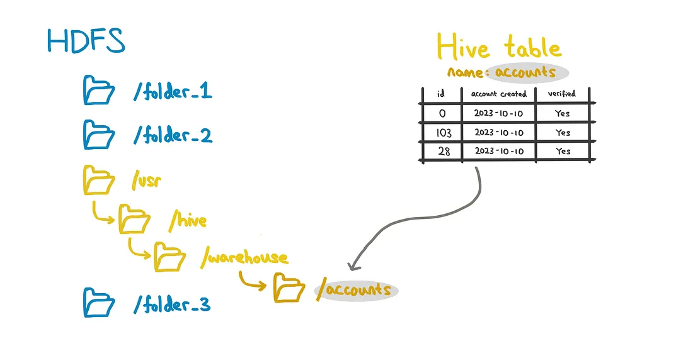

### What is Apache Hive

- Apache Hive is a powerful data warehousing tool that facilitates querying and managing large datasets residing in distributed storage. 
- It’s built on top of Hadoop and extends its capabilities with SQL-like querying. 
- Hive translates these queries into MapReduce jobs, making it an integral part of the Hadoop ecosystem. 


### How does Hive work?

Let’s start with a high-level diagram, then work our way through a typical Hive user journey:


(This is a high level view. For a more granular breakdown, please check out this great diagram and article on geeksforgeeks)

1. Suppose a user sends a query.
   - Note: Queries are done via Hive-QL. It is a SQL-like language, which means it’s similar but not the same as SQL.

    ``` sql
    -- A HiveQL query that selects columns 'column_1' and 'column_2' 
    -- from table 'database_name.table_name', filtered on rows where column_1 
    -- is strictly greater than 3. 

    SELECT column_1, column_2
    FROM database_name.table_name
    WHERE column_1 > 3;

    -- Note how here, the syntax is no different from SQL!
    ```

1. Your query then gets sent to Hive server (HiveServer2), which translates it for the driver.

1. Metastore stores relevant metadata about the Hive table: database name, table name, column names, etc…
   - Also includes details about where the table data is located in HDFS, which is vital in guiding your Hive queries to look in the appropriate directories in HDFS
   - For those more interested in the metastore, I would recommend this page: <https://blog.jetbrains.com/big-data-tools/2022/07/01/why-we-need-hive-metastore/>

2. Now Hive knows where and what to query.
3. In order to execute the query, it uses an execution engine for e.g. Tez or MapReduce.
    - it executes your nicely compiled queries while throwing in some optimization to speed up data retrieval
    - Tez usually is preferred due to less reading and writing to the disk, which saves time.


### Hive Metastore

- Hive Metastore was developed as a part of Apache Hive, “a distributed, fault-tolerant data warehouse system that enables analytics at a massive scale”, per the Amazon website. This basically means you can query everything from one place.
- Hive achieves this goal by being the storage point for all the meta-information about your data storages.
- With its HSQL dialect (which has some limitations compared to regular SQL – but also some advantages), Hive allows you to project any data structure to a structure that is suitable for querying with SQL.
- Note: Hive Metastore is separate from and completely independent of Hive.

#### Architecture

- The actual architecture of Hive Metastore is quite simple
  


##### The metastore database
- Hive Metastore projects types from an underlying store to supported HSQL types, and stores information about the location of the underlying data. 
- This data is stored in the metastore database, which is usually MySQL, Postgres, or Derby.
- Its schema is more or less fluid, and it changes over time and without any prior notice. 
- This database serves only one purpose: to provide the Thrift server with data.

##### The Thrift server

- The Metastore Thrift server is the main entry point for its metastore clients.  
- it’s a fairly simple application with an API that lets you obtain the necessary information about the data sources that Hive Metastore is aware of.
- It’s typed, but you can still use it with dynamically typed languages like Python, which Thrift’s code generator also supports.
- All the clients including Hive itself communicate only with the Hive Metastore thrift server.

> Thrift is an RPC protocol initially created by Facebook and now maintained by the Apache Software Foundation.
> Benefits of Thrift over gRPC:
>  - It has typed exceptions. So you don’t just get a random exception from inside your RPC, but rather you can actually understand what’s going wrong.
>  - It has a rich standard library (if a set of predefined types can be called that).
>  - Like gRPC, it supports many languages. However, Thrift’s generator produces much nicer code than gRPC’s generator does.

### Hive Tables

- Hive tables need to first be created before it can be queried
- Note that it’s essential to optimize the creation of Hive tables to reduce query time downstream.
- Depending on your needs for a Hive table, there are different categories to choose from:
  - **Transactional**: Able to perform ACID/CRUD operations
  - **Non-transactional**: Not able to perform ACID/CRUD operations
  - **Managed**:
    - Stored in Hive-created subfolders, namely `/usr/hive/warehouse/*` (still stored in HDFS).
    - This location means they’re under the hive metastore, giving you much more control including ACID operability and the ability to delete tables.
    
  - **External**:
    - Stored in the HDFS file system, but not within the Hive subfolders.
    - Because this is not under the Hive metastore, these tables don’t have ACID operations.
    - The tables also require additional settings to be properly deleted.
    
- While these are all distinct categories, Hive does intend for certain types to be used together:
  - managed & transactional tables: Useful when more flexibility and control over your table.
  - external & non_transactional tables: Useful when the tables are used outside of Hive. They can also offer faster table reads and writes, but still run performance tests to make sure.

### Optimizing your Hive tables

- Once you’ve chosen the type of Hive table which suits your data, there are several optimization methods you can apply:

#### Compression

- When storing the Hive Tables in HDFS, we can declare the type of storage we want (e.g. snappy compress, gzip, lz4).
- This configuration gives us the option to store the data in a compressed format — different compressions provide different tradeoffs.
- Compression is helpful as it results in faster reads/writes to/fro HDFS during a Hive Query i.e. lower Input/Output time a.k.a I/O time.

#### Partitioning

- Note: Hive partitions are not the same as Spark partitions!
- Hive partitions are where you split up sections of the table based on distinct values in a column.
= Partitioning enables Hive to skip scanning irrelevant partitions of data, speeds up retrieving the relevant data much quicker!

> Note:
>
> - Aim to partition on columns that users generally filter on. Or else it’s not too helpful.
> For example, if users never filtered on column ‘account_created’, Hive would still traverse the whole table, even with those partitions.

#### Clustering/bucketing

- Bucketing allows you to generate an evenly distributed split of the data, which isn’t dependent on the cardinality of a column.
- With skewed partitions, if we bucket our data into 3 instead of partitioning means that we avoid having 50 small partitions in our above example — they group up into one larger partition!
- With large partitions, bucketing helps  to divide the data further into more manageable partitions.

#### Vectorization

- In general, a Hive query takes some time when you’re reading a lot of rows.
- Vectorization enables us to check these rows in batches: Batches of 1024 to be exact!
- By checking them in batches, Hive is able to treat the batch of rows as a vector, which improves overall performance.

### When it’s best used (and when not to use it)

- Hive is best suited in an analytical context (OLAP).
- Other benefits include:
  - Great to use when you’re scaling up, as you can add more nodes to your cluster.
  - The SQL-like language is intuitive.
  - Can handle various file formats (Parquet, ORC, JSON, etc…)
- However, it’s also important to acknowledge when Hive is not the best solution for your needs.
  - Hive is not suited for OLTP (online transactional processing). OLTP is a data model that expects frequent row insert/updates (e.g. new transactions every millisecond), which Hive isn’t suited for.
- Although there are transactional Hive tables which allow for ACID operations. ACID features on Hive are not as mature.
