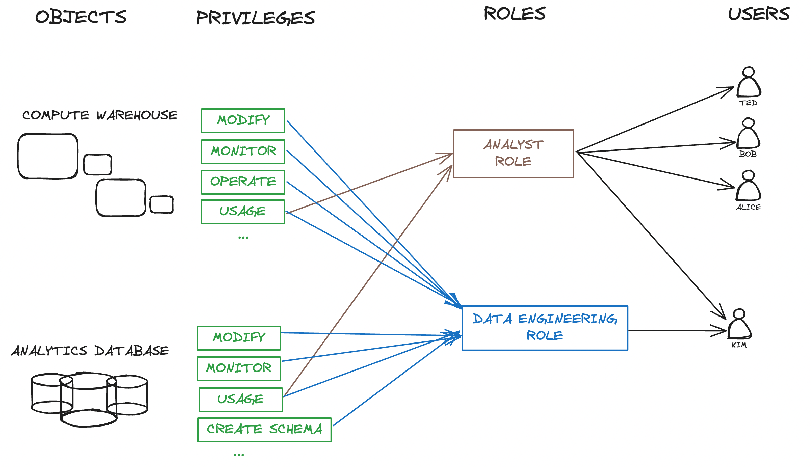
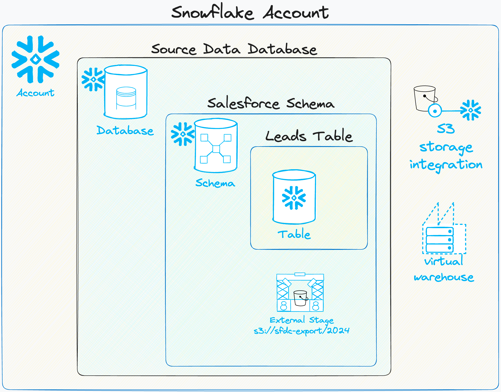
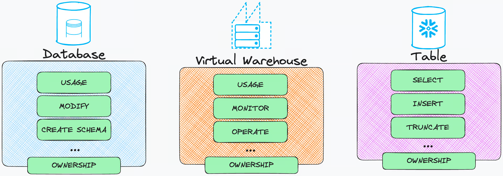
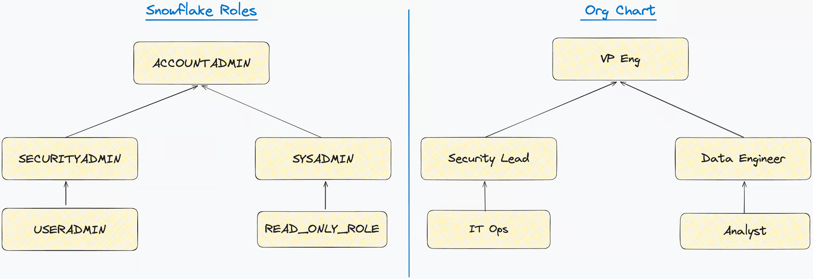
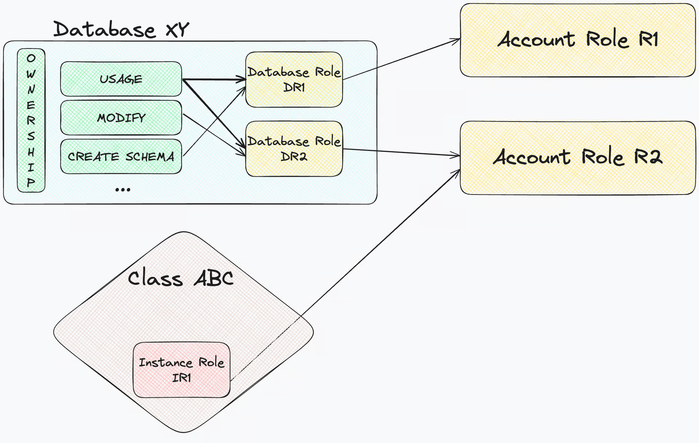
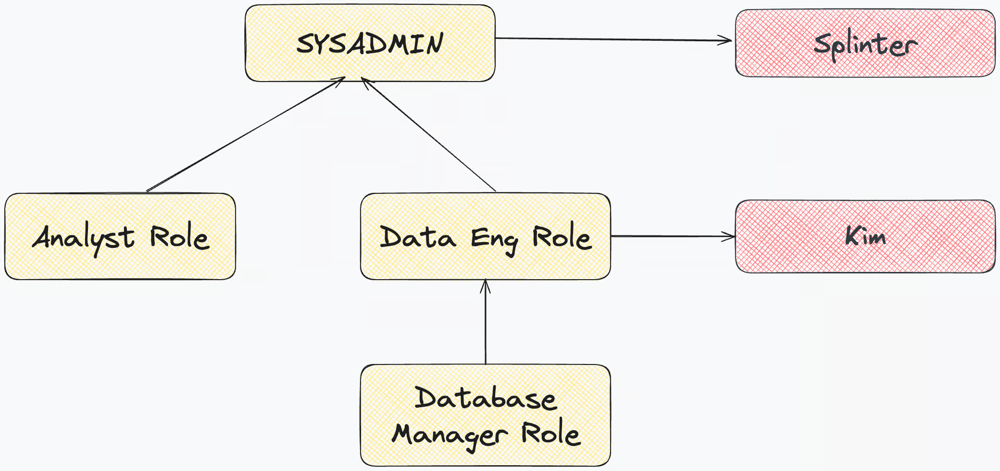
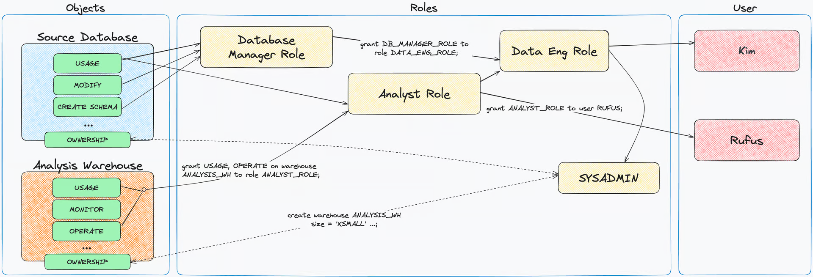

<https://select.dev/posts/snowflake-roles>

## Access Control



#### Key concepts in Snowflake access control

- Snowflake follows a Role-Based Access Control (RBAC) approach to managing what users and other systems can access and do.
- In RBAC, having a certain role means being granted certain privileges.
- Privileges are granted to roles, and roles are granted to users, to specify the operations that the users can perform on objects in the system.
  - **User** - An entity that enables a person (or service) to connect to Snowflake
  - **Object** - An entity that a User can access (i.e. table, view, database), if they have the right privileges.
  - **Privilege** - An operation that a User could execute on an Object, if their Role has been granted it.
  - **Role** - A bridging entity between Users and Privileges. Privileges are granted to Roles, and Roles are granted to Users.

### Users

- A Snowflake User is an identity that can connect to a Snowflake Account and run a set of allowed operations.
- Every person in your data team should have a Snowflake User that they use to connect to Snowflake and run queries.
- A Snowflake User can also be used by a third-party system - examples include BI tools (e.g. Tableau or Looker) or ELT tools (e.g. Stitch or Fivetran).

Ultimately, what Snowflake Users are able to do is the main concern of access control.

#### Objects

- Objects are Snowflake primitives to which access can be granted.
- The most obvious objects are databases, schemas and tables, but also include account level objects such as warehouses, storage integrations etc.


#### Snowflake access control objects

- Here are some common examples of Snowflake Objects:

| Securable           | Object Level   | Description                                           |
| ------------------- | -------------- | ---------------------------------------------------------------------------------------------- |
| Database            | Account-level  | Databases are the key objects keeping all the other securable objects isolated and logically grouped.                                   |
| Schema              | Database-level | A logical grouping of objects like tables, views, stages, etc.                                                                                |
| Table               | Schema-level   | The object that contains data and takes up physical storage. In most cases, tables are the keystone of making Snowflake useful. There are a couple types of tables, each serving different use cases.             |
| View                | Schema-level   | A table in disguise. It provides access to data, but does not actually take up storage. A view is defined as a query on top of other tables. There are a couple types of views, each serving different use cases. |
| Virtual Warehouse   | Account-level  | Main compute resources that are required to run queries, or loading data into Snowflake.                                                         |
| Storage Integration | Account-level  | An object that connects an S3 (GCS, and Azure Blob storage too) bucket to Snowflake, allowing Users to load into or unload data from Snowflake, or query the bucket contents directly.                            |
| Snowpipe            | Schema-level   | An object that automates loading of data from S3 (or GCS, and Azure Blob storage) into tables as soon as new files land in the bucket.                                                                            |
| Stage               | Schema-level   | Location of data files (CSV, Parquet, etc.) in cloud storage. There are two types of stages: internal (Snowflake-managed cloud storage) and external (self-managed cloud storage).                                |

### Privileges

- Privileges are an essential concept in access control.
- They permit an individual operation or a sometimes a set of operations to be performed on an object.
  - For e.g., with a Snowflake Table, a User could have the privilege to `SELECT` data from it, `INSERT` rows into it, `DELETE` data from it, etc. In a Snowflake Database, a User could `CREATE SCHEMA` in it, or `MONITOR` it.

- The table below briefly describes some of the key privileges that can be granted to key objects.

  - Database

    | Object | Privilege Description |
    | --- | --- |
    | USAGE | Enables using and viewing the database, but additional privileges are required to take any actions on it. |
    | MONITOR | Enables running a DESCRIBE <database> command.|
    | CREATE SCHEMA | Enables creating (or cloning) a schema in the database.|
    | IMPORTED PRIVILEGES | Only applies to shared databases, and enables other account roles to access the shared objects. For more on imported privileges, <https://docs.snowflake.com/en/user-guide/data-share-consumers#option-1-objects-in-a-share-not-associated-with-a-database-role>.|

  - Schema

    | Object | Privilege Description |
    | --- | --- |
    | USAGE | Enables seeing and using the schema, but still requires additional privileges on schema-level objects to see or execute commands on them.|
    | MONITOR | Enables running a DESCRIBE <schema> command.|
    | CREATE TABLE / CREATE VIEW / CREATE STAGE / CREATE PIPE | Enables creating a table / view / stage / pipe in the schema.|
  - Table

    | Object | Privilege Description |
    | --- | --- |
    | `SELECT` | Enables querying the table to retrieve data.|
    | `INSERT` | Enables inserting rows into the table.|
    | `UPDATE` | Enables updating existing data in the table.|
    | `TRUNCATE` | Enables deleting all data from the table.|
    | `DELETE` | Enables deleting all or a specific subset of rows from the the table.|
  - View

    | Object | Privilege Description |
    | --- | --- |
    | `SELECT` | Enables querying the table to retrieve data from the view (regardless of the view’s underlying tables and privileges granted on them).|
  - Stage

    | Object | Privilege Description |
    | --- | --- |
    | `USAGE` | Enables using the external stage in a SQL statement.|
    | `READ` | Enables running any command that reads the internal stage. (GET, LIST, COPY INTO)|
    | `WRITE` | Enables running any command that writes to the internal stage. (PUT, REMOVE, COPY INTO)|
- You can find a complete list of available object privileges for Snowflake access control [here](https://docs.snowflake.com/en/user-guide/security-access-control-privileges#database-privileges).

- With this list in mind, it will come in handy when auditing access to remember that privileges are granted on different levels depending on where an object is created (i.e. account-level, database-level, schema-level).


### Ownership Privilege
>
> Snowflake follows a Role-Based Access Control (RBAC) approach […]

- The first sentence of this section was only partially true.
  - Snowflake combines RBAC with a key concept from another access control model - Discretionary Access Control (DAC).
  - In DAC, each object must have an owner.
- In Snowflake’s implementation of DAC, each object is owned by the Role used to create it.
- A Role owning an object means that it has the `OWNERSHIP` privilege on it.
- NOTE: **Users do not own objects, Roles do.**
- Assuming all the Analysts in your data team have the same Role granted to them, this means that objects an Analyst creates will be owned by all the Analysts.
- Note that the `OWNERSHIP` privilege on an object can be transferred to another Role. For example, you might want to transfer ownership of a table to a “more powerful” role in order to limit who can grant other roles access to it.

#### Privileges On Future Objects

- Snowflake allows us to be proactive by granting certain privileges on future objects.
  - i.e. the objects might not exist yet but we already know that you will want a certain role to have access to them once they’re created.
  - For e.g., an `ANALYST` role can be granted the `SELECT` privilege on future tables in the `GOLDEN_DB` database, or on future tables in a specific schema.
  - Check [this Snowflake doc](https://docs.snowflake.com/en/sql-reference/sql/grant-privilege#considerations) out for additional information about future object grants’ precedence.

### Roles

- Conceptually, you can think of Snowflake roles as keys.
  - You have a key to your home, another one for your car, and potentially one for the office.
  - If you have a close neighbour, they might have a spare key to your home (in case of emergency).
  - The keys to your home grant both you and your neighbour access to it.
- Similarly, in Snowflake terms, a role granted to a user gives them access to various operations and objects.


#### Role Types

- In Snowflake, there are three key types of Roles:
  - account roles
  - database roles
  - instance roles
- In addition, there are application roles, tied to Snowflake Native Applications


#### Account Role

- The original Snowflake roles, Account Roles, are the standard roles that:
  - can be granted privileges on all securable objects in the account,
  - their names are unique on the Account level, and
  - they can be granted to Users or other Account Roles.

#### Database Role

- A Database Role is tied to a specific Database, and:
  - it can only be granted privileges specific to that database’s objects (schemas, tables, views, etc.)
  - their names are unique to the Database they are created on,
  - they can be granted to other Database Roles (within the same Database) and to Account Roles,
  - they can not be granted directly to Users, and
  - a Database Role has the `USAGE` privilege granted to its database by default.

#### Instance Role

- Instance Roles are the least frequently used role type. They are tied to a Snowflake Class Instance, granted to Account Roles, enabling Users to run methods of the Class Instance.
- At the time of writing, only Snowflake can create Classes. Read more about the available Snowflake Classes here.

#### Which type of Role should you use?

- If you’re just starting out, Account Roles will take you a long way.
- When you start thinking about database roles, and the potential they have in simplifying and standardising your configuration, allowing the owner of a database to self-manage privileges on it, without having `ACCOUNTADMIN`.
- If you’re dealing with Snowflake Shares to share your data, database roles make access control more easily configurable.

#### Role Hierarchy

- Roles can also be granted to other Roles. Doing so creates a Role Hierarchy.
- for e.g. the role hierarchy below, Splinter, with his `SYSADMIN` role has the privileges superset of roles `DATA_ENG_ROLE`, `ANALYST_ROLE`, `DB_MANAGER_ROLE`, whereas Kim only has privileges of `DATA_ENG_ROLE` and `DB_MANAGER_ROLE`.



#### Default Snowflake Account Roles

- When you create a Snowflake account and open the Admin / Users & Roles, you will see a set of **roles that Snowflake creates by default.
- These system-defined roles can not be dropped, nor can the standard set of privileges each of them have be modified. They all have their intended purpose, namely:
  - `ACCOUNTADMIN` - The god-mode role that can do anything on the account-level. Be intentional with who you grant it to. Notice that `ACCOUNTADMIN` role inherits all the privileges that `SECURITYADMIN` and `SYSADMIN` have.
  - `SECURITYADMIN` - This role has the MANAGE GRANTS account-level privilege granted to it, allowing it to grant (or revoke) grants on all objects in the account to (or from) other roles. Notice that `SECURITYADMIN` role inherits all the privileges passed to it from the `USERADMIN` role.
  - `USERADMIN` - As its name suggests, this role is used for creating and managing users (with the help of `CREATE USER` and `CREATE ROLE` account-level privileges.
  - `SYSADMIN` - This role is allowed to create all objects in the account (including databases, warehouses, and other schema-level objects).
  - `PUBLIC` - All users in the account are granted the `PUBLIC` role by default, but unless explicitly granted access to objects, it can not do much. Still, be very careful not to accidentally grant it privileges on important data, as all users in the account will be able to access it. Or, better yet, don’t grant any privileges to PUBLIC role. 😉
  - `ORGADMIN` deserves special attention. It is used for organisation-level operations, like creating more Snowflake accounts, and does not fit nicely in the default role hierarchy.

- When creating custom roles and putting together a role hierarchy, Snowflake recommends for all the custom roles to ultimately be a descendant role of `SYSADMIN`.

- While it is common to see the majority o database objects created and owned by ACCOUNTADMIN, this is a generally bad practice, suggesting there is little thought being put into access control, and a signal that `ACCOUNTADMIN` is used as a default role, which can lead to destructive mistakes like deleting data or users. We will cover some best practices of access control in Part II of the post series. 🙌

#### User Default Role

- When connecting to Snowflake, a user establishes a session, which in most cases requires setting a role for it.
- If not specified, Snowflake will fall back on the user’s default role.

#### Secondary Roles

- Secondary roles are a way to allow a use to leverage the access capabilities of multiple roles at once.
- Most Snowflake customers only use primary roles (a single role), but secondary roles are a powerful capability that can help prevent the need to combine multiple roles.

- Similar to how you run the use `role` command to set your primary role in a given session, you can run the use secondary roles. The main difference is that this command accepts two options:
  - `use secondary roles all` activates all roles a user has been granted access to
  - `use secondary roles none` disables secondary roles.

### Putting it all together

- An end-to-end example of bootstrapping a fresh Snowflake account and enabling Kim and Rufus to use it in line with their needs.

1. We create Users, Roles and the Database.

    ``` sql
    use role SECURITYADMIN;
    create role DATA_ENGINEER_ROLE;
    create role DB_MANAGER_ROLE;
    create role ANALYST_ROLE;

    use role USERADMIN;
    create user KIM;

    use role SYSADMIN; -- objects are owned by the active role
    create database SOURCE_DB;
    create warehouse ANALYSIS_WH;
    ```

2. Privileges on securable objects are granted to Roles.

    ``` sql
    use role SECURITYADMIN;

    grant USAGE, MODIFY, CREATE SCHEMA
    on database SOURCE_DB to role DB_MANAGER_ROLE;
    grant USAGE on database SOURCE_DB to role ANALYST_ROLE;

    grant USAGE, OPERATE
    on warehouse ANALYSIS_WH to role ANALYST_ROLE;
    ```

3. Roles are connected into a hierarchy, creating privilege inheritance.

    ``` sql
    use role SECURITYADMIN;

    grant role DB_MANAGER_ROLE to role DATA_ENGINEER_ROLE;
    grant role ANALYST_ROLE to role DATA_ENGINEER_ROLE;
    grant role DATA_ENGINEER_ROLE to role SYSADMIN;
    ```

4. Users get access to securable objects by being granted Roles.

``` sql
use role SECURITYADMIN;

grant role DATA_ENGINEER_ROLE to user KIM;
grant role ANALYST_ROLE to user RUFUS;
```



- This gets us to a configuration that:
  - allows Kim to:
    - create schemas in, and use the `SOURCE_DB`
    - use and operate the `ANALYSIS_WH`
  - allows Rufus to:
    - use the `SOURCE_DB` (If you’re wondering whether additional privileges on schemas and databases are missing — you are 💯 right, but they are left out for simplicity.)
    - use and operate the `ANALYSIS_WH`

### Frequently Asked Questions

- Snowflake provides an incredibly intuitive SQL API, allowing you to create, update and delete pretty much anything via SQL commands. They are also actively expanding what you can do through their UI (Snowsight).
- Most of the time, putting the action you want to take into words will be pretty close to what the actual SQL command for the action is.

#### Create a role

``` sql
create role FINANCE_ROLE; -- Account role
create database role SOURCE_DB.READ_DB_ROLE; -- Database role
```

#### Check default role for a user

describe user select_dogfood;
Snowflake default role for user

#### Set default role for a user

To update the user’s default role, you can run the following command:

alter user select_dogfood set default_role=data_eng_role;

#### Show roles in your account

show roles;

#### Run a query using a different role

use role USERADMIN;
drop user EX_EMPLOYEE_USER; -- query requires USERADMIN role

#### Grant ownership in Snowflake

grant ownership
 on database FIVETRAN_DB
 to role FIVETRAN_ROLE
 copy current grants; -- keeps existing grants on the database

grant ownership
 on all tables
 in schema DEV_ANALYTICS.DBT_KIM
 to role DEV_ROLE
 revoke current grants; -- resets existing grants on all tables

#### Grant a role to a Snowflake user

Here’s an example of granting the SYSADMIN role to a user named IAN_WHITESTONE:

grant role SYSADMIN to user IAN_WHITESTONE;

#### Grant user access to a warehouse

To allow a user to run queries on a Snowflake warehouse, you first grant the usage privilege on the warehouse to the role:

grant usage on warehouse COMPUTE_XLARGE_WH to role data_engineer;
Then grant the role to that user:

grant role data_engineer to user ian;

#### Grant a role to another Snowflake role

As shown earlier in this post, you can also grant a role to another role, instead of a user.

grant role DATA_ENG_ROLE to role SYSADMIN;
See which privileges a role has been granted
show grants to role BI_ROLE;
Note that when running the above query, your active Role either needs to be the Role you’re querying for, or any of its parent Roles in the hierarchy.

Show roles granted to user
Here’s an example to see all users which have been granted the ACCOUNTADMIN role:

show grants of role ACCOUNTADMIN;

select *
from table(result_scan(last_query_id()))
where "granted_to" = 'USER';
Snowflake show roles granted to user

#### Remove access to an object

revoke USAGE on all databases from role business_role;
Audit a Snowflake user’s roles, grants and privileges

#### Audit which Roles a User has been granted

show grants to user holistics_user;
Snowflake show roles granted to user
Now that you know which Roles a User can assume, you can dig into what privileges each of these roles have.
show grants to role HOLISTICS_ROLE;
Snowflake show privileges granted to role
This approach can get tedious quickly, especially if there’s a complex role hierarchy in place. There are various resources and tools for auditing and managing access control, but this StackOverflow accepted answer is a great starting point. If you’re keen to move towards well managed access control, consider GitLab’s permifrost, which could provide you with queries you should run to get to a desired specification.

#### Grant select on all future tables in a schema and database

Note that there is a distinction between all and future objects. Granting a privilege on future objects will not grant the privilege on all existing objects, and vice versa.

all refers to objects that exist when the query is run
future only refers to objects that are yet to be created
So, to grant select on all and future tables in a schema, you will need to run 2 queries - one for all and one for future tables (or other objects like views or schemas).

grant select
 on future tables
 in schema MY_DATABASE.FOO_SCHEMA
 to role BAR_ROLE
 copy current grants;

grant select
 on future tables
 in database MY_DATABASE
 to role BAR_ROLE
 copy current grants;

grant select
 on all tables
 in database MY_DATABASE
 to role BAR_ROLE
 copy current grants;
Who can see which users and roles exist, and which users have been granted which role?
Everyone. Every role, including the default PUBLIC role, allows the User to see all users and roles that exist in the account, as well as which roles have been granted to which users. However, not everyone can see which privileges are granted to roles.
