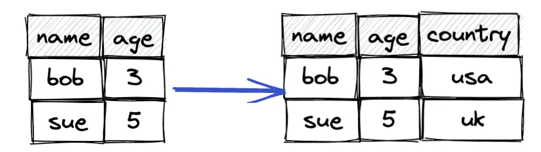

> **Note: For Confluent Avro format, see [[tools.streams.processing.spark_streaming.kafka]]**

### Life before AVRO

-   For years, JSON, XML, and CSV have served as the go-to data formats for various applications, from web APIs to data storage and exchange.
-   However, as data complexity and volume continue to surge, these traditional formats often fall short.

> Imagine you’re managing a database of customer information for an e-commerce platform. You’re storing data like customer names, email addresses, and purchase history. Here’s how each format handles this data.
>#### JSON
>-   JSON’s readability and simplicity are its strength, and it becomes the first choice when flexibility is needed
>-   It has its shortcomings, especially when dealing with data consistency, compatibility, and evolution because it is schema-less by design.
>
>```JSON
>{
>    "name": "John Doe",
>    "email": "johndoe@email.com",
>    "purchases": [
>    {
>        "product": "Widget A",
>        "price": 19.99
>    },
>    {
>        "product": "Widget B",
>        "price": 29.99
>    }
>    ],
>"accountStatus": "ACTIVE"
>}
>```
>
>#### XML
>- It offers hierarchical structure and flexibility. It could look like this:
>- XML’s flexibility comes at the cost of increased verbosity, making it less efficient for large-scale data processing.
>``` xml
><customer>
>  <name>John Doe</name>
>  <email>johndoe@email.com</email>
>  <purchases>
>    <purchase>
>      <product>Widget A</product>
>      <price>19.99</price>
>    </purchase>
>    <purchase>
>      <product>Widget B</product>
>      <price>29.99</price>
>    </purchase>
>  </purchases>
>  <accountStatus>ACTIVE</accountStatus>
></customer>
>```
>#### CSV
>- It is simple and widely supported. In CSV, the data will store as comma separated values like this:
>- CSV’s simplicity is admirable, but it struggles with complex, nested data structures and lacks a standardized way to represent data types.
>``` csv
>"John Doe","johndoe@email.com","Widget A",19.99,"ACTIVE"
>"John Doe","johndoe@email.com","Widget B",29.99,"ACTIVE"
>```

### What is Avro?
- Apache Avro is a data serialisation system that provides a way to exchange data between systems.
- It was developed as part of the Apache Hadoop ecosystem but is now a standalone project in the Apache Software Foundation.

### Why Avro?
#### Efficient Data Serialization/ Deserialization
- Avro uses a compact binary format, which reduces the size of the serialized data significantly compared to text-based serialization formats like XML and JSON. 
- This compactness leads to faster data transmission over networks and reduces storage requirements.

#### Language independence
- Avro is language-neutral, means it supports multiple programming languages, enabling seamless data exchange between different systems.

#### Schema Definition:
- In Avro, a schema serves as a blueprint for data. 
- It defines the structure of data, including field names, types, and optional attributes making data self-descriptive. 
- Avro also allows us to add documentation in the schema which helps in avoiding any confusion when handling data and allows other team members to understand the data’s purpose without needing to ask you for explanations.
- Avro schemas are written in JSON, making them human-readable and versatile. Let’s take a look of how we define schema in Avro.
``` json
{
    "type": "record",
    "name": "CustomerInfo",
    "fields": [
        { "name": "name", "type": "string" },
        { "name": "email", "type": "string" },
        {
            "name": "purchases",
            "type": {
                "type": "array",
                "items": {
                    "type": "record",
                    "name": "Purchase",
                    "fields": [
                        { "name": "product", "type": "string" },
                        { "name": "price", "type": "float" }
                    ]
                }
            }
        },
        {
            "name": "accountStatus",
            "type": {
                "type": "enum",
                "name": "AccountStatus",
                "symbols": ["ACTIVE", "INACTIVE", "SUSPENDED"]
            }
        }
    ]
}
```
##### The AVRO Schema
- This schema is stored along with the serialized data, enabling schema validation during both serialization and deserialization. This helps catch data inconsistencies early and ensures data integrity.
- Schema Elements
  - **Type**: Avro schemas specify the data type of a field. Avro supports primitive types (e.g., string, int, float) and complex types (e.g., records, enums, arrays, maps, unions).
  - **Field Names**: Each field in a schema has a name that uniquely identifies it within the schema.
  - **Default Values**: You can define default values for fields, which are used when a field is not present in the data.
  - **Documentation**: Schemas can include optional documentation to describe the purpose and usage of fields, providing clarity for users.

#### Schema Evolution

- Schema evolution allows you to **evolve the structure of your data over time** like adding new fields, removing existing fields, and data types can change while maintaining compatibility with previously serialized data.

- When reading Avro data, the reader’s schema is compared to the schema that was used to write the data. This process is known as schema resolution. 
- Avro handles any differences between the schemas by applying compatibility rules ensuring that the data can be correctly interpreted. 
- There are mainly three directions of schema evolution:
    - **Backward Compatibility**: Backward compatibility ensures that older readers can read data written using newer schemas without any issues.
    - **Forward Compatibility**: Forward compatibility ensures that newer readers can read data written using older schemas without errors.
    - **Full Compatibility**: This direction is the combination of both Backward and Forward compatibility.

#### Dynamic Typing
- Avro’s schema is present in the serialized data itself. 
- This allows readers to dynamically understand the structure and types of the data they’re reading without needing to be aware of the schema beforehand. 
- This is in contrast to formats like JSON, where external schema information is not typically embedded in the data.

---

<https://marcosschroh.github.io/dataclasses-avroschema/avro_schema/>

## Record Attributes

-   name: a JSON string providing the name of the record (required).
-   namespace: a JSON string that qualifies the name;
-   doc: a JSON string providing documentation to the user of this schema (optional).
-   aliases: a JSON array of strings, providing alternate names for this record (optional).
-   fields: a JSON array, listing fields (required). Each field is a JSON object with the following attributes:
    -   name: a JSON string providing the name of the field (required), and
    -   doc: a JSON string describing this field for users (optional).
    -   type: A JSON object defining a schema, or a JSON string naming a record definition (required).
    -   default: A default value for this field, used when reading instances that lack this field (optional). Permitted values depend on the field's schema type, according to the table below. Default values for union fields correspond to the first schema in the union. Default values for bytes and fixed fields are JSON strings, where Unicode code points 0-255 are mapped to unsigned 8-bit byte values 0-255.
    -   order: specifies how this field impacts sort ordering of this record (optional). Valid values are "ascending" (the default), "descending", or "ignore". For more details on how this is used, see the the sort order section below.
    -   aliases: a JSON array of strings, providing alternate names for this field (optional).

## Generating Avro Schema using Python Classes

```py
import dataclasses
from dataclasses_avroschema import AvroModel


@dataclasses.dataclass
class User(AvroModel):
    name: str
    age: int
    has_pets: bool
    money: float

# Generate the avro schema from a class. Returns str
User.avro_schema()

'{
  "type": "record",
  "name": "User",
  "fields": [
    {"name": "name", "type": "string"},
    {"name": "age", "type": "long"},
    {"name": "has_pets", "type": "boolean"},
    {"name": "money", "type": "float"}
  ],
  "doc": "User(name: str, age: int, has_pets: bool, money: float)"
}'

# Avro schema to python. Returns dict
User.avro_schema_to_python()

{
    "type": "record",
    "name": "User",
    "doc": "An User",
    "namespace": "User.v1",
    "aliases": ["user-v1", "super user"],
    "fields": [
        {"name": "name", "type": "string"},
        {"name": "age", "type": "long"},
        {"name": "pets", "type": {"type": "array", "items": "string", "name": "pet"}},
        {"name": "accounts", "type": {"type": "map", "values": "long", "name": "account"}},
        {"name": "favorite_color", "type": {"type": "enum", "name": "favorite_color", "symbols": ["BLUE", "YELLOW", "GREEN"]}},
        {"name": "country", "type": "string", "default": "Argentina"},
        {"name": "address", "type": ["null", "string"], "default": None}
    ],
}
```
