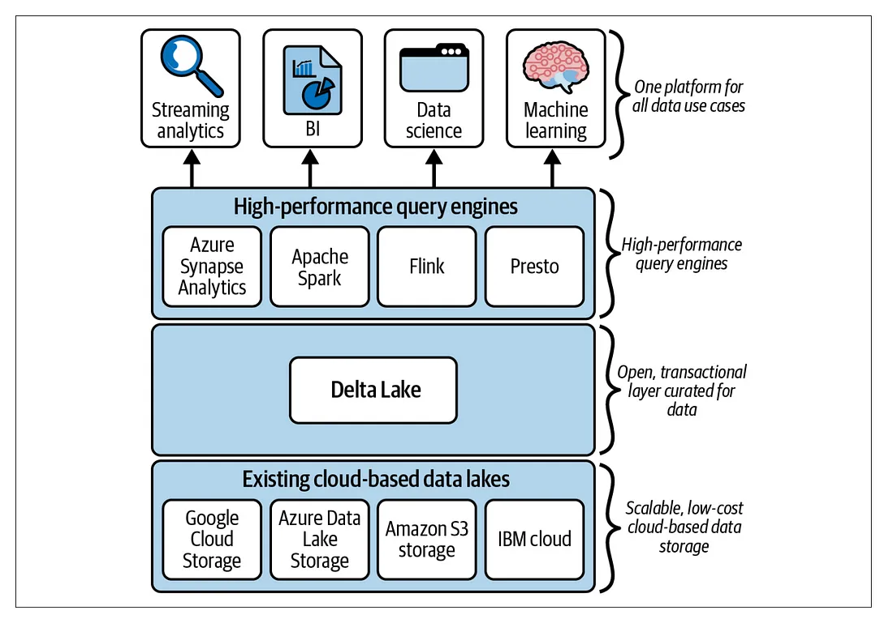

https://medium.com/data-reply-it-datatech/mastering-delta-lake-optimizations-optimize-z-order-and-vacuum-f6ca110c9869

### What is Delta Lake

- Delta Lake is the optimized storage layer that is designed to run on top of an existing data lake and improve its reliability, security, and performance. 
- Delta Lakes support ACID transactions, scalable metadata, unified streaming, and batch data processing.
- Extends Parquet data files with a file-based transaction log for ACID transactions and scalable metadata handling. 
- Delta Lake is fully compatible with Apache Spark APIs, and was developed for tight integration with Structured Streaming, allowing you to easily use a single copy of data for both batch and streaming operations and providing incremental processing at scale.

### Delta Lake and the Lakehouse Architecture



- Delta Lake is a technology that brings reliability to data lakes with features like ACID transactions and schema enforcement. 
- a Data Lakehouse is a data architecture paradigm that combines the best features of data lakes and data warehouses. 
- Delta Lake can be used as part of a Data Lakehouse architecture to add reliability and performance to data lakes.


### Why Delta Lake
- **ACID Transactions**: Delta Lake provides full ACID transaction support, ensuring data integrity and consistency, even across concurrent reads and writes.
- **Scalable Metadata Handling**: Unlike many big data solutions that struggle with large amounts of metadata, Delta Lake can handle millions of files and petabytes of data without sacrificing performance.
- **Schema Enforcement and Evolution**: Delta Lake uses schema-on-write to prevent inconsistencies and bad data. Moreover, it supports schema evolution, allowing you to add or change data structures.
- **Unified Batch and Streaming Processing**: With Delta Lake, you can run batch and streaming workloads simultaneously on the same data set, simplifying your data architecture.
- **Time Travel (Data Versioning)**: Delta Lake stores a history of all the transactions, enabling you to access previous versions of the data for auditing or reproducing experiments.

### [The Delta Lake Protocol](https://www.sparkcodehub.com/spark-delta-lake/spark-delta-lake-tutorial)
#### The Transaction Log
- Delta Lake uses a transaction log (also known as DeltaLog) in order to implement ACID transactions. 
- The transaction log is an ordered record of every transaction that has been committed since the Delta Lake creation.
- When a user creates a Delta Lake table, a new transaction log is automatically created in the `_delta_log/` subdirectory. 
- Any new change users apply to the table is recorded as ordered atomic commits in the transaction log. 
- Delta Lake writes every commit into a JSON file, with a name starting as  `00000000000000000000.json`. 
- Similarly, the subsequent changes to the table produce new JSON files in the ascending numerical order.

    ``` md
    /tmp/deltaPath7589771148223852481/
    ├── _delta_log
    │   ├── 00000000000000000000.json
    │   └── 00000000000000000001.json
    ├── partitionId=0
    │   ├── part-00000-1db4932a-a7d6-4478-93a0-99488999d584.c000.snappy.parquet
    │   └── part-00000-52cffe75-e13c-4bf2-988a-a7b64e9304a6.c000.snappy.parquet
    ├── partitionId=1
    │   ├── part-00000-9ba571bc-8256-46c9-870a-905e4e32c7c3.c000.snappy.parquet
    │   └── part-00000-a15e768e-fd1a-43e4-bc0c-1eaa4bd83157.c000.snappy.parquet
    └── partitionId=2
        ├── part-00000-0e7b64dc-d183-4f9e-a7b2-abfbf0637de8.c000.snappy.parquet
        └── part-00000-8a97f406-5ce3-4227-89b8-714f60f495e9.c000.snappy.parquet
    ```
- Each commit log contains a series of steps known as actions such as `INSERT`, `UPDATE` or `DELETE` 

    ``` json
    # Contents of the  /tmp/deltaPath7589771148223852481/_delta_log/00000000000000000001.json commit log

    {
        “commitInfo”:{
            “timestamp”:1583312472793,
            “operation”:”WRITE”,
            “operationParameters”:{
                “mode”:”Overwrite”,
                “partitionBy”:”[“partitionId”]”
            },
            “readVersion”:0,
            “isBlindAppend”:false
        }
    }
    {
        “add”:{
            “path”:”partitionId=0/part-00000-1db4932a-a7d6-4478-93a0-99488999d584.c000.snappy.parquet”,
            “partitionValues”:{
                “partitionId”:”0″
            },
            “size”:632,
            “modificationTime”:1583312468000,
            “dataChange”:true
        }
    }
    {
        “add”:{
            “path”:”partitionId=1/part-00000-a15e768e-fd1a-43e4-bc0c-1eaa4bd83157.c000.snappy.parquet”,
            “partitionValues”:{
                “partitionId”:”1″
            },
            “size”:643,
            “modificationTime”:1583312468000,
            “dataChange”:true
        }
    }
    {
        “add”:{
            “path”:”partitionId=2/part-00000-0e7b64dc-d183-4f9e-a7b2-abfbf0637de8.c000.snappy.parquet”,
            “partitionValues”:{
                “partitionId”:”2″
            },
            “size”:632,
            “modificationTime”:1583312468000,
            “dataChange”:true
        }
    }
    {
        “remove”:{
            “path”:”partitionId=2/part-00000-8a97f406-5ce3-4227-89b8-714f60f495e9.c000.snappy.parquet”,
            “deletionTimestamp”:1583312472792,
            “dataChange”:true
        }
    }
    {
        “remove”:{
            “path”:”partitionId=0/part-00000-52cffe75-e13c-4bf2-988a-a7b64e9304a6.c000.snappy.parquet”,
            “deletionTimestamp”:1583312472793,
            “dataChange”:true
        }
    }
    {
        “remove”:{
            “path”:”partitionId=1/part-00000-9ba571bc-8256-46c9-870a-905e4e32c7c3.c000.snappy.parquet”,
            “deletionTimestamp”:1583312472793,
            “dataChange”:true
        }
    }
    ``` 
    - Here the user overwrote the previous dataset with new data. 
    - As a result, Delta Lake recorded that transaction by removing files that contain previous data and adding new files containing the new data.
    - Although the removed files are no longer needed, the Delta Lake keeps these commits so that we can go back in time and check the table at any particular point in time. 
    - Also helps with table audit, governance and compliance requirements since an exact record of every change ever made is retained.


#### Benefits of Transaction Log

-   **ACID Transactions**: 
    -   Allows Delta Lake to provide ACID transactions
    -   When a change is made to the data, it is not directly applied to the dataset. Instead, Delta Lake first writes the changes out to a new Parquet file, then atomically updates the transaction log with the operation's details and the location of the new Parquet file. 
    -   The update to the transaction log is an atomic operation, ensuring that each transaction is isolated and consistent.
-   **Concurrency Control**: 
    -   When multiple users attempt to modify data at the same time, Delta Lake uses an optimistic concurrency control model. 
    -   Each transaction first checks the transaction log before committing changes. 
    -   If there is a conflict, the operation is retried.
-   **Fault Tolerance and Recovery**: 
    -   If a write operation fails partway, the transaction log can be used to roll back the changes, ensuring the data remains in a consistent state. 
    -   Similarly, if a system failure occurs, the transaction log can be used to recover the system to its last known good state.
-   **Schema Enforcement and Evolution**: 
    -   Delta Lake's transaction log stores schema information. 
    -   Each transaction log entry contains the table schema at the time of the transaction. 
    -   This helps enforce schema-on-write and also enables schema evolution, allowing you to add columns or change column data types.
-   **Time Travel**: 
    -   Since the log keeps track of every modification made to the data, it effectively records the state of the data at each point in time. 
    -   This allows users to query a snapshot of the data from any point in the past.

#### Parquet Data Storage 
- Apache Parquet is a columnar storage file format that is optimized for use in big data processing frameworks like Apache Spark, Apache Hive, Apache Impala, and many others. 
- It is open-source and was specifically designed to manage complex and large volumes of data, offering several significant benefits which have led to its adoption in many big data solutions including Delta Lake.
- See [[tools.storage.format.parquet]]


---

#### Delta Sharing

Data sharing is when different companies need to exchange information securely. For example, let’s say a retail company wants to share its sales data with a logistics provider. By sharing this data, the logistics provider can better plan deliveries and manage inventory. In the past, setting up a secure data-sharing system like this was difficult and expensive.

That’s where Delta Sharing comes in. It’s a special way of securely sharing large amounts of data stored in a specific format called Delta Lake. With Delta Sharing, the retail company can securely share its sales data, which is stored in places like Amazon S3 or ADLS (Azure Data Lake Storage), with the logistics provider. Both companies can then access and use that shared data with their preferred tools, like Apache Spark or Power BI, without needing any extra setup. Plus, Delta Sharing even allows sharing data between different cloud providers without needing custom development.

In this case:

The logistics provider can use Apache Spark to work with the shared sales data stored in Amazon S3 on their cloud platform.
The retail company can use Power BI to directly analyze and visualize the shared sales data stored in ADLS.
In summary, Delta Sharing makes it easier for companies to securely share data, collaborate, and make better decisions, without the complexity and cost of building custom solutions.

#### Delta Connectors

-   The goal of Delta Connectors is to make Delta Lake accessible to other big data engines beyond Apache Spark.
-   These connectors are open-source and enable direct connectivity to Delta Lake.
-   One essential component is Delta Standalone, a Java library that allows reading and writing of Delta Lake tables without the need for an Apache Spark cluster.
-   Applications can use Delta Standalone to connect directly to Delta tables created by their own big data infrastructure, eliminating the need for duplicating data in another format before consumption.

There are also native libraries available for different engines:

Hive Connector: Reads Delta tables directly from Apache Hive.
Flink/Delta Connector: Reads and writes Delta tables from Apache Flink applications. It includes a sink for writing to Delta tables and a source for reading Delta tables using Flink.
SQL-delta-import: Allows importing data from a JDBC data source directly into a Delta table.
Power BI Connector: A custom Power Query function that enables Power BI to read a Delta table from any file-based data source supported by Microsoft Power BI.
The Delta Connectors ecosystem is expanding rapidly, with new connectors being added regularly. An example is the recently introduced Delta Kernel in the Delta Lake 3.0 release. Delta Kernel and its simplified libraries remove the need to understand the technical details of the Delta protocol, making it easier to build and maintain connectors.
