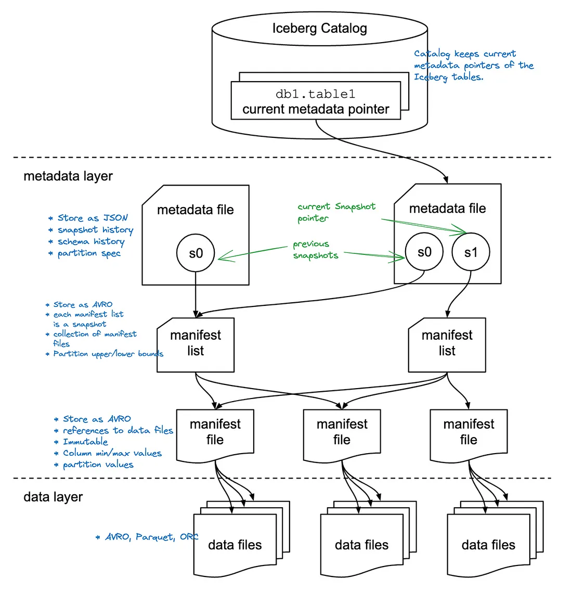

https://www.youtube.com/watch?v=nWwQMlrjhy0

### What is Iceberg

- Apache Iceberg, a project initiated by Netflix in 2017¹ and subsequently embraced by the Apache Incubator in 2018², has emerged as a popular open table formats in addition to Hudi and DeltaLake.
- Iceberg is what`s known as a Table Format. 
  - A table format allows you to manipulate data stored in various file formats by implementing table operations such as inserts and deletes. 
- Iceberg is a framework that allows you to manipulate data over immutable file formats like Parquet, Avro and ORC as if they are tables.

### The issues with Hive

- Hive tracks data at directory level. Even when data is partitioned, very big tables could result in thousands of files in a partition. 
- The lack of file level statistics causes a query that matches a partition to **read all the file splits** in it. 
- The query planning also required to perform file list operations within partitions which could introduce further delays to the planning by putting extra pressure on distributed file systems when queried at scale. 
- As a remedy, we could think about repartitioning data in a much granular key combinations but it will risk introducing much more smaller files. 
- The community feedbacks also reports scalability issues with the metastore and becoming a bottleneck at query planning⁴

The initial atlas case study has shown significant improvements in Iceberg with query planning. Use case was based on 2.7 million files spread over 2,688 partitions. Hive planning resulted in 400k+ splits and Iceberg partitioning with min/max column statistics together resulted only 412 splits. Planning time was 9.6 minutes in hive compared 25 seconds in Iceberg. Hive was un-queryable while Iceberg query completed in 22 mins.

Another problem with Hive’s partitioning style is, its poor integration with object storage systems. Hive treats the data as if they are organized in a hierarchical file system, which is the opposite of key-value (KV) stores like S3 operates. The support for hierarchical access patterns in KV stores are afforded by prefixing key with partition column(s). This can eventually leads to performance struggles as list file operations over a same prefix becomes more frequent.

As a result of data being tracked at directory level, any changes to the partitioning scheme will require rewrite of entire dataset which would be unimaginable for petabyte scale tables.

Hive`s schema evolution, implemented from version 0.13 onwards for parquet⁵, only offers limited support. The DDL operations such as drop columns are not allowed.

- To solve all these metadata related issues with Hive metastore, Iceberg introduced a metadata layer that act as an immutable yet evolving index at file level. 
- The metadata layer is designed with O(1) complexity for file search operations unlike in Hive where complexity follows a linear function with increasing number of files in a partition. 
- This allows to perform partition pruning at file level rather directory level preventing unnecessary list file operations. 
- Re-partitioning or schema changes are easily accommodated at metadata level without involving any data movement.

Now lets take a closer look at Iceberg specification to understand what made all these improvements possible.

### Iceberg specification
- Iceberg maintains the metadata of a table in the file system itself, inside a directory called metadata (as of current version). 
- In contrast to Hive, where metadata is managed by a centralized metastore service, in Iceberg, its client responsibility to maintain the table metadata. 
- This eliminates any potential performance issues that may arise from having a centralized service to handle high number of metadata requests.

- Both data and metadata files in Iceberg are immutable and every change to the data or the schema will result in creating a new version of metadata files. 
  - This behavior is also be recognized as snapshotting and its what makes time travel possible.


- The metadata layer extends over three types metadata files.
    - **Manifest** 
      - An Avro file that keeps links to a collection of data files. 
      - It also stores partition details for each data file. 
      - A data file can belong only to a single partition. Otherwise file level partition pruning will not work. 
      - In addition, Manifest entry also keeps column statistics such as min/max values by boosting query planning performance significantly. refer scan planning.
    - **Manifest List** 
      - An Avro file which tracks all the manifests of a table in a particular time i.e. manifest list is a snapshot of a table. 
      - Each manifest entry in the list also stores upper and lower partition bounds of the manifest file facilitating accelerated scan planning.
    - **Table Metadata** 
      - The entry point of an Iceberg table. 
      - It is stored as a Json file and evolves (by introducing a new version) every time when table metadata gets changed. 
      - This file maintains the snapshot history by keeping references to the latest manifest list as well as the preceding ones. 
      - it also maintains schema and partition definitions along with their history as well.
- Having data files spread over in two layers, manifest and manifest list, allows Iceberg to read metadata of multi-petabyte tables consisting millions of files just from a single node client application, without needing a distributed SQL engine.

### Insert and deletes
Following illustration further depicts how Iceberg metadata behaves with insert and deletes. The key highlight is that all the files, both data and metadata, are immutable. Every change will result in a new version of a file.


insert and delete operation (designed with excalidraw.io)
Step 1: Create table statement and it populates table metadata.json file.

Step 2: Insert operation which creates the manifest list, manifest and the data files. The same time metadata.json file evolves into the next version and keeps pointing to the manifest.

Step 3: One more insert statement results in creating new data files and the evolved manifest list contains the reference to associated manifest file.

Step 4: Delete operation on Copy-On-Write (COW) mode. The diagram illustrates data is being deleted from the data file created in Step 3. When table is configured with COW mode, deletes result in copying un-deleted rows of a data file to a new file that is referenced by a new manifest file. The source file is marked as deleted in a another new manifest file. The delete marker is only informational and will not be used for scan planning. Hence there is no point storing it in a manifest that store existing files. The original link to the manifest-01.avro file is dropped from the manifest list.

The delete/update operations on COW mode can be expensive because it involves copying data to new files. This mode is particularly well-suited for analytical workloads, where writes are less frequent( they will be large batches) and the table is required to be optimized towards reads.

To have support for more frequent update/delete workloads, like streaming, Iceberg introduced Merge-On-Read (MOR) mode in format version 2. In this mode, delete operation will not result in any changes to the existing data files. Instead it will either write the positions of the deleted rows to a file called positional delete file or it will write predicate used in the delete operation to a file called equality delete file.

As an example, if we delete rows where id = 3 in the following table, positional and equality delete files would look like below.

``` raw
1: id | 2: category | 3: name
-------|-------------|---------
 1     | marsupial   | Koala
 2     | toy         | Teddy
 3     | NULL        | Grizzly
 4     | NULL        | Polar


positional_delete_file.parquet

file_path     | pos   |
--------------|-------|
xx/yy.parquet | 33253 |
xx/yy.parquet | 45231 |
aa/bb.parquet | 12412 |


equality_delete_file.parquet

1: id
-------
 3
```
While positional delete files need to read through the data files to locate positions, the equality delete files simply persists the predicate which contributes to the much more efficient delete operations in the expense of reduced read performance later.

MOR configured tables handle updates by combining delete operation followed by an insert operation. The delete will remove impacted rows from the data file and insert adds a new data file with updated rows.

The delete files also get tracked via manifests similar to the data files. However both delete files and data files are not tracked in a single manifest file, as scan planning reads delete files first, Iceberg distinguish delete manifests from existing manifests by keeping them separate.

The COR and MOR can be configured by write.delete.mode, write.update.mode and write.merge.mode properties.

### Feature walkthrough
#### Transaction isolation
According to the docs — “An atomic swap of one table metadata file for another provides the basis for serializable isolation” . The file rename functionality is a suitable atomic swap operation which is supported in blob storages as well as in file systems.

Iceberg transaction isolation is based on optimistic concurrency. Hence, the writers must retry their update/delete operations, if there is already a more recent table metadata version in place than the one in use.

Iceberg supports two isolation levels, serializable and snapshot, that can be configured with write.delete.isolation-level, write.update.isolation-level and write.merge.isolation-level properties.

#### Schema Evolution
Iceberg schema keeps track of fields using field IDs rather using the field name directly. This allows to have schema changes without much of a hassle. See column projection for more details.

Following is a metadata output of a parquet file in Iceberg using parquet-tools . The second column with the field id = 2, has been dropped previously and later re-introduced with the same name, which introduced a new field with the field id = 4. This file is created by an insert after the drop column operation took place. The previous parquet files still have the field id = 2, but hidden from consumers by the column projection. The data files are immutable once written.

``` sh
File path:  00000-8-aa2c5b04-b0dd-49a7-b7ba-fb5b5900e704-00001.parquet
Created by: parquet-mr version 1.13.1 (build db4183109d5b734ec5930d870cdae161e408ddba)
Properties:
  iceberg.schema: {"type":"struct","schema-id":0,"fields":[{"id":1,"name":"customer_id","required":true,"type":"int"},{"id":3,"name":"order_date","required":true,"type":"date"},{"id":4,"name":"name","required":true,"type":"string"}]}
Schema:
message table {
  required int32 customer_id = 1;
  required int32 order_date (DATE) = 3;
  required binary name (STRING) = 4;
}
```
Although I am not sure about the schema-id in the properties, according to the metatada.json it could be schema-id = 2. Besides schema-id pointer within data files is not needed as long as table metadata.json points to the correct schema version.

#### Hidden Partitions
Iceberg tables defines partitions using a constuct called partition spec. Partition spec is an expression which uses a transformer function applied over a table column. The Spark SQL partition clause provided below will yield the following partition specification.
``` sql
PARTITIONED BY (months(order_date), customer_id)
```
``` json
  "partition-specs" : [ {
    "spec-id" : 0,
    "fields" : [ {
      "name" : "order_date_month",
      "transform" : "month",
      "source-id" : 3,
      "field-id" : 1000
    }, {
      "name" : "customer_id",
      "transform" : "identity",
      "source-id" : 1,
      "field-id" : 1001
    } ]
  } ]
```  
Both month and identity are transformer functions. The partition spec is kept in metadata.json file while actual partition values are stored as a tuple in manifest files.

The most important feature of iceberg partitions is that users are not required to specify the partition clause from the queries. Even when the query does not include fields that were used in the transformation functions, Iceberg automatically figures the partitions to search based on the column statistics in manifest-list and manifest files. This hidden partitioning implementation of Iceberg is very advantageous for the users because they can write an effective queries even without having any knowledge about the underlying partitioning scheme.

#### Partition Evolution
Imagine the hassle of rewriting a whole table to repartition a hive table 🙂. Iceberg offers more flexible partition management where users are allowed to modify the partition spec without any data movement. By design, old data will still follow the old partition spec, while new data will be written accordance to the new spec.

This is visually represented below where a query spawns multiple plans for evolved partition specs.


Partition spec evolution ( Iceberg docs )
#### Time Travel
- The key idea of Iceberg design was to track all the data files in a table over time. 
- Since all the manifest and data files are immutable, going back in time is simple as introducing a new metadata.json file with a pointer to a snapshot(manifest-list.avro file) in the past.

- With Spark SQL, we can see the table history and the snapshots using Iceberg metadata tables.
    ``` sql
    SELECT * FROM <schema>.<table_name>.history;
    SELECT * FROM <schema>.<table_name>.refs;
    ```
- Reverting to the previous snapshot is possible with a simple procedure call.
    ``` sql
    CALL iceberg.system.rollback_to_snapshot('<schema>.<table_name>', snapshot_id)
    ```