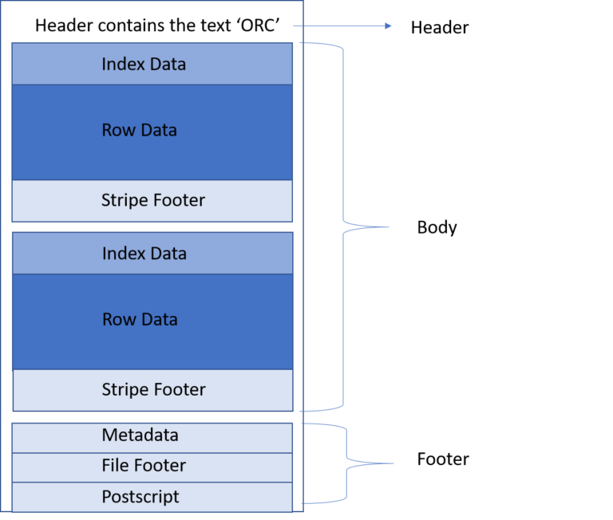

### What is ORC

- An ORC (Optimized Row Columnar) file is a data storage format designed for Hadoop and other big data processing systems.
- It is a columnar storage format, which means that the data is stored in a way that is optimized for column-based operations like filtering and aggregation.

### ORC File Structure
- Divided into Header, body, and footer.
- ORC also stores metadata about the file, such as the schema, at the end of the file.
- This metadata is used to quickly read the data without having to scan the entire file.
- Additionally, ORC can store indexes for specific columns, allowing for faster retrieval of specific rows.

#### Header
- The Header contains the text ‘ORC’ in case some tools are required to determine the file type while processing.

#### Body

- The body contains the actual data as well as the indexes. 
- Actual data is stored in the ORC file in the form of rows of data that are called Stripes. 
  - Each stripe is a collection of rows.
  - The default stripe size is 250 MB.

- Stripes are further divided into three more sections: the index section, the actual data, and a stripe footer section. 
  - One interesting thing to note here is that the index and data section are stored as columns so that only the columns where the required data is present are read. 
  - Index data consists of min and max values for each column as well as the row positions within each column. 
  - ORC indexes help to locate the stripes based on the data required, as well as row groups. 
  - The Stripe footer contains the encoding of each column, the directory of the streams, and their location.

- Each stripe is further divided into a series of data chunks, where each chunk stores the data for a specific set of columns.
- The chunks are compressed using a combination of techniques such as predicate filtering, dictionary encoding, and run-length encoding.

#### Footer
- The footer section consists of file metadata, file footer, and postscript.

- The **File Metadata** section contains the various statistical information related to the columns, which is present at a stripe level. 
  - These statistics enable input split elimination based on predicate push down, which evaluates for each stripe. 
- The **file footer** contains information regarding the list of stripes in the file, the number of rows per stripe, and the data type for each column. It also includes aggregate counts at column-level like min, max, and sum. 
- The **Postscript** section contains:
  - the file information like the length of the file’s Footer and Metadata section,
  - the version of the file, and
  - the compression parameters like general compression used (for example none, zlib, or snappy) and the size of the compressed folder

### Pros and Cons

#### Advantages

- They offer significant performance improvements over row-based storage formats like text and avro.
  - In a columnar storage format, the data for a single column is stored together, which makes it faster to read and process
- Additionally, ORC files also support predicate pushdown, which allows the storage format to filter out unnecessary data before it is read into memory, further improving performance.
- ORC files also offer good support for compression. It uses a number of compression algorithms such as Snappy, Zlib, Gzip etc. which reduces the storage space required to store the data. This is particularly useful when working with large datasets, as it can significantly reduce the cost of storing the data.
- Another advantage of ORC files is that they support a wide range of data types, including complex types such as structs, maps, and arrays. This makes it easy to work with different kinds of data, and allows for more flexible data modeling.

To use ORC files with PySpark, you can simply read and write data using the `spark.read.format(“orc”)` and `.write.format(“orc”)` options, respectively.