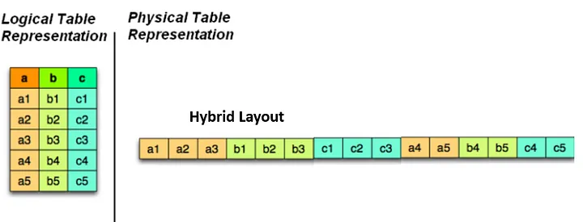
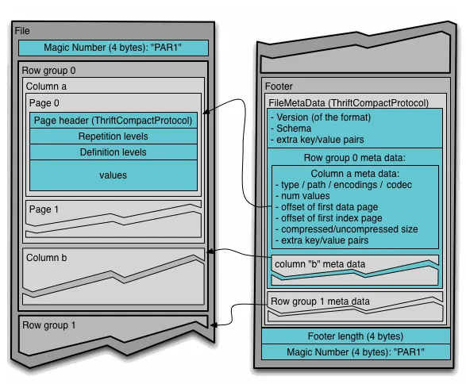
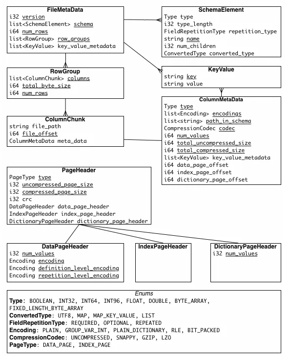

> Links
> - https://github.com/apache/parquet-format
> - https://parquet.apache.org/docs/file-format/
> - https://learncsdesigns.medium.com/understanding-apache-parquet-d722645cfe74
> - https://data-mozart.com/parquet-file-format-everything-you-need-to-know/

### What is Parquet?

-   Apache Parquet is an open-source columnar storage file format that is specifically designed for use in big data processing and analytics environments.
-   This means that the values of each column are stored together in contiguous memory locations, allowing for efficient compression, encoding, and processing of data.
-   Unlike traditional row-based storage formats like CSV or JSON, where each record is stored as a separate row, Parquet organizes data in a columnar format.

-   Parquet uses the hybrid approach of sequentially storing chunks of columns.
    -   Hybrid layout are really effective for OLAP workflows because they support both projection and predicates.
    -   Projection is the process of selecting columns
    -   Predicates is the criteria which is used to select rows.



### Why Parquet

-   **Columnar Storage**: Parquet’s columnar storage layout is optimized for analytical queries. It minimizes I/O operations by reading only the columns needed for a query, leading to faster query execution.
-   **Compression and Encoding**: Parquet uses various compression algorithms and encoding techniques specific to each column, resulting in efficient use of storage space and improved data transfer speed.
-   **Predicate Pushdown**: The ability to push down filters to the Parquet format means that queries can skip over irrelevant data, reducing the amount of data read and improving performance.
-   **Schema Evolution**: Parquet’s support for schema evolution enables easy adaptation to changing data requirements without significant data transformation efforts.
-   **Performance**: With its storage efficiency, compression, and predicate pushdown capabilities, Parquet contributes to overall better performance for analytical workloads compared to traditional row-based formats.
-   **Interoperability**: Parquet’s compatibility with various big data processing tools ensures seamless integration into existing data processing ecosystems.
-   **Data Types**: Parquet supports a wide range of data types, making it versatile for storing diverse datasets.
-   **Metadata**: Parquet files contain metadata that describes the schema and encoding of the data, enhancing query optimization.

### Architecture and Internals

#### Structure of Parquet Files:



-   Parquet files are organized in a columnar storage format, resulting in better compression and query performance.
-   Columns and Row Groups:
    -   Data in a Parquet file is divided into columns, and groups of columns are organized into “row groups.”
    -   Each row group contains a section of the data
    -   Columns within a row group are stored together to optimize compression and minimize I/O operations.

#### Metadata and Data Pages:

-   Parquet files contain metadata that describes the structure of the data and allows for efficient retrieval.
-   There are three main types of metadata: file metadata, column(chunk) metadata, page header metadata.

    -   **File Metadata**: High-level information about the Parquet file, including version, schema, row groups, and footer, enabling efficient file navigation and data retrieval.
    -   **Column (Chunk) Metadata**: Column-specific details within a row group, such as encoding, statistics, data type, and compression, optimizing data storage and query performance.
    -   **Page-header Metadata**: Information within each data page, like size, dictionary references, encoding, and value count, facilitating efficient decoding and processing of columnar data during queries.



#### Dictionary Encoding:

-   Dictionary encoding is a technique used to compress repetitive or redundant data.
-   In a columnar storage format like Parquet, there’s often a high probability of data repetition in a single column.
-   **Dictionary encoding replaces repeated values with shorter identifiers (or indices) that refer to a dictionary of unique values.**
-   This technique significantly reduces the storage footprint by storing repetitive data only once in the dictionary.
-   It also improves query performance as dictionary-encoded columns can be efficiently compressed and decompressed during query execution.

#### Predicate Pushdown:

-   Predicate pushdown is a query optimization technique that filters data at the data source before it’s read into memory.
-   In the context of Parquet files, predicate pushdown involves pushing down filtering conditions to the Parquet reader level, allowing it to skip irrelevant data during the reading process.
-   By applying filtering conditions early in the read process, only relevant data is loaded into memory, reducing the amount of data transferred and improving query performance. This is particularly beneficial when dealing with large datasets.

### Creating Parquet Files

#### Writing Parquet Files in Python

-   Python provides several libraries that enable you to write data into Parquet files.
-   One popular library is pyarrow
    ```sh
    pip install pyarrow
    ```

```py
# Writing a Pandas DataFrame into a Parquet file using pyarrow:
import pandas as pd
import pyarrow as pa
import pyarrow.parquet as pq

# Create a sample DataFrame

data = {'Name': ['Alice', 'Bob', 'Charlie'],
'Age': [25, 30, 28]}
df = pd.DataFrame(data)

# Convert the DataFrame to an Arrow table

table = pa.Table.from_pandas(df)

# Write the table to a Parquet file

pq.write_table(table, 'sample.parquet')
```

#### Configuration Options for Writing Parquet Files

-   While writing Parquet files, you have the flexibility to configure various options that can impact the resulting file size, compression, and performance.
-   Here are some important configuration options to consider:
    -   **Compression**: Parquet supports multiple compression algorithms, such as snappy, gzip, and lz4.
        -   Choose the compression algorithm based on the trade-off between compression ratio and CPU overhead.
        ```py
        pq.write_table(table, 'sample.parquet', compression='snappy')
        ```
    -   **Page Size**: The `page_size` parameter determines the size of each data page within the Parquet file.
        -   Larger page sizes can improve read performance at the cost of memory usage.
        ```py
        pq.write_table(table, 'sample.parquet', page_size=4096) # Specify page size in bytes
        ```
    -   **Row Group Size**: Parquet files are divided into row groups. You can control the number of rows in each group using the row_group_size parameter.
        ```py
        pq.write_table(table, 'sample.parquet', row_group_size=100000)
        ```
    -   **Dictionary Encoding**: Parquet supports dictionary encoding for columns with repeated values. This can significantly reduce storage space.
        ```py
        pq.write_table(table, 'sample.parquet', use_dictionary=True)
        ```
    -   **Data Page Version**: You can specify the data page version to use for encoding data. This can affect compatibility with different Parquet readers.
        ```py
        pq.write_table(table, 'sample.parquet', data_page_version='2.0')
        ```
#### Reading Parquet Files
- Reading data from Parquet files is a fundamental task in data processing pipelines. 
- Parquet’s columnar storage format is designed to improve query performance and minimize I/O operations, making it a preferred choice for analytical workloads.
``` py
import pyarrow.parquet as pq
import pandas as pd

# Read Parquet file

parquet_table = pq.read_table('sample.parquet')

# Convert Parquet table to DataFrame

df = parquet_table.to_pandas()
print(df)
```

### Partitioning and Bucketing in Parquet
Partitioning and bucketing are two powerful techniques in Apache Parquet that can significantly improve query performance when dealing with large datasets.

#### Partitioning in Parquet:
- Partitioning involves dividing data into subdirectories based on the values of one or more columns. 
- Each subdirectory represents a distinct value of the partitioning column(s). 
  - For e.g. if you have a dataset containing sales data and you partition it by the “year” and “month” columns, Parquet will create a directory structure like:
    ``` raw
    /sales/year=2023/month=01/
    /sales/year=2023/month=02/
    ...
    ```
- Why Partitioning:
  - **Data Pruning**: During query execution, if your query filters involve the partitioning columns, Parquet can skip reading entire directories that don’t match the filter criteria, leading to faster query performance.
  - **Reduced I/O**: Partitioning helps to minimize the amount of data read from disk, as queries can target specific partitions.
  - **Organized Data**: Data becomes more organized, making it easier to manage and query specific subsets.

#### Bucketing in Parquet:
- Bucketing, also known as “clustered” or “sorted” storage, involves dividing data into a fixed number of buckets based on the hash value of a chosen column. 
- Data within each bucket is sorted based on the values of the bucketing column. 
- Bucketing is typically used when you have a large dataset and want to evenly distribute data across buckets for balanced querying.

- Why Bucketing 
    - See [[tools.transform.spark.opt.bucketing.md]]
    - **Even Distribution**: Bucketing ensures that data is evenly distributed across buckets, preventing data skew and hotspots during query processing.
    - **Join Optimization**: If two tables are bucketed on the same column, the join operation becomes more efficient, as the data is already sorted within each bucket.
    - **Predictable Query Performance**: Since data is evenly distributed and sorted, query performance is more predictable and stable.

### Performance & Cost Saving compared to CSV stored in S3 bucket
It takes 87% less space with Parquet and queries 34x faster (1 TB of data, S3 storage), 99% less data scanned which means 99.7% cost savings.

https://dzone.com/articles/how-to-be-a-hero-with-powerful-parquet-google-and
