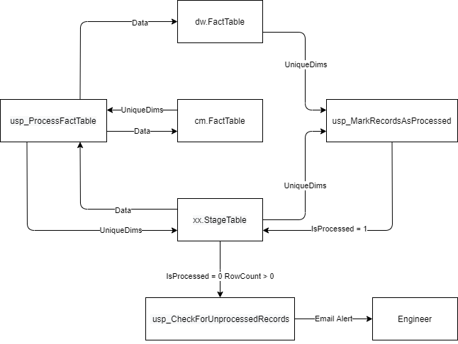

### Auditing
#### Checking For Unprocessed Records
- The basic feedback system is checking to see if everything in a stage table processed correctly.
- This is done by matching UniqueDim and/or UniqueRow hash values. 
    - This process is normally done with fact tables as loads are usually designed to stop processing if there are missing dimension records.
- Note: Hashes in EDW and the common model in ODS are calculated automatically.

  1. The fact table is loaded. In that process, unique dims are passed back to the stage table.
  2. Unique dims from the fact table and stage table are compared and where there is a match, that record is marked as processed.
  3. The stage table is checked for the existence of unprocessed records.
  4. If unprocessed records are found, an email alert is sent to the engineers.

#### Stored Procedures

##### `19 CREATE PROC usp_MarkRecordsAsProcessed`
- Mark records in stage tables as having been processed. 
- Necessary Modification: 
    - Every fact table load you build will need code added to the stored procedure so it becomes part of the audit process. 
    - Loading dimensions isn't normally problematic so they are not part of this process. 
    - If a dimension is missing records, the entire process will grind to a halt as designed.
``` sql
-- An example of the code that needs to be added for each load process.
UPDATE st
SET Processed = 1
FROM [eod].[Assets] st
JOIN FSA..FactAssets pt
ON pt.UniqueDims = st.UniqueDims
WHERE st.ErrorRecord = 0
USE ODS
GO
​
DROP PROCEDURE IF EXISTS dbo.usp_MarkRecordsAsProcessed
GO
​
SET ANSI_NULLS ON
GO
​
SET QUOTED_IDENTIFIER ON
GO
​
CREATE PROCEDURE dbo.usp_MarkRecordsAsProcessed
AS
BEGIN
​
​
UPDATE st
SET Processed = 1
FROM [eod].[Assets] st
JOIN FSA..DimAssets pt
ON pt.RowHash = st.UniqueRows 
WHERE st.ErrorRecord = 0
​
UPDATE st
SET Processed = 1
FROM eod.Exchanges st
JOIN FSA..FactExchangeCloseData pt
ON pt.UniqueDims = st.UniqueDims
WHERE st.ErrorRecord = 0
​
​
​
END
GO
```

##### `20 CREATE PROC usp_CheckForUnprocessedRecords`
- Check Stage Tables for unprocessed records.
- Necessary Modification: 
    - Every fact table load you build will need code added to the stored procedure so it becomes part of the audit process. 
    - Loading dimensions isn't normally problematic so they are not part of this process.
- Before each alert, you need to run a select on a staging table checking for unprocessed records. 
- Then alter the message that message that gets sent based on the staging table being checked.

``` sql
SELECT *
FROM [eod].[Assets]
WHERE Processed = 0
​
​
IF @@RowCount > 0
BEGIN
    EXEC msdb.dbo.sp_send_dbmail
    @profile_name = 'Monitoring',
    @recipients = @OperatorEmailAddress,
    @subject = 'Unprocessed Records Exist',
    @body = 'There are unprocessed records in the Assets Staging Table' ;
END
USE ODS
GO
​
DROP PROCEDURE IF EXISTS dbo.usp_CheckForUnprocessedRecords
GO
​
SET ANSI_NULLS ON
GO
​
SET QUOTED_IDENTIFIER ON
GO
​
CREATE PROCEDURE dbo.usp_CheckForUnprocessedRecords
AS
BEGIN
​
--Update with your operator name.
DECLARE @OperatorName sysname = N'YourOperatorName';
​
DECLARE @OperatorEmailAddress NVARCHAR(100) = (SELECT email_address FROM msdb.dbo.sysoperators WHERE [name] = @OperatorName);
​
​
--Check for unprocessed records
SELECT *
FROM [eod].[Assets]
WHERE Processed = 0
​
​
IF @@RowCount > 0
BEGIN
    EXEC msdb.dbo.sp_send_dbmail
    @profile_name = 'Monitoring',
    @recipients = @OperatorEmailAddress,
    @subject = 'Unprocessed Records Exist',
    @body = 'There are unprocessed records in the Assets Staging Table' ;
END
​
SELECT *
FROM [eod].[EODPrices]
WHERE Processed = 0
​
IF @@RowCount > 0
BEGIN
    EXEC msdb.dbo.sp_send_dbmail
    @profile_name = 'Monitoring',
    @recipients = @OperatorEmailAddress,
    @subject = 'Unprocessed Records Exist',
    @body = 'There are unprocessed records in the EOD Prices Staging Table' ;
END
​
SELECT *
FROM [eod].[Exchanges]
WHERE Processed = 0
​
​
IF @@RowCount > 0
BEGIN
    EXEC msdb.dbo.sp_send_dbmail
    @profile_name = 'Monitoring',
    @recipients = @OperatorEmailAddress,
    @subject = 'Unprocessed Records Exist',
    @body = 'There are unprocessed records in the Exchanges staging table.' ;
END
​
​
END
GO
```