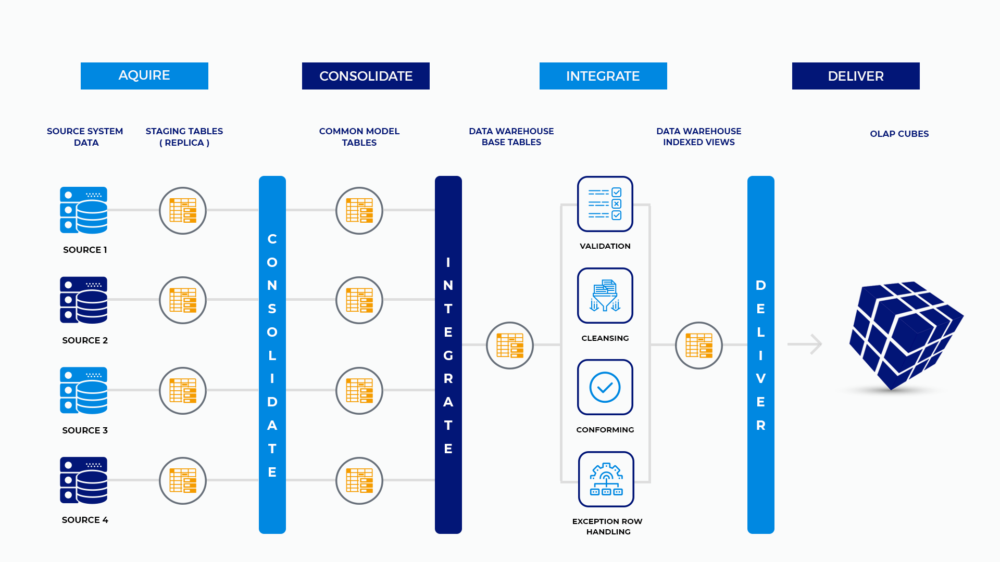
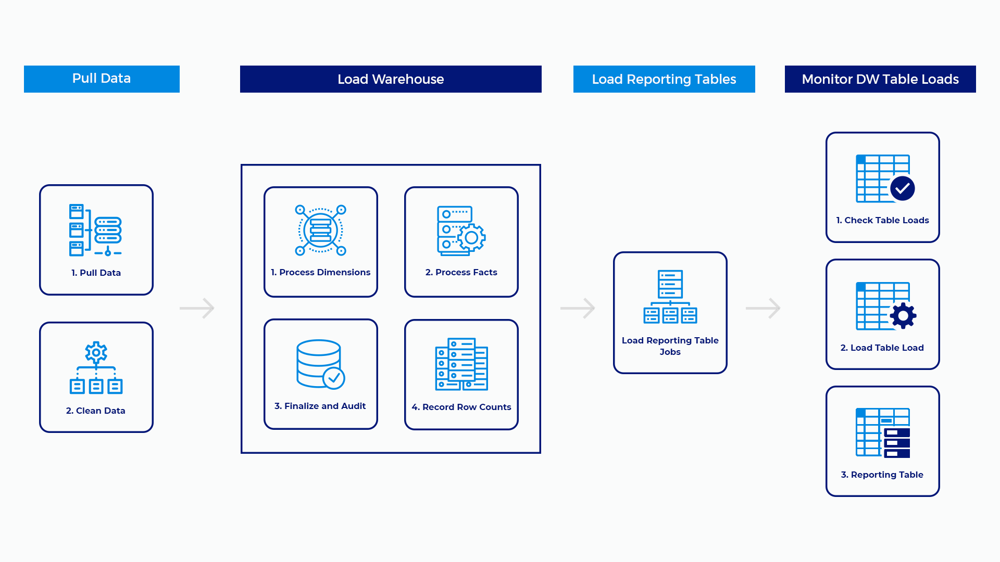

https://docs.massstreet.net/v/data-warehouse-etl-framework
https://github.com/MassStreetAnalytics/etl-framework

> NOTE: For context, this framework is for moving data from OLTP system into OLAP system

### Enterprise Data Ecosystem

-   The EDW is just a piece of the total ecosystem.
-   When it comes to storing and retrieving historical data the EDW is the central authority.
    -   Applications should be feeding it data.
    -   It should be feeding other applications the results of historical analysis.
    -   Can even expose it to external users via APIs.

#### ETL Overview

-   Designed to accept data from many sources and combine that data into a single dataflow that terminates in the data warehouse. The data moves through in stages.

    -   **Acquire**:
        -   Each ETL process that pulls data into the system is entirely independent of any other process.
        -   Each dataset is pulled from its source system and placed in a staging table.
    -   **Consolidate**:
        -   All data that is collected in staging tables is moved to common model tables together.
        -   The common model is a unified representation of all data across systems.
    -   **Integrate**:
        -   Moving data from consolidate to integrate is accomplished in the same step as moving from acquire to consolidate.
        -   Integrate is where we move the data from the common model into the warehouse tables.
    -   **Deliver**:
        -   At this time, there are no OLAP cubes in the data architecture. Data is delivered through various vectors. Most of those vectors pass through the warehouse. A few bypass the warehouse and go straight to de-normalized reporting tables.

##### Acquire: Getting Data

-   Two general methods data is provided to the data warehouse
    -   **Demand pull** is when the system reaches out to other systems
        -   Demand pull processes are triggerd by the data warehouse environment. **The grand majority of your processes should be demand pull.**
        -   The key element being that the data warehouse box has access to the remote system.
    -   Supply push processes are initiated by processes external to the data warehouse.
        -   for .e.g data dropped by 3rd party into a folder that is then scanned by DWH processes and moved into the InterfacesAndExtracts folder.
        -   Should be rare and only done when there are no other options for e.g. bank feeds where the DWH cannot pull the data from the source system.

##### Consolidate: The Common Data Model

-   The common model represents the unified data model for the enterprise.
-   The common model is necessary to process master data.
    -   With data coming from various systems, that data will have different column names and different data types.
    -   The common model combines the information from disparate systems into a single model where the same concepts from different systems will share a common name.

##### The Semantic Layer

-   The semantic layer exist in the Reporting database.
-   The semantic layer's purpose to make known datasets available to the business users. These data sets frequently comprise canned reporting requirements.
-   Should be incredibly intuitive.
    -   Table names and column names should be so obvious that a person brand new to the organization can sit down and using the database without any assistance
    -   The Reporting database is filled with a bunch of de-normalized dimensional datasets.
    -   These datasets, preferably views, are build with pretty names
        -   i.e. `DimCustomer.FirstName` becomes `Customer.[First Name]`.
    -   This is to allow them to simply click and drag ready made easy to read columns for their reports.
        > Pro tip: There should be practically NO logic in the Semantic Layer.
-   The creation of these BI datasets should not need anything beyond joins and filters to pull the data from the DWH.

##### Databases and Schemas

-   There are three databases used to deliver data.
    -   The data warehouse database
        -   That database will be used by the entire organization
        -   Important to have a name for the DWH database that is easy to remember and recognizable
            > Pro Tip: Do NOT name your data warehouse EDW.
        - Schemas:
          - `dw`: Data Warehouse
            - All base data warehouse tables that are physically implemented belong in the dw schema.
    -   Operational data store (ODS)
        -   This is where all ETL take place.
        -   Contains
            -   Staging tables and the tables that support the common model.
            -   The stored procedures that perform ETL
            -   Views that support monitoring of the ETL processes.
        -   Note: STRICTLY for data professionals and anything here should not be something that non-IT users will access.
        -   Schemas:
            -   `Common Model` (`cm`}: All common model tables go in the common model schema.
            -   `Report` (`rpt`): Any table that records de-normalized reporting information in support of load management goes in the rpt schema.
            -   `Volumetrics` (`vol`): Tables that are involved in statistical control processes used to manage the EDW load go in the vol schema.
                - `vol` vs `rpt`: 
                    - `vol` tables are normalized in support of small applications that perform statistical analysis. 
                    - `rpt` tables are just flat tables to dump de-normalized data into.
            - `mdm` (Master Data Management): Any tables that are involved in the processing of mdm data but are not staging tables go in the mdm schema.
            - `ms` (Multi-System): Stage tables that combine data from more than one system go in the ms schema.
    -   Reporting
        -   Allows rapid access to data without having to build complex reports. Every model in production, is represented here as a de-normalized view.
        -   Consists of de-normalized reporting tables and views that are built from tables in the data warehouse.
    -   Metadata
        -   The database that holds the logging information from the execution of SSIS packages. This database is FAR more useful and user friendly than the execution information provided by SQL Server.

- Note: The framework comes with standard schemas. 
  - Schemas help segregate various database objects so DBAs can properly assign access rights depending on a users required level of access.
  -  Schema allow you to differentiate objects with the same name for two different objects in your code without a name collision error.
  -  Schemas help to identify / define the function of the object.

​
#### ETL Processes

-   Pull Data
    -   In general, all processes that acquire data from outside systems pull and clean data in the same step.
-   Data Cleansing
    -   As with any ETL process, some of the data that comes in to the system needs to be cleaned and standardized before it is loaded. Cleaning dates is a common task.
-   Load Warehouse
    -   The actual warehouse load processes is a combination of loading tables and auditing processes that are used to check and make sure everything loaded ok.
    -   As you build ETL processes, you will need to make sure to add code that takes these processes into account.
    -   All dimensions are processed first; then all fact tables are processed.
    -   Fact table loads communicate back to staging to take note of what exactly was loaded to the warehouse.
    -   The Finalize and Audit processes checks staging records and reports discrepancies.
-   Load Reporting Tables
    -   This job is for those processes that load de-normalized reporting tables that reside in the Reporting database only.
    -   The reporting tables that live in ODS are only for data professionals and are loaded by different processes.
-   Monitor DW Table Loads
    -   Check Tables Loads will report on unusual record load amounts.
    -   Either more than usual or none at all over a three day period are the trigger events.
    -   In the final step, volumetric data is dumped into a de-normalized reporting table for easy digest.

[[tools.storage.framework.mass_street.tables]]

### Handling Calculated Values
- In general, there should be no math in the pipeline. You should not be storing the results of calculations. 
- instead, you should be storing the components of calculations. 
  - The reason for this is because the definitions of values often change.
  - This is particularly true of greenfield projects as the business negotiates with various internal factions and consensus is built around the definition of various KPIs. 
  - Even after this process is complete, it is a poor assumption that the definition of a KPI is written in stone.
Having math in your pipeline is problematic. The question is, where does the calculation go?
Does it go in the pull?
Does it go in the cleansing process?
Does it go in the fact table load?
Do you have a published policy about where calculations go?
Are all your engineers familiar with the policy so they don't put calculations where they don't belong according to the policy?
Are you 100% certain of 5 because now there is a problem with numbers and you can't find where the calculation lives.
Having math in the pipeline is bad DataOps. It is one of the very many opportunities you will be given to shoot your organization's analytic efforts in the foot. Anything that slows down your ability to push code needs to be tossed aside in favor of something simpler, faster, and easier to manage.

#### So where should calculations go?
- Having all calculations handled in BI Reporting tools or processes in the Reporting database is a natural thought process that does not require a policy for everybody to memorize. Because of course that's where the math goes. Where else would it go but the end point where the value can be surfaced at runtime just like we all learned in college but somehow forgot when we hit the real world. I guess all this money made us forget a few fundamentals.
Having said all that, this is software engineering and edge cases are a thing. There are very good arguments to be had for having math in the pipeline if it makes sense to do so. The scenario that I run into most often is that the result of a calculation is itself a component of another calculation and we do not care one bit about the original components. In that case, it makes sense to put math in the pull.

