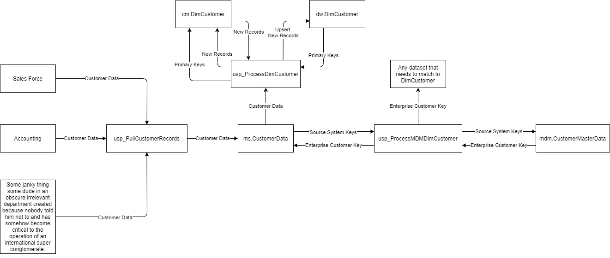

### Master Data Management

> Assumptions:
> - The same data comes from more than one source system.
> - The matching process is an exact match on source system keys.

#### Implementation
- For this scenario, we are going to use the example of combing customer data from various systems.
  - We are going to pull and combine customer data from three different systems.
    - SalesForce
    - Accounting
    - Some janky thing some dude in an obscure irrelevant department created because nobody told him not to and has somehow become critical to the operation of an international super conglomerate.


- The key to the system is the master data management table. 
    - The table contains columns for every key from the source systems in question. 
    - Those keys are then hashed in `RowHash` which has a unique index on it to ensure we get one and only one unique combination of the keys of the three different source systems.
    - CustomerEK is simply an autoincrementing number, but that number then becomes the Customer Enterprise Key and the main identifier for a customer in a business analytics context.

    | CustomerEK | SalesForceSystemKey | AcctSystemKey | JankyThingSystemKey | RowHash |
    | ---------- | ------------------- | ------------- | ------------------- | ------- |
    | ...        | ...                 | ...           | ...                 | ...     |

- The system works like this.
    1. A pull proc collects and combines the data from the three systems into a stage table that represents the common model of a customer.
    2. An MDM processing doc, pulls the keys from staging and matches them against the `CustomerMasterData` table in much the same way that the junk dimension load process takes place.
    3. A unique combination of keys is identified and assigned a CustomerEK.
    4. That enterprise key is then passed back to the record in staging that the original source system keys came from.
    5. In addition, any dataset that connects to DimCustomer is also updated in staging.
    6. At this point, the normal dimension table load process takes place with the customer enterprise key functioning as the source system key.
    7. (Not shown here) When the fact tables are loaded, all the matching of fact records in staging to `DimCustomer` will use the enterprise customer key as the source system key.

    


#### SQL Script for MDM Table
- The sample master data management table is an adaptation of the junk dimension.
- Necessary Modification:
    - Replace YourDimensionName with the name of your specific master data management table.
    - Replace the source system key place holder columns with your source system keys.
    - Replace the source system key place holder columns with your source system keys in the row hash. 

```sql
USE ODS
GO

DROP INDEX IF EXISTS [NCIDX_YourDimensionNameMasterData_RowHash] ON [mdm].[YourDimensionNameMasterData]
GO

SET ARITHABORT ON
SET CONCAT_NULL_YIELDS_NULL ON
SET QUOTED_IDENTIFIER ON
SET ANSI_NULLS ON
SET ANSI_PADDING ON
SET ANSI_WARNINGS ON
SET NUMERIC_ROUNDABORT OFF
GO

DROP TABLE IF EXISTS [mdm].[YourDimensionNameMasterData]
GO


SET ANSI_NULLS ON
GO

SET QUOTED_IDENTIFIER ON
GO

CREATE TABLE [mdm].[YourDimensionNameMasterData](
	[YourDimensionNameEK] [bigint] IDENTITY(1000,1) NOT NULL,
	[SourceSystemKey1] [nvarchar](50) NOT NULL,
	[SourceSystemKey2] [nvarchar](50) NOT NULL,
	[RowHash]  AS (
        CONVERT(
            [binary](35),
            hashbytes('SHA1',
                concat(
                    CONVERT([nvarchar](35),[SourceSystemKey1],(0)),
                    CONVERT([nvarchar](35),[SourceSystemKey2],(0))
                )
            ),
            (0)
        )
    ) PERSISTED,
    CONSTRAINT [PK_YourDimensionNameMasterData] PRIMARY KEY CLUSTERED 
    (
        [YourDimensionNameEK] ASC
    ) 
    WITH (
        PAD_INDEX = OFF, 
        STATISTICS_NORECOMPUTE = OFF, 
        IGNORE_DUP_KEY = OFF, 
        ALLOW_ROW_LOCKS = ON, 
        ALLOW_PAGE_LOCKS = ON, 
        OPTIMIZE_FOR_SEQUENTIAL_KEY = OFF
    ) ON [PRIMARY]
) ON [PRIMARY]
GO


CREATE UNIQUE NONCLUSTERED INDEX [NCIDX_YourDimensionNameMasterData_RowHash] ON [mdm].[YourDimensionNameMasterData]
(
	[RowHash] ASC
)WITH (PAD_INDEX = OFF, STATISTICS_NORECOMPUTE = OFF, SORT_IN_TEMPDB = OFF, IGNORE_DUP_KEY = OFF, DROP_EXISTING = OFF, ONLINE = OFF, ALLOW_ROW_LOCKS = ON, ALLOW_PAGE_LOCKS = ON, OPTIMIZE_FOR_SEQUENTIAL_KEY = OFF) ON [PRIMARY]
GO

```

#### Stored Procedures

