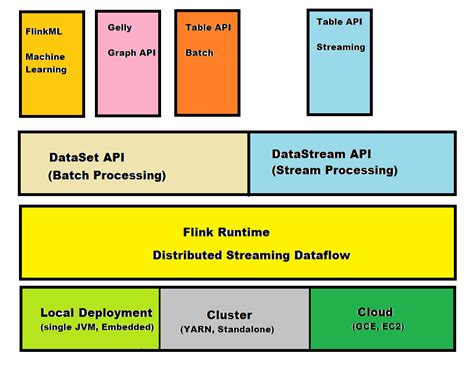

-[PyFlink](https://thecodinginterface.com/blog/intro-to-pyflink/)
- https://www.youtube.com/playlist?list=PLLvMUwMfgFGeM7IzOMiPwCZN2pCq3Nwka


## What is Flink?

- Open source stream processing framework for distributed, high perfirming, alway available and data streaming applications
- also supports for batch processing, graph processing, iterative processing
- Next generation for stream processing. 
- Speed wise: Flink > Spark > Hadoop
- Flink gives us low latency and high throughput
- Robust Fault-tolerance, application can restart exactly from same point where it failed
- Possible to add resource while ap is running
- Also maintains exactly once semantics

## Architecture



## Batching Processing via DataSet API

- The DataSet API is used in Apache Flink for batch processing.
- A high-level API that provides powerful operators for data transformation, filtering, grouping, and aggregation and supports various data sources.
- Stages
  - Data Source: Supports files, databases, and streams etc.
  - Data Transformation such as Map, filter, join, groupby
  - Data Sink: Storing the processed data

``` py
from pyflink.dataset import ExecutionEnvironment
from pyflink.dataset import DataSet
from pyflink.common import Row

# create a Batch Execution Environment
b_env = ExecutionEnvironment.get_execution_environment()

# define a source
input_data = [("apple", 1), ("banana", 2), ("apple", 3), ("banana", 4), ("apple", 5)]
input_ds = b_env.from_collection(input_data)

# apply transformations
result_ds = input_ds \
    .group_by(0) \
    .sum(1)

# define a sink
result_ds.print()

# execute the program
b_env.execute()
```

## Stream Processing via DataStream API

- Uses the DataStream API for real-time processing. 
- The DataStream API is a high-level API that provides a collection of operators for handling large amounts of streaming data.

```py
from pyflink.datastream import StreamExecutionEnvironment
from pyflink.dataset import DataSet
from pyflink.common import Row

#create a Stream Execution Environment
s_env = StreamExecutionEnvironment.get_execution_environment()

#define a source
input_data = [("apple", 1), ("banana", 2), ("apple", 3), ("banana", 4), ("apple", 5)]
input_ds = s_env.from_collection(input_data)

#apply transformations
result_ds = input_ds
.key_by(lambda x: x[0])
.sum(1)

#define a sink
result_ds.print()

#execute the program
s_env.execute()
```
