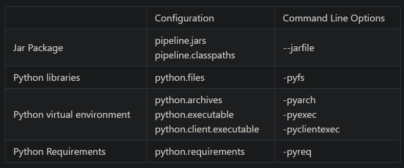

- [All you need to know about PyFlink](https://www.alibabacloud.com/blog/everything-you-need-to-know-about-pyflink_599959?spm=a2c65.11461478.0.0.4c445355JQd9HF)
- [Zeppelin Notebooks for Pyflink](https://www.alibabacloud.com/blog/zeppelin-notebook-an-important-tool-for-pyflink-development-environment_598124?spm=a2c65.11461478.0.0.4c445355JQd9HF)
- https://medium.com/@priyankbhandia_24919/apache-flink-for-data-enrichment-6118d48de04
- [Flink Docs](https://nightlies.apache.org/flink/flink-docs-release-1.17/)
- [Pyflink docs](https://nightlies.apache.org/flink/flink-docs-master/api/python/reference/index.html)


## Stream Processing with Flink

### The Basics
- Flink is a distributed computing engine. 
- It has no storage besides the state which provides the immediate context during processing. 
- Data is assumed to flow from an external data source to (typically, but it’s not required) an external data sink. 
- A Flink/PyFlink job needs at least a data source.
- Like Spark, Flink jobs are lazily executed
  - To submit for execution, you need to call the `execute` API explicitly. 
  - This lets you construct sophisticated programs that Flink executes as a whole. 

### Stream Processing APIs
- Flink offers two different APIs 
  - the procedural and relatively low level DataStream API 
  - the relational/declarative Table API
  - Both APIs can be applied to either stream or batch processing, and both have PyFlink APIs.

## The Flink Job
### Data Sources / Sinks

- PyFlink fully supports both the Table API and the DataStream API. 
- Both APIs provide many different ways to define sources and sinks, and a single job can combine both APIs
- For example converting between Table API reads and DataStream API writes, or DataStream API reads and Table API writes.

#### DataStream API

- The DataStream API connectors are less regular
- Each connector provides a stack of completely different APIs. Refer to the specific connector page to see which APIs are provided. 
- To use a connector not supported by PyFlink you need to write a Python wrapper for the corresponding Java API, see the supported connectors for examples.

#### Table API

- The Table API examples define source/sink properties as key/value pairs. All Table API connectors follow that pattern 
- To use a different connector, or to define a new connector that is not officially supported in PyFlink, just configure appropriate key/value pairs.

<br>

<table>
  <tr>
    <th>DataStream API</th>
    <th>Table API</th>
  </tr>
  <tr>
    <td>

**Reading from Kafka**

```py
source = KafkaSource.builder() \
    .set_bootstrap_servers("localhost:9092") \
    .set_topics("input-topic") \
    .set_group_id("my-group") \
    .set_starting_offsets(KafkaOffsetsInitializer.earliest()) \
    .set_value_only_deserializer(
        JsonRowDeserializationSchema.builder()
        .type_info(Types.ROW([Types.LONG(), Types.STRING()]))
        .build()) \
    .build()

env = StreamExecutionEnvironment.get_execution_environment()
ds = env.from_source(source, WatermarkStrategy.no_watermarks(), "Kafka Source")
```

</td>
<td>


**Reading from Kafka**

```py
env_settings = EnvironmentSettings.in_streaming_mode()
t_env = TableEnvironment.create(env_settings)

t_env.create_temporary_table(
    'kafka_source',
    TableDescriptor.for_connector('kafka')
        .schema(Schema.new_builder()
                .column('id', DataTypes.BIGINT())
                .column('data', DataTypes.STRING())
                .build())
        .option('properties.bootstrap.servers', 'localhost:9092')
        .option('properties.group.id', 'my-group')
        .option('topic', 'input-topic')
        .option('scan.startup.mode', 'earliest-offset')
        .option('value.format', 'json')
        .build())

table = t_env.from_path("kafka_source")
```
</td>
  </tr>
  <tr>
<td>

**Writing from Kafka**

```py
sink = KafkaSink.builder() \
    .set_bootstrap_servers('localhost:9092') \
    .set_record_serializer(
        KafkaRecordSerializationSchema.builder()
            .set_topic("topic-name")
            .set_value_serialization_schema(
                JsonRowSerializationSchema.builder()
                .with_type_info(Types.ROW([Types.LONG(), Types.STRING()]))
                .build())
            .build()
    ) \
    .set_delivery_guarantee(DeliveryGuarantee.AT_LEAST_ONCE) \
    .build()

ds.sink_to(sink)
```

</td>
<td>

**Writing from Kafka**

``` py
env_settings = EnvironmentSettings.in_streaming_mode()
t_env = TableEnvironment.create(env_settings)

t_env.create_temporary_table(
    'kafka_sink',
    TableDescriptor.for_connector('kafka')
        .schema(Schema.new_builder()
                .column('id', DataTypes.BIGINT())
                .column('data', DataTypes.STRING())
                .build())
        .option('properties.bootstrap.servers', 'localhost:9092')
        .option('topic', 'output-topic')
        .option('value.format', 'json')
        .build())

table.execute_insert('kafka_sink')
```
</td>
  </tr>
</table>

### Transformations

#### DataStream API

- If you need fine-grained control of the transformations or access to low level functionality, e.g. timer, state, etc, choose the DataStream API. Otherwise, Table API is a good choice in most cases.

#### Table API

- The Table API is a relational API with a SQL-like flavor.
- Supports executing SQL queries directly , providing access to functions not currently available via the API, e.g. deduplication, pattern recognition, topn, etc. 

<table>
  <tr>
    <th>DataStream API</th>
    <th>Table API</th>
  </tr>
  <tr>
    <td>

- map: Convert one element into another
- flat map: Takes one element as input and produce zero, one, or more elements
- filter: Evaluates a boolean function for each element and filter out the ones which return false
- aggregation: Accumulating multiple elements
- windowing: Group elements into different windows and perform calculations for each group
- connect: Connect two different streams, allows sharing state between two streams
- process: Similar to flat map, however, is more flexible as it allows access to low level operations, e.g. timer, state, etc.
- broadcast: Broadcast one stream to all the subtasks of another stream
- side output: In addition to the main stream, produce additional side output result stream
- async io: This is still not supported in PyFlink.

</td>
<td>

- projection: Similar to map in DataStream API
- filter: similar to filter in DataStream API
- aggregation: Similar to SQL GROUP BY, group elements on the grouping keys and perform aggregations for each group
- window aggregation: Group elements into different windows and perform aggregations for each window
- regular join: Similar to SQL JOIN, joins two streams
- lookup (stream-table) join: Joins a stream with a static table
- temporal join: Join a stream with a versioned table, similar to lookup join, however, it allows join a table at a certain point in time
- window join: Join elements of two streams belonging to the same window
- interval join: Join elements of two streams with a time constraint
- topn and windowed topn: N smallest or largest values ordered by columns
- deduplication and windowed deduplication: Removes elements that duplicate over a set of columns
- pattern recognition: Detect elements of a specific pattern in one stream
</td>
  </tr>

</table>

### Running Flink Scripts
- Flink Console / UI  
  For example, if you have a PyFlink job defined by a Python script word_count.py, you can execute it locally via the Flink console with `$ python word_count.py` or by right clicking and executing in the Flink IDE. Flink will launch a mini Flink cluster which runs in a single process and executes the PyFlink job.

- Command Line Tool  
  You can also submit a PyFlink job to a remote cluster using Flink’s command line tool.
  
  Here is a simple example that shows how to submit a PyFlink job to an Apache YARN cluster for execution:

  ```bash
  ./bin/flink run-application -t yarn-application \
      -Djobmanager.memory.process.size=1024m \
      -Dtaskmanager.memory.process.size=1024m \
      -Dyarn.application.name=<ApplicationName> \
      -Dyarn.ship-files=/path/to/shipfiles \
      -pyarch shipfiles/venv.zip \
      -pyclientexec venv.zip/venv/bin/python3 \
      -pyexec venv.zip/venv/bin/python3 \
      -pyfs shipfiles \
      -pym word_count
  ```

### Handling Python Dependencies

#### JAR Files

- You can include JAR files with a PyFlink job:
``` py
# Table API
t_env.get_config().set("pipeline.jars", "file:///my/jar/path/connector.jar;file:///my/jar/path/udf.jar")

# DataStream API
env.add_jars("file:///my/jar/path/connector1.jar", "file:///my/jar/path/connector2.jar")
```

- You must include all the transitive dependencies. 
- For connectors, use the fat JAR whose name usually contains **sql*, e.g. `flink-sql-connector-kafka-1.16.0.jar` for the Kafka connector instead of `flink-connector-kafka-1.16.0.jar`.

#### Third Party Python Libraries

- You could specify third-party Python libraries as the following:

```py
# DataStream API
env.add_python_file(file_path)

# Table API
t_env.add_python_file(file_path)
```
- The specified Python libraries will be distributed across all the cluster nodes and are available to use in the Python user-defined functions during execution.


#### Python Virtual Environment

- If there are many Python libraries needed to be used, it may be a good practice to package the Python virtual environment together with the Python dependencies:

```py
# Table API
t_env.add_python_archive(archive_path="/path/to/venv.zip")
t_env.get_config().set_python_executable("venv.zip/venv/bin/python3")

# DataStream API
env.add_python_archive(archive_path="/path/to/venv.zip")
env.set_python_executable("venv.zip/venv/bin/python3")
```

- Besides API, it has provided configurations and command line options for all these kinds of dependencies to give users more flexibility.
  
<br>

