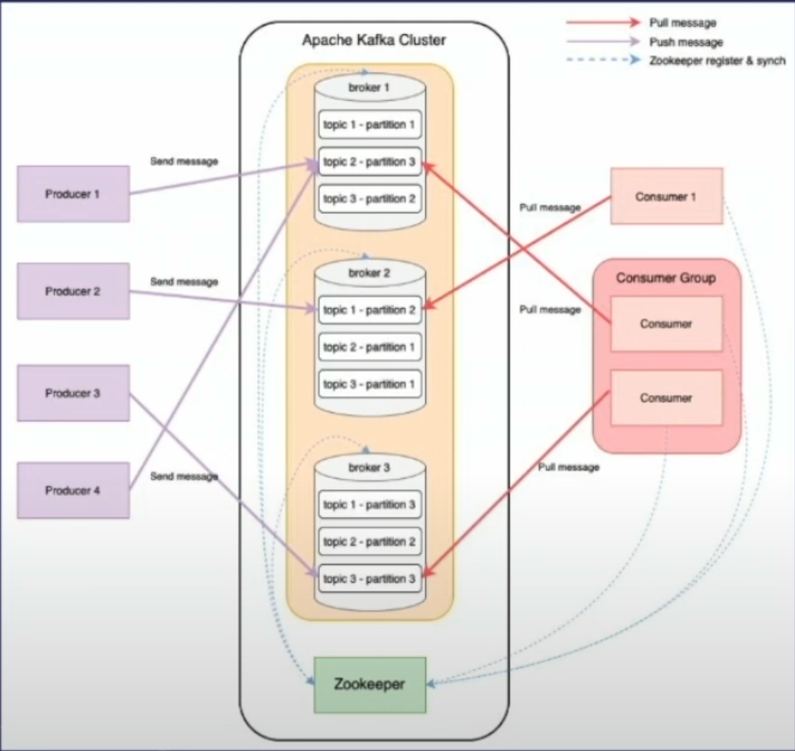

- [Docs for `kafka-python`](https://kafka-python.readthedocs.io/en/master/index.html)
- [AVRO for Kafka](https://www.confluent.io/blog/avro-kafka-data/)
- [Kafka Internals](https://www.youtube.com/watch?v=d89W_GzWnRw&pp=ygUTZGlzdHJpYnV0ZWQgc3lzdGVtcw%3D%3D&ab_channel=TheGeekNarrator)
- [Outbox Pattern](https://www.youtube.com/watch?v=u8fOnxAxKHk&t=29s&ab_channel=CodeOpinion)
- <https://www.kai-waehner.de/blog/2022/06/03/apache-kafka-request-response-vs-cqrs-event-sourcing/>


#### Extensions 
- Kafka with MultiThreading/MultiProcessing
- Kafka DLQs
- Kafka Monitoring
- Consumer Lags
- Optimizing: Partitions
- https://medium.com/swlh/how-to-make-kafka-producer-consumer-production-ready-d40915b78c9


## What is Kafka

- Apache Kafka is an open source distributed event streaming platform used to collect, process, store, and integrate data at scale

## Why Kafka?
- Scalability: Kafka uses a log partition model that distributes the data across multiple servers which makes it highly scalable compared to a single server.
- Fast: It is extremely fast as it decouples the data streams which results in lower latency.
- Durability: It distributes partitions across many servers and all the data is written to disks. Thus, it protects against system failure which makes it durable and fault tolerant.

## Components

- Brokers: Servers of Kafka cluster that receive, sent and save messages
- Producers: Pushes message/data to brokers
- Consumers: Pulls messages/data from brokers. Will commit offet after processing data
- Consumer Groups: Groups of consumers. Only one message pulled by consumer group
- Topics: Grouping of messages. Internal topics save offset and schemas. External topics created to save ingress data
- Partitions: Provides higher availability and performance
- Replica: replication of partitions
- Leaders & Followers: In replication, Followers copy from leaders. If the leader failed, one of the followers takes its place to keep service running
- Controller: One of the brokers. Manages topics, Partit
- ZooKeeper: Stores cluster metadata, status and assist controller execute leader election. Replaced after version 2.8 with KRaft



## How Kafka works?

- In essence, Kafka is an log file that is append-only and immutable
  - Kafka models **events** as key/value pairs.
  - A **topic** is a log of events and is how Kafka organizes different kinds of events
  - New events are added at the end of the log and cannot be modified (immutable)
  - Reading events is based on using an arbitary offsets
  - Storage is done through files stored on disk.
  - Every topic can be configured to expire data after it has reached a certain age (or the topic overall has reached a certain size)

```py
# python package for kafka
pip install kafka-python

# Other kafka packages
confluent kafka
pykafka
```

## Structure of a Kafka event

- Metadata: topic, paritition, offset, timestamp
- Headers: app-specific key value pairs
- Key: serialized bytes in some format or null
- Value: serialized bytes in some format or null

## Partitioning of topics

- Partitioning takes the single topic log and breaks it into multiple logs, each of which can live on a separate node/broker in the Kafka cluster.
- This way, the work of storing messages, writing new messages, and processing existing messages can be split among many nodes in the cluster and allowing for scaling

### Distribution among partitions

Having broken a topic up into partitions, we need a way of deciding which messages to write to which partitions.

- Typically, if a message has no key, subsequent messages will be distributed round-robin among all the topic’s partitions. In this case, all partitions get an even share of the data, but we don’t preserve any kind of ordering of the input messages.
- If the message does have a key, then the destination partition will be computed from a hash of the key.
- This allows Kafka to guarantee that messages having the same key always land in the same partition, and therefore are always in order.
- Note: Ordering of keys is only guaranteed within the same partition

```py
# creating topic with 2 partitions
 from kafka.admin import KafkaAdminClient, NewTopic

 admin = KafkaAdminClient(
    client_id = 'admin', 
    ...
 )

topic_name_partitioned = TOPIC_NAME + '_partitioned'
topic = NewTopic(
    name = topic_name_partitioned,
    num_partitions = 2,
    replication_factor=3
)
admin.create_topics([topic], timeout_ms = int(<TIMEOUT_MS>)
```

## The Brokers

- From a physical infrastructure standpoint, Kafka is composed of a network of machines called brokers.  
- Each broker hosts some set of partitions and handles incoming requests to write new events to those partitions or read events from them.
- Brokers also handle replication of partitions between each other.
  - Regardless, brokers are susceptible to failure
  - Hence, to ensure the data is safe, partition data is replicated to several other brokers
  - Those copies are called follower replica, whereas the main partition is called the leader replica
  - Reading and writing are done to the leader and then replicated to the followers
  - This way, if one node in the cluster dies, another will take over its role.

<br>

## The Producer: Writing to Kafka

docs: <https://kafka-python.readthedocs.io/en/master/apidoc/KafkaProducer.html>

- sends events to Kafka broker
- is responsible for:
  - Partition assignment
    - Default: Same key to same partition, no key assign random partition
  - Batching events for improved throughput
  - Compress data before sending
  - Retries
  - Response Callbacks
  - Transaction Handling

```py
# python package for kafka
pip install kafka-python

# create a Producer
from kafka import KafkaProducer

producer = KafkaProducer(
    bootstrap_servers='localhost:9092'
)

# send events
response = producer.send(
    topic_name,
    key= {'id': 1},
    value = {
        'name': 'Francesco'
        'pizza': 'Margerita'
    }
)

# print('is_done', response.is_done)
# print('failed', response.failed())
# print('succeeded', response.succeeded())

producer.flush()


```

### Significance of a Key in a Kafka Message

#### links

- source: <https://www.baeldung.com/java-kafka-message-key>)
- <https://stackoverflow.com/questions/29511521/is-key-required-as-part-of-sending-messages-to-kafka>

As we know, Kafka effectively stores a stream of records in the order in which we generate the records.

When we publish a message to a Kafka topic, it’s distributed among the available partitions in a round-robin fashion. Hence, within a Kafka topic, the order of messages is guaranteed within a partition but not across partitions.

When we publish messages with a key to a Kafka topic, all messages with the same key are guaranteed to be stored in the same partition by Kafka. Thus, keys in Kafka messages are useful if we want to maintain order for messages having the same key.

To summarize, keys aren’t mandatory as a part of sending messages to Kafka. Basically, if we wish to maintain a strict order of messages with the same key, then we should definitely be using keys with messages. For all other cases, having null keys will provide a better distribution of messages amongst the partitions.

Next, let’s straightaway deep dive into some of the implementation code having Kafka messages with a key.

## The Consumer: Reading from Kafka

- Reads events from Kafka topics. Note that reading a message does not destroy it. It is still there to be read by any other consumer that might be interested in it.
- Keeps track of completed events
- Scales horizontally with Consumer Groups
- Can participate in transactions
- Also, consumers need to be able to handle the scenario in which the rate of message consumption from a topic combined with the computational cost of processing a single message are together too high for a single instance of the application to keep up. That is, consumers need to scale. In Kafka, scaling consumer groups is more or less automatic.

```py
# create a Producer
from kafka import KafkaConsumer

# auto_offset_reset='earliest' & enable_auto_commit=True allows consumer to continue from where it failed
consumer = KafkaConsumer(
    topic=<TOPIC_NAME>,
    bootstrap_servers='localhost:9092',
    auto_offset_reset='earliest',  # read from latest committed offset
    enable_auto_commit=True,  
    group_id='my_consumer_group',
    value_deserializer=lambda x: loads(x.decode('utf-8')))
)

# check out topics
consumer.topics()

# subscribe to topic
# NOTE: listening only starts upon subscription (default behaviour)
consumer.subscribe(topics=[<TOPIC_NAME>])
consumer.subscriptions()

for message in consumer:
    print(
        message.partition,
        message.offset,
        message.key,
        message.value
    )
```

### Consumer Groups

- Consumer groups allow Kafka consumers to work together and process events from a topic in parallel.
- Each consumer can be assigned a subset of partitions from a topic or set of topics and can parallelize the processing of those events. (Alternatively, consumers can work individually to consume the same stream of events and process those events in different ways.)
- When consumers are added or removed from a consumer group—either because of a changing workload requirement, a rolling machine, or a consumer failure—the Kafka brokers will redistribute the topic-partitions across the new or remaining active members within the group.

#### Creating consumer groups

- To start using consumer groups, just give multiple consumers the same group.id. The group.id can use any string you like, and all the consumers with the same string will be in the same group.
- For example, you might have 5 consumers all running with group.id=invoice-emails, and they will work-share; at the same time, a single consumer can read the same events from the same topic with group.id=sales-analytics and it will work completely independely.

#### Consumer with Threading

``` py
# https://medium.com/@priyankacheruku2016/multi-threading-kafka-messages-python-60b960e6ac99
# PLEASE VERFIFY CODE AGAIN!

from kafka import KafkaConsumer, TopicPartition
from concurrent.futures import ThreadPoolExecutor


# perform actions using kafka message once
def process_job(kafka_message,topic_offset):
    #....
    consumer.commit(offsets=offsets)# commit the offset


sample_consumer = KafkaConsumer(
                    bootstrap_servers=hosts,
                    group_id=group_id,
                    auto_offset_reset=auto_offset_reset,
                    enable_auto_commit=False,
                    session_timeout_ms=session_timeout_ms,
                )

# Assign partitions to consumers within consumer group
partitions = [TopicPartition(topic_name, partition) for partition in consumer.partitions_for_topic(topic_name)]
consumer.assign(partitions)

# Before consuming messages
for partition in partitions:
    end_offsets = consumer.committed(partition) 
    if end_offsets is not None:
        consumer.seek(partition, end_offsets)

  
for kafka_message in consumer:
    # get partition and offset of message
    topic_partition = TopicPartition(topic_name, kafka_message.partition)
    offset = OffsetAndMetadata(kafka_message.offset + 1, None)
    topic_offset = {topic_partition: offset}
  
    executor = ThreadPoolExecutor(max_workers=number_of_threads)
    executor.submit(process_job, kafka_message,topic_offset)
```

## Kafka Connect

```py
# define schema of message
key_schema = {
    'type': 'struct',
    'fields' : [
        {
            'type': 'int32',
            'optional': False,
            'field': 'id'
        }
    ]
}

value_schema = {
    'type': 'struct',
    'fields' : [
        {
            'type': 'string',
            'optional': False,
            'field': 'name'
        },
        {
            'type': 'string',
            'optional': False,
            'field': 'pizza'
        }
    ]
}

# send some data
producer.send(
    topic_name= <TOPIC_NAME>,
    key = {
        'schema': key_schema,
        'payload': {'id': 1}
    },
    value = {
        'schema': value_schema,
        'payload': {'name': 'Frank', 'pizza': 'Mushrooms'}
    },
)
producer.flush()
```
