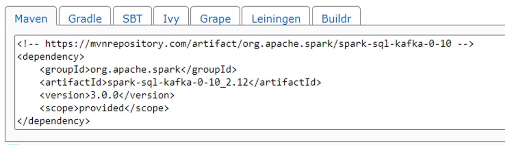

- <https://jaceklaskowski.gitbooks.io/spark-structured-streaming/content/>
- <https://github.com/LearningJournal/Spark-Streaming-In-Python/tree/master>

## Installation

- JDK 8 or above (up to Java 11)
- Hadoop WinUtils (for Windows only)
- Download Spark binaries (Python Only)
- Set Enviroment Variables
  - JAVA_HOME
  - PATH
  - HADOOP_HOME

## Spark Streaming

- Not a true real-time, but a near real time processing framework
- Computation model is based on microbatching

### Spark Streaming APIs

- `Spark Streaming API (DStream)` - Deprecated
  - RDD based streaming API
  - Lack Spark SQL Engine Optimizations
  - No Support for Even Time Semantics
  - No future upgrades and enhancements expected
- `Structured Streaming API`
  - Dataframe based Streaming API
  - SQL Engine Optimization
  - Supports Event Time Semantics
  - Expected future enhancements and new features

### How micro batching works

- Starting the script acts as an action and triggers a spark job, creating a background thread
- The background thread will keep looking for inputs from the data source
- Once new inputs arrived, a spark job is created to process the new data in micro batches

#### Configuring the micro-batch trigger

- Unspecified (default):
  - new micro batch is triggered as soon as the current micro batch finishes.
  - However, the trigger will wait for new data
- Time Interval:
  - first micro batch triggers immediately.
  - next batch trigger time = start of current batch + time interval set
  - if current batch takes longer than time interval set, next batch start right after current batch finishes
- One Time
  - Only one micro batch. The stream processing job now acts like a batch job
  - Useful for spark clusters in cloud, to process everything since last period and then shut down
  - Hence, will involve an external scheduler
- Continous (experimental):
  - micro-batching in milliseconds

### Streaming sources

- Socket Source: data from socket connection. Not for production
- Rate Source: dummy source that generates key-value pairs per second. For testing and benchmarking spark clusters
- File Source
- Kafka Source

### Output modes

#### Append (default)

- insert only, not updating previous outputs. Each batch will only add new records
- Use when you want to output only new rows to the output sink.

#### Update

>"OutputMode in which only the rows that were updated in the streaming DataFrame/Dataset will be written to the sink every time there are some updates."

- upsert operation. Either new records added or old records updated
- It is similar to the complete with one exception; update just outputs the updated aggregated results every time to data sink when new data arrives. but not the entire aggregated results like complete mode. If the streaming data is not aggregated then, it will act as append mode.

#### Complete

- overwrite result. Always end up with the latest output
- Use when you want to aggregate the data and output the entire results to sink every time
- This mode is used only when you have streaming aggregated data.

### Fault Tolerance and Restarts

- The application will eventually stop, either due to failure or maintenance
- When it does stop, it needs to stop and then restart gracefully
  - Maintaining the **exactly once** feature
    - Do not miss any input records
    - Do not create duplicate output records

#### Checkpoints

- Spark maintains the state of the micro batches using checkpoints
- Checkpoints contains
  - read position:
    - start and end of the data range being processed by current micro-batch
    - A commit is created to indicate that the data range is successfully processed once the micro batch finishes
  - state infomation: intermediate data for the micro batch i.e. running totals
- These are maintained using checkpoint and write-ahead log techniques

#### Requirements to ensure exactly-once

- Restart with same checkpoint
- Use a replayable source: Ability to re-read old data from a given point
- Use deterministic computation: Same results given same inputs
- Use an idempotent sink

>##### What about bug fixes?

 Hence a restart strategy is needed after impact analysis

#### Limitations of Spark Streaming

- Spark streaming does not allow analyical functions and windowing aggregates inside a streaming query.
- Only windowing aggregate is the time-based windows and other standard aggregates
- Workaround for things like running totals is to stored these numbers in the database and have the database calculate the running totals instead

### [Setting up dependencies](https://blog.devgenius.io/spark-installing-external-packages-2e752923392e)

- Spark SQL and kafka integration is offered by a seperate package, [spark-sql-kafka`](https://mvnrepository.com/artifact/org.apache.spark/spark-sql-kafka-0-10)

- in /conf/spark.defaults.conf file, add `spark.jars.packages
   <groupId>:<artifactId>:<version>, ...`
- for e.g. based on the screenshot, `spark.jars.packages     org.apache.spark:spark-sql-kafka-0-10_2.12:3.0.0`
  
- Spark will read this config file and download the required package and related dependencies
- Alternatively, we can do it via code. However, this is not recommended as it's better to keep it outside of application code

  ```py
  if __name__ == "__main__":
    spark = SparkSession \
        .builder \
        .appName("File Streaming Demo") \
        .master("local[3]") \
        .config("spark.streaming.stopGracefullyOnShutdown", "true") \
        .config("spark.jars.packages", "org.apache.spark:spark-sql-kafka-0-10_2.12:3.0.0") \
        .getOrCreate()
  ```

## Structure of a stream processing job

1. Read a streaming souce, input dataframe
2. Transform
3. Write rhe output, sink

```py

from pyspark.sql import SparkSession
from pyspark.sql.functions import *

from lib.logger import Log4j

if __name__ == "__main__":
    # init sparksession
    spark = SparkSession \
        .builder \
        .appName("Streaming Word Count") \
        .master("local[3]") \
        .config("spark.streaming.stopGracefullyOnShutdown", "true") \  # ensure graceful shutdown when stopped
        .config("spark.sql.shuffle.partitions", 3) \
        .getOrCreate()

    # Using the log4j logger
    logger = Log4j(spark)

    # define data source
    lines_df = spark.readStream \
        .format("socket") \
        .option("host", "localhost") \
        .option("port", "9999") \
        .load()

    # lines_df.printSchema()

    # words_df = lines_df.select(explode(split("value", " ")).alias("word"))
    words_df = lines_df.select(expr("explode(split(value,' ')) as word"))
    counts_df = words_df.groupBy("word").count() # here, count() is just an aggregate transform, not an action

    word_count_query = counts_df.writeStream \
        .format("console") \
        .outputMode("complete") \
        .option("checkpointLocation", "chk-point-dir") \
        .start()

    logger.info("Listening to localhost:9999")
    # stop only if manual kill or exception
    word_count_query.awaitTermination()
```

### Working with files and directories

>NOTE: schema inference is disabled by default for streaming sources

- Usually for minute-based cases where there is time to collect some data before writing it to file
- Properties:
  - maxFilesPerTrigger: Limit the number of files per micro-batch
  - cleanSource
    - archive: move processed files to an archive location. Doesn't work on Windows
    - delete: delete the processed files
  - sourceArchiveDir: supplies the directory for archive location
- Deleting / Archiving files will take some time in each micro batch
- Clean the input directory. Having a lot of processed files in a directory will negatively impact the micro batches
  
``` py
from pyspark.sql import SparkSession
from pyspark.sql.functions import expr

from lib.logger import Log4j

if __name__ == "__main__":
    spark = SparkSession \
        .builder \
        .appName("File Streaming Demo") \
        .master("local[3]") \
        .config("spark.streaming.stopGracefullyOnShutdown", "true") \
        .config("spark.sql.streaming.schemaInference", "true") \
        .getOrCreate()

    logger = Log4j(spark)

    raw_df = spark.readStream \
        .format("json") \
        .option("path", "input") \
        .option("maxFilesPerTrigger", 1) \
        .load()

    explode_df = raw_df.selectExpr("InvoiceNumber", "CreatedTime", "StoreID", "PosID",
                                   "CustomerType", "PaymentMethod", "DeliveryType", "DeliveryAddress.City",
                                   "DeliveryAddress.State",
                                   "DeliveryAddress.PinCode", "explode(InvoiceLineItems) as LineItem")

    flattened_df = explode_df \
        .withColumn("ItemCode", expr("LineItem.ItemCode")) \
        .withColumn("ItemDescription", expr("LineItem.ItemDescription")) \
        .withColumn("ItemPrice", expr("LineItem.ItemPrice")) \
        .withColumn("ItemQty", expr("LineItem.ItemQty")) \
        .withColumn("TotalValue", expr("LineItem.TotalValue")) \
        .drop("LineItem")

    invoiceWriterQuery = flattened_df.writeStream \
        .format("json") \
        .queryName("Flattened Invoice Writer") \
        .outputMode("append") \
        .option("path", "output") \
        .option("checkpointLocation", "chk-point-dir") \
        .trigger(processingTime="1 minute") \
        .start()

    logger.info("Flattened Invoice Writer started")
    invoiceWriterQuery.awaitTermination()

```

## Windowing and Aggregates

### Types of transformations

#### Stateless

- i.e. `select(), filter(), map(), flatMap(), explode()`
- These have nothing to do with history
- Streaming jobs with only stateless cannot support `output_mode='complete'` since Spark does not maintain the previous outcomes of such jobs. Hence, only append or update modes.

#### Stateful

- i.e grouping, aggregations, windowing, joins
- Cannot work correctly without knowing history
- Excessive amount of state will cause memory problems  
  - Intermediate state info in the executor's memory. Hence, cleaning up memory is critical
  - Time-bounded state is preferred since memory is freed up once state is outdated
  - With unbounded state, providing cleaning logic on when to free up memory is needed (only for Scala and Java APIs)

### Event Time and Windowing

#### What are Window Aggregates

- Time-Bound aggregation which are computed for a specific time window
- A time window is just a way of grouping events
- Never based on trigger time, but on event time!

#### Sliding Time Window

- e.g. get the average for the last 15 mins every 5 mins
- Over-lapping time intervals
- Each event can be accounted for in multple time windows

```py


agg_df = sensor_df \
        .withWatermark("CreatedTime", "30 minute") \
        .groupBy(col("SensorID"),
                 window(col("CreatedTime"), "15 minute", "5 minute")) \
        .agg(max("Reading").alias("MaxReading"))
```

#### Tumbling Time Window

- e.g. group by 15 min intervals
- Series of fixed-sized, non-overlapping time intervals
- Each event can only be accounted for in one of the windows
- Late Arriving Events:
  - As mentioned previously, Spark maintain the window state in the state store
  - So with late records, Spark updates the state of that older window and recomputes the updated values

``` py
from pyspark.sql import SparkSession, Window
from pyspark.sql.functions import from_json, col, to_timestamp, window, expr, sum
from pyspark.sql.types import StructType, StructField, StringType, IntegerType

from lib.logger import Log4j

...

stock_schema = StructType([
    StructField("CreatedTime", StringType()),
    StructField("Type", StringType()),
    StructField("Amount", IntegerType()),
    StructField("BrokerCode", StringType())
])

kafka_df = spark.readStream \
    .format("kafka") \
    .option("kafka.bootstrap.servers", "localhost:9092") \
    .option("subscribe", "trades") \
    .option("startingOffsets", "earliest") \
    .load()

value_df = kafka_df.select(from_json(col("value").cast("string"), stock_schema).alias("value"))

trade_df = value_df.select("value.*") \
    .withColumn("CreatedTime", to_timestamp(col("CreatedTime"), "yyyy-MM-dd HH:mm:ss")) \
    .withColumn("Buy", expr("case when Type == 'BUY' then Amount else 0 end")) \
    .withColumn("Sell", expr("case when Type == 'SELL' then Amount else 0 end"))

window_agg_df = trade_df \
    .groupBy(  # col("BrokerCode"),
        window(col("CreatedTime"), "15 minute")) \
    .agg(sum("Buy").alias("TotalBuy"),
            sum("Sell").alias("TotalSell"))

output_df = window_agg_df.select("window.start", "window.end", "TotalBuy", "TotalSell")

'''
# Batch processing code
running_total_window = Window.orderBy("end") \
    .rowsBetween(Window.unboundedPreceding, Window.currentRow)

final_output_df = output_df \
    .withColumn("RTotalBuy", sum("TotalBuy").over(running_total_window)) \
    .withColumn("RTotalSell", sum("TotalSell").over(running_total_window)) \
    .withColumn("NetValue", expr("RTotalBuy - RTotalSell"))

final_output_df.show(truncate=False)
'''
window_query = output_df.writeStream \
    .format("console") \
    .outputMode("update") \
    .option("checkpointLocation", "chk-point-dir") \
    .trigger(processingTime="1 minute") \
    .start()

logger.info("Waiting for Query")
window_query.awaitTermination()
```

### Watermarks

- watermark is a threshold of how long the system waits for late events.
- If an arriving event lies within the watermark, it gets used to update a query.
- if it’s older than the watermark, it will be dropped and not further processed

#### How it is used

- Before the end of each micro batch, the state of windows ending before the Watermark Boundary are clear from the state store
  - Watermark Boundary = Max Event Time - Watermark
  - Now, any new event generated before the watermark boundary is out of scope and ignored

#### Setting your watermarks

- Things to consider when setting the watermark
  - How long do you want to wait for your late-arriving records?
  - When late records are not relevant?
  - What is the time windows where X% of the records fall in?
- Setting watermarks is done using `.withWatermark(<EVENT_TIME_COLNAME>, <WATERMARK_DURATION>)`
- Setting watermarks must be done before the `groupBy` clause

``` py
 window_agg_df = trade_df \
        .withWatermark("CreatedTime", "30 minute") \
        .groupBy(window(col("CreatedTime"), "15 minute")) \
        .agg(sum("Buy").alias("TotalBuy"),
             sum("Sell").alias("TotalSell"))
```

#### Watermark and Output Modes

- Use `complete` mode on time window aggregations with caution
  - Spark cannot clean the outdated window from the state store since you want the complete output. This is despite applying a watermark
- `Update` mode
  - Most useful, efficient mode for jobs with streaming aggregates
  - Do not use this mode with append only sinks i.e. file sinks since you end up with duplicate records
    - Spark does not  support updating data files like parquet, json but instead create new files
    - should be used with sinks that support upserts like Cassandra
- `Append`` Mode
  - Generally, not allowed on aggregate queries. Allowed only when Soark knows the folliwing record will not change in the future
  - Exception: will supress the output of windowing aggregates until they cross the watermark boundary

## Streaming Joins

### Joining to Static DataFrame

- for stream enrichment
- stateless operation

``` py
from pyspark.sql import SparkSession
from pyspark.sql.functions import from_json, col, to_timestamp
from pyspark.sql.types import StructType, StructField, StringType

from lib.logger import Log4j


def write_to_cassandra(target_df, batch_id):
    target_df.write \
        .format("org.apache.spark.sql.cassandra") \
        .option("keyspace", "spark_db") \
        .option("table", "users") \
        .mode("append") \
        .save()
    target_df.show()


if __name__ == "__main__":
    spark = SparkSession \
        .builder \
        .master("local[3]") \
        .appName("Stream Table Join Demo") \
        .config("spark.streaming.stopGracefullyOnShutdown", "true") \
        .config("spark.sql.shuffle.partitions", 2) \
        # cassandra connection details
        # also need to add dependencies via /conf/spark.defaults.conf
        .config("spark.cassandra.connection.host", "localhost") \
        .config("spark.cassandra.connection.port", "9042") \
        .config("spark.sql.extensions", "com.datastax.spark.connector.CassandraSparkExtensions") \
        .config("spark.sql.catalog.lh", "com.datastax.spark.connector.datasource.CassandraCatalog") \
        .getOrCreate()
    
    
    
    ... # init logger ...
    ... # define schema ...
    ... # Define data source ...
    ... # Deserializing to json ...
    ... # clean up dataframe from kafka ...

    # reading from cassandra
    user_df = spark.read \
        .format("org.apache.spark.sql.cassandra") \
        .option("keyspace", "spark_db") \
        .option("table", "users") \
        .load()

    # join to cassandra df
    join_expr = login_df.login_id == user_df.login_id
    join_type = "inner"

    joined_df = login_df.join(user_df, join_expr, join_type) \
        .drop(login_df.login_id)

    output_df = joined_df.select(col("login_id"), col("user_name"),
                                 col("created_time").alias("last_login"))

    # writing to cassandra
    output_query = output_df.writeStream \
        .foreachBatch(write_to_cassandra) \
        .outputMode("update") \
        .option("checkpointLocation", "chk-point-dir") \
        .trigger(processingTime="1 minute") \
        .start()

    logger.info("Waiting for Query")
    output_query.awaitTermination()
```

### Joining to Streaming DataFrame

#### Inner Joins

- Entire stream from both sides of the join is kept in the state store amd Spark does not know when to clean the state store
  - This issue can be done with setting up watermarks on both streams
  - Watermarks is optional for inner joins. However, not doing so may lead to out-of-memory errors
- Duplicate events will cause incorrect joins
  - the same 'left' record will join will all previous and future 'right' records
  - possible solution is to assign a unique id

```py
from pyspark.sql import SparkSession
from pyspark.sql.functions import from_json, to_timestamp, col, expr
from pyspark.sql.types import StructType, StructField, StringType

from lib.logger import Log4j

if __name__ == "__main__":
    ... # Set up SparkSession
    ... # Set up Logger

    # Define Schema
    impressionSchema = StructType([
        StructField("ImpressionID", StringType()),
        StructField("CreatedTime", StringType()),
        StructField("Campaigner", StringType())
    ])

    clickSchema = StructType([
        StructField("ImpressionID", StringType()),
        StructField("CreatedTime", StringType())
    ])

# ------------Impression Stream --------------------

    ... # read from kafka

    impressions_df = kafka_impression_df \
        .select(from_json(col("value").cast("string"), impressionSchema).alias("value")) \
        .selectExpr("value.ImpressionID", "value.CreatedTime", "value.Campaigner") \
        .withColumn("ImpressionTime", to_timestamp(col("CreatedTime"), "yyyy-MM-dd HH:mm:ss")) \
        .drop("CreatedTime") \
        .withWatermark("ImpressionTime", "30 minute")  # Watermark

# ------------Clicks Stream --------------------

    ... # read from kafka

    clicks_df = kafka_click_df.select(
        from_json(col("value").cast("string"), clickSchema).alias("value")) \
        .selectExpr("value.ImpressionID as ClickID", "value.CreatedTime") \
        .withColumn("ClickTime", to_timestamp(col("CreatedTime"), "yyyy-MM-dd HH:mm:ss")) \
        .drop("CreatedTime") \
        .withWatermark("ClickTime", "30 minute")   # Watermark

    join_expr = "ImpressionID == ClickID"
    join_type = "inner"

    joined_df = impressions_df.join(clicks_df, expr(join_expr), join_type)

    output_query = joined_df.writeStream \
        .format("console") \
        .outputMode("append") \
        .option("checkpointLocation", "chk-point-dir") \
        .trigger(processingTime="1 minute") \
        .start()

    logger.info("Waiting for Query")
    output_query.awaitTermination()
```

#### Outer Joins

- Full outer join is not allowed
- Left outer join is allowed if left side is a stream and vice versa
- Watermark required on the opposite side i.e. for left outer joins, watermark needed on right side
- Max time range constraint needed between events from both sides

```py
from pyspark.sql import SparkSession
from pyspark.sql.functions import from_json, to_timestamp, col, expr
from pyspark.sql.types import StructType, StructField, StringType

from lib.logger import Log4j

if __name__ == "__main__":
    ... # Set up SparkSession
    ... # Set up Logger

    # define schema
    impressionSchema = StructType([
        StructField("ImpressionID", StringType()),
        StructField("CreatedTime", StringType()),
        StructField("Campaigner", StringType())
    ])

    clickSchema = StructType([
        StructField("ImpressionID", StringType()),
        StructField("CreatedTime", StringType())
    ])

# ------------Impression Stream --------------------

    ... # read from kafka

    impressions_df = kafka_impression_df \
        .select(from_json(col("value").cast("string"), impressionSchema).alias("value")) \
        .selectExpr("value.ImpressionID", "value.CreatedTime", "value.Campaigner") \
        .withColumn("ImpressionTime", to_timestamp(col("CreatedTime"), "yyyy-MM-dd HH:mm:ss")) \
        .drop("CreatedTime") \
        .withWatermark("ImpressionTime", "30 minute")

# ------------Clicks Stream --------------------

    ... # read from kafka

    clicks_df = kafka_click_df.select(
        from_json(col("value").cast("string"), clickSchema).alias("value")) \
        .selectExpr("value.ImpressionID as ClickID", "value.CreatedTime") \
        .withColumn("ClickTime", to_timestamp(col("CreatedTime"), "yyyy-MM-dd HH:mm:ss")) \
        .drop("CreatedTime") \
        .withWatermark("ClickTime", "30 minute")

    join_expr = "ImpressionID == ClickID" + \
                " AND ClickTime BETWEEN ImpressionTime AND ImpressionTime + interval 15 minute"

    join_type = "leftOuter"

    joined_df = impressions_df.join(clicks_df, expr(join_expr), join_type)

    output_query = joined_df.writeStream \
        .format("console") \
        .outputMode("append") \
        .option("checkpointLocation", "chk-point-dir") \
        .trigger(processingTime="1 minute") \
        .start()

    logger.info("Waiting for Query")
    output_query.awaitTermination()

```

## Monitoring

<https://medium.com/creative-data/real-time-monitoring-of-apache-spark-streaming-jobs-with-power-bi-475ec873125c>
